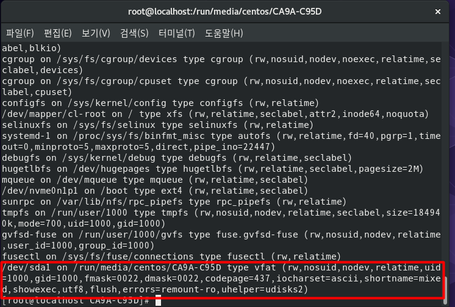

<!-- CentOS 리눅스의 기본 개념과 리눅스 관리자의 기본 역할 -->

### 터미널/콘솔에서 시스템 종료 명령 실행

poweroff , shutdown -P now , halt -p , init 0

### -P 또는 -p 옵션은 시스템 종료를 의미한다.

### shutdown

|                   명령어                    |                                         설명                                         |
| :-----------------------------------------: | :----------------------------------------------------------------------------------: |
|               shutdown -P +10               |                                     10분 후 종료                                     |
|              shutdown -r 22:00              |                            오후 10시에 재부팅 (r: reboot)                            |
| shutdown -c 예약된 shutdown 취소(c: cancle) |
|               shutdown -k +15               | 현재 접속한 사용자에게 15분 후에 종료된다는 메시지를 보내지만 실제로는 종료되지 않음 |
|               shutdown -h +10               |          현재 접속한 사용자에게 15분 후에 종료된다는 메시지를 보내고 종료됨          |

### 시스템 재부팅

shubdown -r now , reboot, init 6 등

### 로그아웃

logout , exit

<!-- 런레벨 -->

### init 명령 뒤에 붙는 숫자를 런레벨(RunLevel)이라고 부른다.

| 런타임 |  영문모드  |              설명              |       비고       |
| :----: | :--------: | :----------------------------: | :--------------: |
|   0    | Power Off  |            종료모드            |                  |
|   1    |   Rescue   |        시스템 복구 모드        | 단일 사용자 모드 |
|   2    | Multi-User |                                |  사용하지 않음   |
|   3    | Multi-User | 텍스트 모드의 다중 사용자 모드 |                  |
|   4    | Multi-User |                                |  사용하지 않음   |
|   5    | Graphical  | 그래픽 모드의 다중 사용자 모드 |                  |
|   6    |   Reboot   |                                |                  |

### 현재 런 레벨 알아보기

ls -l /etc/systemd/system/default.target

### 부팅 시 텍스트 모드(런레벨 3)로 부팅되도록 런레벨을 변경해보자

ln -sf /lib/systemd/system/multi-user.target /etc/systemd/system/default.target
// 리부팅 reboot

### 다시 x 윈도를 실행하려면 startx 명령을 입력한다.

### 잠시 기다리면 x 윈도가 실행되고, 폴더 이름을 영문으로 변경하겠냐는 메시지가 나온다. <keep old names>를 클릭한다(영문 모드의 x 윈도로 부팅되므로 기조의 한글 폴더 이름을 변경하겠냐는 메시지이다.)

startx

<!-- 자동 완성과 히스토리 -->

### 자동 완성이란, 파일 이름의 일부만 입력하고 tab을 눌러 나머지 파일 이름 또는 폴더 이름을 자동으로 완성하는 기능을 말한다.

### 자동 완성과 도스 키 기능을 사용해 보자

### 도스키

위, 아래 키

### 기존의 사용했던 명령을 모두 보려면 history 명령을 입력한다

history

### 저장되었던 명령을 모두 삭제하려면 history -c 명령을 입력한다

history -c
|||
|:--:|:--:|
|cd|현재 사용자의 홈 디렉터리로 이동|
|ls|파일 확인|
|cat|파일 내용을 출력|

<!-- 에디터 사용 -->

### windows의 메모장 처럼 x 윈도에서 제공하는 편리한 에디터로 gedt 이 있다

### 기존 전통적으로 사용되어 온 에디터로는 vi 에디터가 있다.

### 에디터 - gedit

gedit 파일\_이름

### 에디터 - vi

vi 파일\_이름

|  vi 사용법   |                  내용                  |
| :----------: | :------------------------------------: |
|      i       |             편집기(insert)             |
|      a       |   현재 커서의 위치 다음 칸부터 입력    |
|      o       |       현재 커서의 다음줄에 입력        |
|      s       | 현재 커서 위치의 한 글자를 지우고 입력 |
| I(shift + i) |     현재 커서 줄의 맨 앞부터 입력      |
| A(shift + i) |   현재 커서 줄의 맨 마지막 부터 입력   |
| O(shift + o) |       현재 커서의 이전 줄에 입력       |
| S(shift + s) |    현재 커서의 한 줄을 지우고 입력     |

### 명령 모드

| vi 사용법  |                          내용                          |
| :--------: | :----------------------------------------------------: |
| ESC (버튼) |                        명령모드                        |
|     h      |               커서를 왼쪽으로 한칸 이동                |
|     k      |               커서를 위쪽으로 한칸 이동                |
|     j      |                커서를 아래로 한칸 이동                 |
|     l      |               커서를 오른쪽으로 한칸이동               |
|  ctrl + f  |       다음 화면으로 이동 (page down)과 같은 의미       |
| [ctrl + B] |       이전 화면으로 이동([page up]과 같은 의미)        |
|     $      |               현재 행의 마지막으로 이동                |
|     ^      | 현재 행의 처음으로 이동(Home 과 같은 의미,[shift + 6]) |
|     gg     |                  제일 첫 행으로 이동                   |
|     G      |            제일 끝 행으로 이동 [shift + G]             |
|   숫자G    |      해당 숫자 행으로 이동(숫자 다음[shift + G])       |
|   :숫자    |                해당 숫자의 행으로 이동                 |
|     :w     |                        저장하기                        |
|     :q     |                         나가기                         |

|:q!|기존 변경된 내용은 무시하고 종료|
|:wq test3.txt| test3.txt이름으로 저장하고 나가기|

## 명령 모드에서 삭제 복사 붙여넣기와 관련된 키

| vi 사용법 |                       내용                        |
| :-------: | :-----------------------------------------------: |
|     x     |           현재 커서가 위치한 글자 삭제            |
|     X     |    현재 커서가 위차한 앞 글자 삭제 [shift + X]    |
|    dd     |      현재 커서의 행 삭제 [D 연속 두번 입력]       |
|  숫자 dd  |         현재 커서부터 숫자만큼의 행 삭제          |
|    yy     |   현재 커서가 있는 행을 복사 [Y 연속 두번 입력]   |
|  숫자 yy  |         현재 커서부터 숫자만큼 행을 복사          |
|     p     |       복사한 내용을 현재 행 이후에 붙여넣기       |
|     P     | 복사한 내용을 현재 행 이전에 붙여넣기 [shift + p] |

## 명령 모드에서 문자열을 찾는 키

| vi 사용법 |               내용                |
| :-------: | :-------------------------------: |
|   /내용   |             내용 찾기             |
|     n     | 찾은 문자 중에서 다음 문자로 이동 |

## 그 외에도 ex 모드(라인 명령 모드)에서 가장 많이 사용하는 두가지

|        vi 사용법         |             내용              |
| :----------------------: | :---------------------------: |
| '%s/기존문자열/새문자열' |         문자열을 치환         |
|       .set number        | vi 에디터 앞에 행 번호가 표시 |

### vi 사용시 수정 작업이 정상적으로 종료 되지 않았을때

E325: ATTENTION
Found a swap file by the name ".test1.txt.swp"
owned by: root dated: Tue Feb 6 23:21:57 2024
file name: ~root/test1.txt
modified: YES
user name: root host name: localhost.localdomain
process ID: 3270
While opening file "test1.txt"
dated: Tue Feb 6 23:14:51 2024

(1) Another program may be editing the same file. If this is the case,
be careful not to end up with two different instances of the same
file when making changes. Quit, or continue with caution.
(2) An edit session for this file crashed.
If this is the case, use ":recover" or "vim -r test1.txt"
to recover the changes (see ":help recovery").
If you did this already, delete the swap file ".test1.txt.swp"
to avoid this message.
"test1.txt" 1L, 18C
Press ENTER or type command to continue

### 비 정상 종료된 파일의 스윕(swp) 파일이름은 '.파일이름.확장자.swp'이다. 삭제하면 정상적으로 편집이 가능하다.

<!-- 도움말 사용법 -->

### 리눅스에는 많은 명령어가 있으며 각 명령어의 옵션까지 합하면 수천개가 넘는다.

### 이때 필요한 것이 'man'명령어이다 man은 manual의 약어로 리눅스에 포함된 체계화된 도움말이다.

### 사용법은 man <명령어>로 아주 간단하다.

### man <명령어> 예시

man ls 또는 man [섹션] ls

### man의 섹션

| man 섹션 번호 |      내용      |
| :-----------: | :------------: |
|       1       |     명령어     |
|     2 ~ 3     |   프로그래밍   |
|       4       |    디바이스    |
|       5       |   파일 형식    |
|       6       |      게임      |
|       7       |   기타 주제    |
|       8       |  시스템 관리   |
|       9       | 커널 관련 설명 |

### man 사용법

|              man 사용법               |        내용        |
| :-----------------------------------: | :----------------: | -------------------- |
|         위 , 아래 또는 k , j          |   위쪽 아래쪽 행   |
| Page Up , Page Down 또는 Spacebar , B | 페이지 단위로 이동 |
|                 /단어                 |  특정 단어를 검색  |
|                   N                   |                    | 다음 단어로 넘어가기 |
|                   Q                   |        종료        |

# <!-- 마운트와 CD/DVD/USB 활용 --> 참조 page 170쪽

### 리눅스에서 하드디스크의 파티션 , CD/DVD , USB 메모리 등을 사용하려면 지정한 위치에 연결해야 한다.

### 이렇게 물리적인 장치를 특정한 위치 (대개는 폴더)에 연결시키는 과정을 '마운트'라고 한다.

## 기존 마운트 정보를 확인

mount

### /dev/sda2가 루트 파티션('/')에 마운트 된것을 확인

## 기존에 CD/DVD 마운트 해제

umount /dev/cdrom

### 필자의 CD/DVD 장치 이름을 /dev/cdrom으로 사용했는데, /dev/sr0 과 /dev/cdrom은 동일하게 취급해도 된다. (사실 /dev/cdrom은 /dev/sr0에 링크된 파일이다.)

### 리눅스에 따라서 /dev/sr0 라는 이름은 변경 될 수 있으나, /dev/cdrom이라는 링크 이름은 대부분 고정되어 있다. 그러므로 앞으로는 CD/DVD 장치를 /dev/cdrom으로 기억하는 것이 편리하다.

### /dev/sr0 가 /run/media/root/CentOS-8-BaseOS-x86_64 디렉터리에 자동으로 마운트 되어 있다.

# <!-- 서버에 마운트된 CD/DVD를 사용해보자 -->

### 자동으로 마운트 된 CD/DVD 의 디렉터리는 /run/media/ 다. 그 아래 디렉터리 이름은 현재 사용자 이름과 CD/DVD의 Lable 이름이며 디렉터리가 자동 생성된다.

### 즉 Cent OS 8 DVD의 Label 은 'CentOS-8-BaseOS-x86_64'이므로 마운트 된 폴더는 /run/media/root/CentOS-8-BaseOS-x86_64 이다.

### /run/media/root/CentOS-8-BaseOS-x86_64/BaseOS/Packages 디렉터리 안에는 알파벳 순으로 정렬된 rpm 파일이 있다. 우리가 chapter 03 에서 centOS를 설치할 때 이 파일들이 자동으로 설치 된 것이다.

### DVD를 더 이상 사용하지 않는다면 umount /dev/cdrom 명령을 입력해 마운트를 해제한다.

### 그런데 'target is busy'라는 메시지가 나오며 마운트 해제에 실패한다.

### 지금 작업 중인 디렉터리 DVD가 마운트된 /run/media/root/의 하위 디렉터리 이기 때문이다.

### cd 등의 명령을 입력해 디렉터리가 아닌 디렉터리로 이동한 후 umount /dev/cdrom 명령으로 마운트를 해제해야 한다.

cd
umount /dev/cdrom

### 결국 DVD의 마운트를 해제할 때는 현재 마운트된 디렉터리에서 명령을 실행하면 안된다.

### 자주 실수하는 부분이므로 잘 기억해 두자

### mount 명령을 입력해서 확인하면 아까와 달리 /dev/sr0이 마운트 되어 있지 않을 것이다.

### DVD의 마운트를 완전히 해제하려면 다시 VMware 오른쪽 위의 DVD 모양 아이콘을 마우스 오른쪽 버튼으로 클릭후 Disconnected 를 선택한다 경고 창이 나오면 YES를 클릭한다.

# <!-- USB 메모리 사용하기 --> 설정 참조 173쪽

### windows 에서는 USB 메모리의 파일 시스템은 FAT32 또는 NTFS를 사용한다.

### CentOS는 기본적으로 FAT32 방식의 USB만 인식할 수 있다. 그러므로 실습을 위해 USB 포맷시 FAT32로 지정해서 포맷해야한다.

### 해당 USB 디렉터리

/run/media/현재사용자이름/USB이름

### CD/DVD와 달리 USB메모리에는 당연히 읽기/쓰기가 가능하다.

### mount 명령을 입력해서 USB 메모리가 마운트된 장치를 확인하자

### 필자의 경우 chapter 01에서 Client 가상 머신에 NVMe 디스크를 장착했다 그래서 기본 디스크가 /dev/nvme0n1p1 로 설정되어 있기 때문에 USB 메모리가 /dev/sda1이 된 것이다.

### Server 가상머신 이나 Server(B) 가상머신은 기본 디스크가 /dev/sda 이므로 USB 메모리를 장착한다면 /dev/sdb1로 이름이 할당 될 것이다.

### 지금 사용한 방식은 가상머신에서 호스트 컴퓨터로 파일을 전송하는 경우에도 편리하게 사용이 가능하다.

# <!-- Server(B) --> 참조 178쪽 iso , usb 연결

### /dev/cdrom 은 링크 파일이며 /dev/sr0이 실제 CD/DVD 장치다. 하지만 대부분의 리눅스는 /dev/cdrom 링크파일을 제공하므로 그냥 /dev/cdrom이 CD/DVD 장치라고 기억해 놓는것이 편리하다.

## 장치 이름 확인

ls /dev/sd\*

### /dev/sdb1 이 방금 장착한 USB 메모리의 장치 이름이다.

### /dev/sd\*는 하드디스크나 USB 메모리 등을 의미한다.

### /dev/sda 는 CentOS가 설치된 최초 하드디스크를 나타내며 /dev/sdb는 추가한 USB 메모리를 나타낸다.

### CD/DVD , USB 메모리를 직접 마운트 시켜보자

mount CD/DVD 파일 - mount /dev/cdrom /media/cdrom -> CD/DVD 마운트
mount USB 파일 - mount /dev/sdb1 /media/usb -> USB 마운트

### 결과 화면 - /media/usb

### 결과 화면 - /media/cdrom

### 마지막으로 umount 까지 진행

umount /media/usb
umount /media/cdrom
