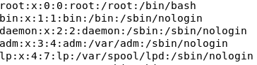
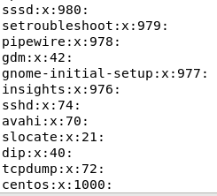
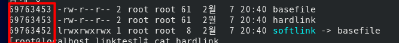
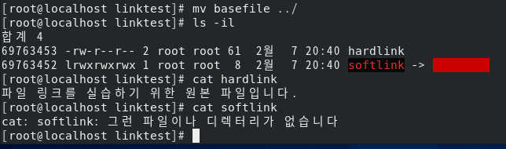
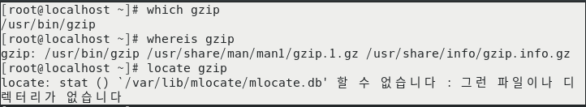

# <!-- 사용자 관리와 파일 속성 -->

# 1. 사용자와 그룹

### 리눅스는 다중 사용자 시스템(multi-user system)이다. 즉 1대의 리눅스에 사용자 여러명이 동시에 접속해서 사용할 수 있는 시스템이다. 리눅스를 설치하면 기본적으로 root라는 이름을 가진 수퍼 유저(super user)가 있다.

### root 사용자는 시스템의 모든 작업을 실행할 수 있는 권한이 있다. 또한 시스템에 접속할 수 있는 사용자를 생성할 수 있는 권한도 있다.

### 그런데 모든 사용자는 혼자서 존재하는 것이 아니라 하나 이상의 그룹에 소속되어 있어야 한다.

### 예를 들면 회사에서 '홍길동'이라는 직원이 '전산실'과 같은 어느 부서에 소속된 것과 같다고 생각하면 된다.

## 우선 gedit이나 vi 에디터로 /etc/passwd 파일을 열어보자

/etc/passwd

### 사용자 이름:암호:사용자ID:사용자가 소속된 그룹 ID:전체 이름:홈 디렉터리:기본 셸

centos:x:1000:1000:centos:/home/centos:/bin/bash

### 제일 아래의 centos 사용자를 보면, 사용자 이름은 centos고 암호는 x가 표시되는데 이는 /etc/shadow 파일에 비밀번호가 지정되어 있다는 의미이다.

### centos의 사용자 id는 1000번이고 , centos가 속한 그룹id 는 1000번이다.

### 전체 이름도 centos로 사용하며 centos 사용자의 홈 디렉터리는 /home/centos이며 로그인시 제공되는 셸은 /bin/bash이다.

## 이번에는 /etc/group 파일을 확인해 보자

/etc/group

### 각 행의 의미는 다음과 같다

### 그룹 이름:비밀번호:그룹id:그룹에 속한 사용자 이름

centos:x:1000:

### 마지막 '그룹에 속한 사용자이름'은 참조로 사용된다.

### 즉 해당 부분에 아무것도 써 있지 않다고 해서 그룹에 소속된 사용자가 반드시 없다는 뜻은 아니다.

### 필자의 경우에도 제일 첫행 root 그룹에 root 사용자가 속해 있으나 여기에는 표현되어 있지 않다.

<!-- 사용자 및 그룹과 관련된 명령어 -->

# 사용자 및 그룹과 관련된 명령어는 다음과 같다. 중요!!

## useradd (또는 adduser) - 새로운 사용자를 추가해준다 이 명령을 실행하면 /etc/passwd , /etc/shadow , / etc/group 파일에 새로운 행이 추가된다.

|           명령어            |                                                 내용                                                  |
| :-------------------------: | :---------------------------------------------------------------------------------------------------: |
|       useradd newuser       |       newuser라는 이름의 사용자를 생성 (기본 설정 : 홈 디렉터리 자동 생성, 기본 셸 : /bin/bash)       |
|   useradd -u 1111 newuser   |                          newuser 사용자를 생성하면서 사용자 ID를 1111로 지정                          |
| useradd -g mygroup newuser  | newuser 사용자를 생성하면서 mygroup 그룹에 newuser 사용자를 포함시킴(mygroup 그룹을 먼저 생성해놓자!) |
| useradd -d /newhome newuser |                       newuser 사용자를 생성하면서 홈 디렉터리를 /newuser로 지정                       |
| useradd -s /bin/csh nweuser |                         newuser 사용자를 생성하면서 기본 셸을 /bin/csh로 지정                         |

## passwd - 사용자의 비밀번호를 지정하거나 변경한다

|     명령어     |                    내용                     |
| :------------: | :-----------------------------------------: |
| passwd newuser | newuser 사용자의 비밀번호를 지정(또는 변경) |

## usermod - 사용자의 속성을 변경한다. 옵션은 useradd와 동일하다

|         명령어          |                    내용                    |
| :---------------------: | :----------------------------------------: |
| usermod -g root newuser | newuser 사용자의 그룹을 root 그룹으로 변경 |

## userdel - 사용자를 삭제한다

|       명령어       |                       내용                       |
| :----------------: | :----------------------------------------------: |
|  userdel newuser   |              newuser 사용자를 삭제               |
| userdel -r newuser | newuser 사용자를 삭제하면서 홈 디렉터리까지 삭제 |

## change - 사용자의 암호를 주기적으로 변경하도록 설정

|            명령어            |                                                                              내용                                                                               |
| :--------------------------: | :-------------------------------------------------------------------------------------------------------------------------------------------------------------: |
|      change -l newuser       |                                                               newuser 사용자에 설정된 사항을 확인                                                               |
|     change -m 2 newuser      |                                    newuser 사용자에 설정한 암호를 사용해야 하는 최소 일자(즉, 변경 후 최소 2일은 사용해야함)                                    |
|     change -M 30 newuser     |                                  newuser 사용자에 설정한 암호를 사용할 수 있는 최대 일자 (즉, 변경 후 30일까지 사용할수 있음)                                   |
| change -E 2026/12/12 newuser |                                         newuser 사용자에 설정한 암호가 만료되는 날짜(즉, 2026/12/12까지만 사용이 가능)                                          |
|     change -W 10 newuser     | newuser 사용자에 설정한 암호가 만료되기 전에 경고하는 기간, 지정하지 않는 경우 기본값은 7일(즉, 이와 같이 설정하면 암호가 만료되기 10전부터 경고 메시지가 나감) |

## groups - 사용자가 소속된 그룹을 보여준다

|     명령어     |                내용                |
| :------------: | :--------------------------------: |
|     groups     | 현재 사용자가 소속된 그룹을 보여줌 |
| groups newuser |   newuser가 소속된 그룹을 보여줌   |

## groupadd - 새로운 그룹을 생성한다.

|          명령어           |                          내용                          |
| :-----------------------: | :----------------------------------------------------: |
|     groupadd newgroup     |              newgroup 이라는 그룹을 생성               |
| groupadd -g 2222 newgroup | newgroup이라는 그룹을 생성하면서 그룹 ID를 2222로 지정 |

## groupmod - 그룹의 속성을 변경한다.

|            명령어            |                  내용                   |
| :--------------------------: | :-------------------------------------: |
| groupmod -n mygroup newgroup | newgroup 그룹의 이름을 mygroup으로 변경 |

## groupdel - 그룹을 삭제한다

|      명령어       |                                      내용                                       |
| :---------------: | :-----------------------------------------------------------------------------: |
| groupdel newgroup | newgroup 그룹을 삭제(단, 해당 그룹을 주요 그룹으로 지정한 사용자가 없어야한다.) |

## gpasswd - 그룹의 암호를 설정하거나 그룹 관리를 수행한다

|           명령어            |                      내용                      |
| :-------------------------: | :--------------------------------------------: |
|      gpasswd newgroup       |          newgroup 그룹의 암호를 지정           |
| gpasswd -A newuser newgroup | newuser 사용자를 newgroup 그룹의 관리자로 지정 |
|  gpasswd -a user1 newgroup  |     user1을 newgroup 그룹의 사용자로 추가      |
|  gpasswd -d user1 newgroup  |    user1을 newgroup 그룹의 사용자에서 제거     |

# <!-- 사용자 및 그룹을 관리하는 연습을 해보자 -->

# 참조

[root@localhost home]# tail -5 /etc/passwd
centos:$6$5p7H94pcwlspXxF0$9W.XP/FG8DD5TGglJ02QTxIhHT8PwJF4m80ntJji.Q1opro50ZoItGIWfxiL5YwGCCPn.IRgQRyZ6.eDIwjd61::0:99999:7:::
user1:!!:19760:0:99999:7:::
user2:!!:19760:0:99999:7:::

## /etc/shadow - 유저의 패스워드가 들어있는 곳

| 문자열 |           내용            |
| :----: | :-----------------------: |
|   !!   | 암호가 지정되어 있지 않음 |

## /etc/skel

### 새로운 사용자를 생성하면 해당 사용자의 홈 디렉터리 기본 설정은 '/home/사용자 이름'이며, /etc/skel 디렉터리의 모든 내용을 사용자의 홈 디렉터리에 복사하는 작업이 발생함

### 따라서 앞으로 생성하는 사용자에게 특정한 파일 등을 배포하고 싶은 경우 /etc/skel 디렉터리에 넣어두면 된다.

# <!-- 파일과 디렉터리의 소유권과 허가권 -->

# 파일과 디렉터리의 소유권과 허가권

### 리눅스는 각각의 파일과 디렉터리 마다 소유군과 허가권이라는 속성이 있다. root 사용자가 자신의 홈 디렉터리에서 touch sample.txt 명령을 실행해 빈 파일을 만들고 ls -l 명령을 실행하면 다음과 나타난다.

-rw-------. 1 root root 1493 2월 5 22:00 anaconda-ks.cfg
-rw-r--r-- 1 root root 0 2월 7 20:01 sample.txt
-rw-r--r-- 1 root root 18 2월 6 23:14 test1.txt
drwxr-xr-x. 2 root root 6 2월 5 22:02 공개
drwxr-xr-x. 2 root root 6 2월 5 22:02 다운로드

## -rw-r--r-- 1 root root 0 2월 7 20:01 sample.txt

|   문자열    |        내용        |
| :---------: | :----------------: |
|      -      |     파일 유형      |
|  rw-r--r--  |    파일 허가권     |
|      1      |      링크 수       |
|    root     |  파일 소유자 이름  |
|    root     | 파일 소유 그룹이름 |
|      0      |  파일 크기(Byte)   |
| 2월 7 20:01 |  마지막 변경/시간  |
| sample.txt  |     파일 이름      |

## 파일유형

### 파일이 어떤 종류인지 나타낸다 디렉터리인 경우 'd'가, 일반적인 파일인 경우 '-'가 표시된다. 그 외에 b(블록 디바이스), c(문자 디바이스),l(링크) 등이 있다.

| 문자열 |     내용      |
| :----: | :-----------: |
|   d    |   디렉터리    |
|   -    | 일반적인 파일 |
|   b    | 블록 디바이스 |
|   c    | 문자 디바이스 |
|   l    |     링크      |

## 파일 허가권

### 파일 허가권(permission)은 rw-- ,r-- ,r-- 3개씩 끊어서 인식하면 된다

### r은 read , w 는 write , x는 실행권한(excute)의 약자다.

### 또한 첫번째 rw- 는 소유자(owver)의 파일 접근 권한을 , 두번째 r--는 그룹(group) 파일 접근 권한, 세번째 r--는 그 외 사용자(other)의 파일 접근 권한을 의미한다.

### 풀어서 예기하면 sample.txt 파일의 소유자는 일거나 쓸 수 있고 그룹은 읽을수만 있으며 그외 사용자도 읽을 수 만 있도록 허가되어 있는 예기다.

## 책 194쪽 내용을 참조하자

### 중요!! 소유자의 허가권인 6이라는 숫자는 2진수 100이므로 rw-로 표현할 수 있고, 그룹 허가권인 4라는 숫자는 2진수 100이므로 r-- , 그 외 사용자의 허가권인 4라는 숫자도 2진수로 100이므로 r--로 표현되는 것이다.

### 예를 들어 파일 허가권 754라는 것은 rwxr-xr-- 가 되므로 소유자는 읽고 쓰고 실행할 수 있고, 그룹은 읽고/실행만 할 수 있으며 그 외 사용자는 읽을 수만 있다는 것을 의미한다.

### 참고로 디렉터리(=폴더)의 경우 해당 디렉터리로 이동하려면 반드시 실행 권한이 있어야 한다 그래서 일반적으로 소유자/그룹/기타 사용자 모두에게 실행 권한(x)가 설정되어 있을 것이다.

## chmod

chmod

|         예시         |   내용    |
| :------------------: | :-------: |
| chmod 754 sample.txt | rwxr-xr-- |
| chmod 755 sample.txt | rwxr-xr-x |
| chmod 777 sample.txt | rwxrwxrwx |

### 파일 허가권을 변경하는 명령어로 chmod 명령이 있다 이 명령어는 root 사용자 또는 해당 파일의 소유자만 실행할 수 있다 일례로 chmod 777 sample.txt 명령을 실행하면 sample.txt 파일은 모든 사용자가 읽고 쓰고 실행할 수 있는 파일이 된다.

### chmod 명령을 상대 모드(synbolic method)로도 사용할 수 있다 chmod u+x 파일이름 명령은 '소유자(user)에게 실행(excute)권할을 허가하라(+)'는 의미이다.

|         예시         |                    내용                     |
| :------------------: | :-----------------------------------------: |
| chmod u-wx 파일이름  |     사용자에게 쓰기와 실행 권한을 제거      |
| chmod g+rx 파일이름  |      그룹에게 읽기와 실행 권한을 허가       |
| chmod o+rwx 파일이름 | 그 외 사용자에게 읽기/쓰기/실행 권한을 허가 |

### 몇가지 예를 들면 , u-wx는 사용자에게 쓰기와 실행 권한을 제거하라는 의미이며, g+rx 는 그룹에게 읽기와 실행 권한을 허가하라는 의미고, o+rwx는 그 외 사용자에게 읽기/쓰기/실행 권한을 허가하라는 의미다.

## 파일 소유권

### 파일 소유권(ownership)은 파일을 소유한 사용자와 그룹을 의미한다. sample.txt 파일은 root 라는 이름의 사용자가 소유자며, 그룹도 root 로 되어 있다 파일의 소유권을 바꾸는 명령어는 chown 이다.

chown

|              예시              |                                             내용                                              |
| :----------------------------: | :-------------------------------------------------------------------------------------------: |
|    chown centos sample.txt     |                   sample.txt 파일의 소유자를 centos 사용자로 바꾸라는 의미                    |
| chown centos.centos sample.txt | 파일의 소유자 및 그룹도 centos 그룹으로 바꾸라는 의미(chown centos:centos sample.txt 도 가능) |
|    chgrp centos sample.txt     |                            그룹만 centos 그룹으로 변경하라는 의미                             |

### 사용법은 chown 새로운사용자이름(새로운그룹이름) 파일이름 명령의 형식으로 사용하면 된다.

### 예를 들어 chown centos sample.txt 명령은 sample.txt 파일의 소유자를 centos 사용자로 바꾸라는 의미이고, chown centos.centos sample.txt 명령은 파일의 그룹도 centos 그룹으로 바꾸라는 의미이다. 또한 chgrp centos sample.txt 명령은 그룹만 centos 그룹으로 변경하라는 의미이다.

## 링크

### 파일의 링크(Link)는 하드 링크(Hard Link)와 심볼릭 링크(Symbolic Link 또는 Soft Link) 2가지가 있다. 원본파일이 inode1을 사용할 때 하드 링크를 사용하면 '하드 링크 파일'만 하나 생성되며 같은 inode1을 사용하게 된다. 하드 링크를 생성하려면 ln 링크대상파일이름 링크파일이름 명령을 실행한다.

ln 링크대상파일이름 링크파일이름

## inode란? 무엇일까

### inode는 리눅스/유닉스 파일 시스템에서 사용하는 자료 구조를 말하는데 , 파일이나 디렉터리의 여러가지 정보가 있다. 모든 파일이나 디렉터리는 각자 1개씩 inode가 있으며 각 inode에는 해당 파일의 소유권 허가권, 파일 종류 등의 정보와 해당 파일의 실제 데이터 위치(=주소)도 있다. 이러한 inode가 모여 있는 공간이 inode 블록이며 일반적으로 전체 디스크 공간의 1% 차지한다. Data 블록은 실제 데이터가 저장된 디스크 공간으로 전체 디스크의 대부분을 차지한다.

### 원본 파일에 심볼릭 링크를 생성하면 새로운 inode2를 만들고 , 데이터는 원본 파일과 연결되는 효과를 갖는다. 일반적으로 사용자는 주로 심볼릭 링크를 사용하며, Windows의 바로 가기 아이콘도 심볼릭 링크에 해당된다. 심볼릭 링크를 생성하려면 ln -s 링크대상파일이름 링크파일이름 명령을 실행한다.

ln -s 링크대상파일이름 링크파일이름

### 밑의 그림을 보려면 명령어 ls -il을 눌러야 한다.

### 원본파일(basefile)과 하드 링크 파일(hardlink)은 inode1(69763453 번)로 지정되어 있다

### 그러나 심볼릭 링크 파일(softlink)은 inode2(...2번)로 다르게 지정되어 있다. 원본 파일(basefile)과 하드 링크 파일(hardlink)는 Data 블록에 같은 원본 파일 데이터를 사용하므로 기가 61바이트로 동일하며, 심볼링 링크 파일(softlink)는 별도의 원본 파일 포인터를 갖기 때문에 8바이트로 크기가 다르다

### 파일 이름에서도 심볼릭 링크 파일(softlink)는 원본 파일(basefile)을 지정한다는 의미로 화살표로 표시되어 있다.

### 원본(basefile)을 다른 곳으로 이동시키고 하드 링크(hardlink)과 심볼릭 링크(softlink)를 확인 해보자

### 하드 링크는 디렉터리에서 원본 파일이 없어져도 아무 이상없고, 심볼릭 링크는 디렉터리에서 원본 파일이 없어지면 연결이 끊어진다.

### 원본 파일을 현재 디렉터리로 가져와서 다시 한번 해보면 심볼릭 링크가 원상태로 복구되었음을 알수 있다.

# <!-- 리눅스 관리자를 위한 명령어 -->

# 리눅스 시스템을 관리하기 위해서 관리자 측면에서 사용해야 할 명령을 알아보자

## 프로그램 설치를 위한 RPM

### CentOS에서 패키지를 설치하는데 가장 많이 사용되는 것은 RPM과 DNF(또는 YUM)다

### DNF(또는 YUM)이 나오기 전에는 주로 RPM(Redhat Package Manager)사용 되었으나, DNF는 RPM의 개념과 기능을 포함하기 때문에 최신 버전 CentOS에서는 DNF를 사용하면 된다.

### 그러나 DNF가 별도로 존재한다기보다 RPM을 포함한 확장 개념에 가까우므로 먼저 RPM의 개념을 익혀야 한다.

## RPM 이란?

### 초창기 리눅스의 경우 새로운 프로그램을 설치하기가 꽤 어려웠기 때문에 초보자에게는 프로그램을 설치하는 것조차 하나의 난제였다. 이 점을 개선하여 레드햇사에서는 Windows의 setup.exe와 같이 프로그램 설치 후 바로 실행할 수 있는 설치 파일을 제작했다. 설치 파일의 확장자명은 \*.rpm이며 이를 '패키지(Package)'라고 부른다.

## 파일의 의미

[root@localhost Packages]# pwd
/run/media/root/CentOS-8-BaseOS-x86_64/BaseOS/Packages
[root@localhost Packages]# ll gzip\*
-r--r--r-- 1 root root 169968 7월 2 2019 gzip-1.9-4.el8.x86_64.rpm
[root@localhost Packages]#

### CentOS 8 DVD ISO파일을 연결하면 자동으로 마운트되는 폴더에 많은 rpm파일이 존재한다.

### 그중 압축 프로그램인 gzip이다.

### 우선 rpm 파일의 형식은 일반적으로 다음과 같다(패키지에 따라 형식이 좀 다를 수 있다.)

### 패키지이름-버전-릴리스번호.CentOS버전.아키텍처.rpm (패키지에 따라 형식이 좀 다를수 있다)

### gzip-1.9-4.el8.x86_64.rpm 위는 이와 같다.

|    의미     | 문자열 | 내용                                                                                                       |
| :---------: | :----: | ---------------------------------------------------------------------------------------------------------- |
| 패키지 이름 |  gzip  | 패키지(프로그램)의 이름이다.                                                                               |
|    버전     |  1.9   | 대부분 2자리 또는 3자리 수로 구성된다. 주 버전, 부 버전, 패치 버전 순서며 당연히 숫자가 높을수록 최신이다. |
| 릴리즈 번호 |   4    | 문제점을 개선할 때마다 붙여지는 번호이다                                                                   |
| CentOS 버전 |  el8   | CentOS 8에서 배포할 경우 붙여진다. el8은 Redhat Enterprise Linux 8을 의미한다                              |
|  아키텍처   | x86_64 | x86 계열의 64bit CPU를 의미한다. 즉, 이 파일을 설치할 수 있는 CPU를 뜻한다.                                |

|         아키텍쳐          |                           내용                            |
| :-----------------------: | :-------------------------------------------------------: |
| i386 , i486 , i586 , i686 |              인텔 또는 AMD 계열의 32bit CPU               |
|          x86_64           |              인텔 또는 AMD 계열의 64bit CPU               |
|     alpha/sparc/la64      |             미국 DEC사의 알파(ALPHA)프로세서              |
|            src            | 소스 파일패키지, 설치 후에는 컴파일을 별도로 해줘야 한다. |
|          noarch           |        모든 CPU에 설치 가능하다 (NO ARCHitecture)         |

## 자주 사용하는 RPM 명령어 옵션

### 설치

|      명령어 또는 옵션       |                                               내용                                                |
| :-------------------------: | :-----------------------------------------------------------------------------------------------: |
| rpm -Uvh 패키지파일이름.rpm |                                               설치                                                |
|              U              | 기존에 패키지가 설치되지 않았다면 일반적인 설치를 진행하고, 패키지가 설치되있다면 업그레이드 한다 |
|              v              |                                          설치 과정 확인                                           |
|              h              |                               설치 진행 과정을 #기호로 화면에 출력                                |

### 삭제

|  명령어 또는 옵션  |        내용         |
| :----------------: | :-----------------: |
| rpm -e 패키지 이름 |     패키지 삭제     |
|         e          | erase (지움)의 약자 |

### 이미 설치된 패키지 조회

|    명령어 또는 옵션     |                        내용                        |
| :---------------------: | :------------------------------------------------: |
|   rpm -qa 패키지이름    |        시스템에 패키지가 설치되었는지 확인         |
| rpm -qf 파일의 절대경로 | 이미 설치된 파일이 어느 패키지에 포함된것인지 확인 |
|   rpm -ql 패키지이름    |   특정 패키지에 어떤 파일들이 포함되었는지 확인    |
|   rpm -qi 패키지이름    |              설치된 패키지의 상세정보              |

### 아직 설치되지 않은 rpm 파일 조회

|      명령어 또는 옵션       |                     내용                      |
| :-------------------------: | :-------------------------------------------: |
| rpm -qlp 패키지파일이름.rpm | 패키지 파일에 어떤 파일들이 포함되었는지 확인 |
| rpm -qip 패키지파일이름.rpm |            패키지 파일의 상세 정보            |

### 특히 rpm -qip 패키지파일이름.rpm 명령은 패키지를 설치하기 전, rpm 파일안에 해당 기능이 포함되었는지 미리 확인하는 데 유용하게 사용할 수 있다.

## RPM의 단점

### 가장 큰 단점은 '의존성'이다. 간단한 예로 CentOS의 기본 웹 브라우저인 Firefoxs는 당연히 X 윈도에서 가동된다. 그런데, X윈도가 설치되지 않은 상태에서 Firefox를 설치한다면 Firefox는 X 윈도에 의존성이 있으므로 설치가 되지 않을 것이다

### 이러한 불편을 해결한 것이 dnf 명령이다.

## 편리하게 패키지를 설치하는 DNF

### RPM은 분명히 유용하지만 의존성 문제로 불편한 점이 발생한다. 이를 해결하기 위해 제공하는 것이 DNF(Dandified yum) 명령어 이다. DNF는 RPM과 별도라기보다 rpm 패키지를 설치하는 편리한 도구라고 생각하면 된다.

### CentOS 7까지는 패키지 설치 관리자로 YUM(Yellow Dog Updater , Modified)를 사용했으나, CentOS 8부터는 YUM의 기능이 대폭 개선된 DNF를 주로 사용한다. 그래서 DNF를 Dandified Yum으로도 부르는 것과 같다 DNF 또한 동일하게 /etc/yum.repos.d/를 사용하기 때문에 이전 버전의 centos 사용자도 yum 명령 대신 dnf 명령으로만 변경하면 특별히 사용법을 익힐 필요가 없다.

# DNF

### dnf 명령은 rpm 명령의 패키지 의존성 문제를 완전히 해결해준다. 즉, 특정 패키지를 설치할 때, 의존성이 있는 다른 패키지를 자동으로 먼저 설치하는 인공지능(?)을 갖춘 명령어 이다.

### DNF 명령어는 설치하려는 rpm 파일이 DVD에 있거나 인터넷에서 미리 다운로드한 후 설치해야한다.

### 물론 해당 파일과 의존성이 있는 다른 rpm 파일까지 인터넷을 통해 모두 알아서 다운로드한 후 자동으로 설치까지 해준다. 그러므로 사용자는 rpm 패키지 설치 시 의존성 문제를 고민하지 않아도 된다. 단, '인터넷을 통해' 다운로드한 후 설치하게 되므로 당연히 인터넷에 정상적으로 연결 되어 있어야 한다.

## 저장소의 URL은 어떻게 아는가?

### 이 저장소의 URL은 /etc/yum.repos.d/ 디렉터리의 파일에 저장되어 있다. 이 저장소는 잠시 후에 상세히 살펴보자

## DNF의 기본 사용법

### DNF의 기본 사용법은 무척 간단하며 대기는 이 기본 사용법으로 충분히 가능하다

## 기본 설치 방법

dnf -y install 패키지이름

### 여기에서 -y옵션을 써주면 사용자에게 yes/no를 묻는 부분에서 무조건 yes를 입력한 것으로 간주하고 자동으로 넘어가므로 편리하다

## 주의해야 할 점은 rpm 패키지 파일이 아닌 패키지 이름만 적어야 한다는 것이다. 예를 들어 앞에서 설치한 mc 패키지의 경우 dnf -y install mc까지만 적어줘야 한다. 만약 dnf -y install mc-4....rpm 명령으로 전체 rpm 패키지 파일이름을 적으면 로컬에 있는 rpm 파일을 설치하려고 시도할 것이다.

## rpm 파일 설치 방법

dnf install rpm파일이름.rpm

### rpm 파일을 설치하고자 한다면 rpm -Uvh rpm파일이름.rpm 명령 대신 dnf install rpm파일이름.rpm 명령을 실행해 패키지를 설치할 수 있다.

## 업데이트 가능한 목록 보기

dnf check-update

### 시스템에 설치된 패키지 중에서 업데이트가 가능한 패키지의 목록을 출력한다. 이 명령을 실행하기 전 dnf clean all 명려을 실행해서 기존의 dnf 관련 임시 파일을 지우는 것이 좋다.

## 업데이트

dnf update 패키지이름

### 소개는 하지만 별로 사용할 필요는 없다. dnf install 패키지이름 명령을 실행하면 기존에 설치되지 않은 패키지는 새로 설치하고, 이미 설치되어 있으면 업데이트 한다. 아무런 옵션을 정하지 않고 dnf update 명령만 실행하면 업데이트 가능한 모든 패키지를 업데이트 하므로 시간이 무척 오래 걸릴 것이다.

## 삭제

dnf remove 패키지 이름

### 기존의 설치된 패키지를 제거한다.

## 정보 확인

dnf info 패키지이름

### 패키지의 요약 정보를 보여준다.

## 요약하기

|      명령어 또는 옵션       |           내용            |
| :-------------------------: | :-----------------------: |
|  dnf -y install 패키지이름  |      기본 설치 방법       |
| dnf install rpm파일이름.rpm |    rpm 파일 설치 방법     |
|      dnf check-update       | 업데이트 가능한 목록 보기 |
|    dnf update 패키지이름    |         업데이트          |
|   dnf remove 패키지 이름    |           삭제            |
|     dnf info 패키지이름     |         정보 확인         |

# DNF 고급 사용법

### 패키지 설치는 대부분 앞에서 사용한 dnf -y install 패키지이름 명령을 실행하는 것으로 충분하다. 그 외에 추가로 알아두면 좋은 것들을 확인해보자

|             명령어 또는 옵션             |                                                                                                                                                 내용                                                                                                                                                  |
| :--------------------------------------: | :---------------------------------------------------------------------------------------------------------------------------------------------------------------------------------------------------------------------------------------------------------------------------------------------------: |
|    dnf groupinstall "패키지그룹이름"     |                                      패키지 그룹설치는 패키지 그룹에 포함된 패키지들을 통째로 설치할때 사용할 수 있다. 패키지 그룹의 종류는 dnf grouplist 명령으로 확인할 수 있다. 설치 시 패키지 그룹의 이름은 띄어쓰기가 많으므로 큰 따옴표 ("")안에 써야한다.                                      |
|           dnf list 패키지이름            | 패키지 리스트 확인 - CentOS에서 제공하는 패키지 리스트를 보여준다. 일례로 dnf list all 명령을 실행하면 모든 패키지 목록을 보여주며, dnf list httpd\* 명령을 실행하면 httpd 라는 이름이 들어간 패키지 목록을 보여준다. 그리고 dnf list available 명령을 실행하면 현재 설치 가능한 목록을 모두 보여준다 |
|          dnf provides 파일이름           |                                                                                특정 파일이 어느 패키지에 들어 있는지 확인할 수 있다. 예를 들어 dnf provides ifconfig 명령은 ifconfig 명령이 들어있는 패키지를 알려준다                                                                                |
| dnf install --nogpgcheck rpm파일이름.rpm |                                                               CentOS 8 에서 인증되지 않은 rpm 파일을 dnf install 로 설치하면 설치되지 않는 경우도 있다 그럴때 '--nogpgcheck' 옵션을 사용하면 GPG 키 인증을 생략하므로 설치가 가능하다.                                                                |
|              dnf clean all               |                                                                                          기존에 다운로드한 패키지 목록을 지운 다음 dnf install 패키지이름 명령을 실행하면 패키지 목록을 다시 다운로드 한다.                                                                                           |

# DNF의 작동 방식과 설정 파일

### dnf 명령어와 관련된 설정 파일은 /etc/yum.conf 와 /etc/yum.repos.d/ 디렉터리가 있다.

### yum.conf 파일은 특별이 설정을 변경할 것이 없으므로 앞으로도 신경 쓸 필요는 없다. 중요한 것은 /etc/yum.repos.d/ 디렉터리에 있는 여러개의 파일이다. 각 파일에는 dnf 명령을 실행했을때 인터넷에서 해당 패키지 파일을 검색하는 네트워크 주소가 들어 있다.

### 예시는 216쪽 그림을 참조

### 먼저 dnf install mysql-errmsg 패키지 설치 명령을 입력하면, 자동으로 /etc/yum.repos.d/ 디렉터리의 repo 파일을 확인한다. 이 파일에는 'CentOS 8 패키지 저장소'의 인터넷 주소가 적혀 있다. 그리고 전체 패키지 목록 파일을 요청하고 다운로드 한다. 여기서 주의할 점은 실제 패키지 파일을 다운로드 하는 것이 아니며 패키지의 이름이 들어 있는 목록만 가져온다는 것이다.

### 그리고 다운로드한 패키지 목록 파일을 근거로 사용자가 요청한 mysql-errmsg 패키지와 의존성 있는 패키지 목록을 출력한다. 사용자는 패키지 목록을 확인하고 설치 의향이 있다면 y(yes)를 입력해 실제 패키지 다운로드를 요청하고 해당 패키지 파일(rpm 파일)을 다운로드해 자동으로 설치한다. 이 흐름에서 독자는 dnf 명령과 y만 입력하면 모두 자동으로 처리된다.

### 여기서 'CentOS 8 패키지 저장소'의 BaseOS 패키지는 /etc/yum.repos.d/CentOS-Base.repo 파일의 [BaseOS] 부분에 적혀있다. 즉 [BaseOS] 부분은 CentOS 8 기본 패키지들의 위치인 것이다.

### 이제 repo 파일이 어떻게 구성되었는지 살펴보자. /etc/yum.repos.d/This.repo 파일을 gedit으로 열면 다음과 같다.

[BaseOS]
name=CentOS-$releasever - Base
baseurl=https://archive.kernel.org/centos-vault/8.0.1905/BaseOS/x86_64/os/
http://linuxsoft.cern.ch/centos-vault/8.0.1905/BaseOS/x86_64/os/
gpgcheck=0

[AppStream]
name=CentOS-$releasever - AppStream
baseurl=https://archive.kernel.org/centos-vault/8.0.1905/AppStream/x86_64/os/
http://linuxsoft.cern.ch/centos-vault/8.0.1905/AppStream/x86_64/os/
gpgcheck=0

[extras]
name=CentOS-$releasever - Extras
baseurl=https://archive.kernel.org/centos-vault/8.0.1905/extras/x86_64/os/
http://linuxsoft.cern.ch/centos-vault/8.0.1905/extras/x86_64/os/
gpgcheck=0

[centosplus]
name=CentOS-$releasever - Plus
baseurl=https://archive.kernel.org/centos-vault/8.0.1905/centosplus/x86_64/os/
http://linuxsoft.cern.ch/centos-vault/8.0.1905/centosplus/x86_64/os/
gpgcheck=0

[PowerTools]
name=CentOS-$releasever - PowerTools
baseurl=https://archive.kernel.org/centos-vault/8.0.1905/PowerTools/x86_64/os/
http://linuxsoft.cern.ch/centos-vault/8.0.1905/PowerTools/x86_64/os/
gpgcheck=0

### 파일 내용이 좀 복잡해 보이지만 꼭 필요한 것만 알면 된다.

### 먼저 대괄호 {} 는 저장소의 식별자이다. This.repo 파일에는 [BaseOS] , [AppStream] , [extras] , [centosplus] , [PowerTools] 5 개를 등록해 놓았는데 필요하다면 각 식별자별로 별도의 파일로 저장해도 상관 없다. 어차피 DNF가 /etc/yum.repos.d/ 폴더 아래 확장명이 \*.repo 인 파일을 모두 열어보기 때문이다. 단, 그 하위 폴더는 찾아보지 않는다. 그래서 /etc/yum.repos.d/backup/ 폴더는 없는 폴더와 동일한 효과이다.

### 이렇게 여러개의 식별자를 파일안에 사용할 수 있으며, 각 식별자는 서로 관련없이 독립적으로 존재한다. 일례로 [BaseOS] 부분과 [AppStream]은 서로 영향을 미치지 않는다. 책에서는 dnf 명령어를 대부분 This.repo 파일의 [BaseOS] 나 [AppStream] 식별자 부분만 사용하므로 이 부분만 살펴보자

|   문자열   |                                                                                                                                       내용                                                                                                                                        |
| :--------: | :-------------------------------------------------------------------------------------------------------------------------------------------------------------------------------------------------------------------------------------------------------------------------------: |
|     #      |                                                                                                                         주석이므로 없는 것과 마찬가지다.                                                                                                                          |
|    name    |                                                                                                 저장소의 이름이다. 보기 편한것으로 아무이름이나 지정해도 되며 별로 중요하지 않다.                                                                                                 |
|  baseurl   | URL이 적혀있어야한다. http , ftp , file 3가지 중 하나가 오면 된다. 독자가 저장소의 URL을 정확히 안다면 직접 적어도 된다. 여러개가 나올 수 있는데 지금처럼 baseurl 다음에 여러 URL 이 이어져 나오면 앞의 주소가 읍답하지 않을 경우 다음 주소를 확인하는 방식으로 패키지를 검색한다 |
|  gpgcheck  |                                             패키지의 GPG 서명 확인할지 여부를 1(사용) , 0 (미사용)으로 지정할 수 있다. 1로 지정할 경우, 이어서 gpgkey 항목을 반드시 설정해야 한다. 더 자세한 내용은 https://www.gnupg.org/를 참조하자                                             |
|   gpgkey   |                                                                                                  앞의 gpgcheck가 1일 경우 아스키 GPG가 들어있는 저장소의 URL이 적혀 있으면 된다.                                                                                                  |
| mirrorlist |                                                            baseurl에 설정값(URL)이 생략되어 있으면 그 대신 mirrorlist에 적힌 URL이 사용된다. 이 mirrorlist 의 URL에는 전 세계에 분포된 여러개의 저장소가 연결되어 있다                                                            |
|  enabled   |                                                                                      이 저장소를 사용할지 여부를 1(사용) , 0(사용 안함)으로 지정할 수 있다. 이 행을 생략하면 기본값이 1이다.                                                                                      |

### 이 중 꼭 필요한것인 [식별자]와 name , baseurl , gpgcheck 정도이다.

### 기본으로 제공되는 repo 파일은 특별히 변경하지 않는 것이 바람직 하지만 만약 시간이 오래 지나서 CentOS 8 의 URL이 변경된다면 dnf 명령어가 작동하지 않을 수 있다. 이럴때는 직접 이 파일의 내용을 수정해주면 된다.

# <!-- 파일 압축과 묶기 -->

# 파일 압축과 묶기

## 파일압축

### 리눅스에서 많이 볼 수 있는 압축 파일의 확장명은 xz , hz2 , gz, zip, Z 등이다. 예전에는 주로 확장명을 gz를 사용했으나, 최근에는 압축률이 더 좋은 xz 나 bz2를 더 많이 사용하는 추세이다.

## xz

### 확장명 xz로 압축하거나 풀어줌, 비교적 최신 압축 명령이며 압축률이 뛰어남

| 명령어 또는 옵션  |                                        내용                                         |
| :---------------: | :---------------------------------------------------------------------------------: |
|    xz 파일이름    |         '파일이름'을 압축 파일인 '파일이름.xz'로 만들며 기존 파일은 삭제됨          |
| xz -d 파일이름.xz | '파일이름.xz' 압축 파일을 일반 파일인 '파일이름'으로 만듦' (d는 Descompress의 의미) |
| xz -l 파일이름.xz |   '파일이름.xz' 압축 파일에 포함된 파일 목록과 압축률등을 출력(l은 listㅡ이 의미)   |
|  xz -k 파일이름   |          압축 후에 기존 파일을 삭제하지 않고 그대로 둠 (k 는 keep의 의미)           |

## bzip2

### 확장명 bz2로 압축하거나 풀어줌

|   명령어 또는 옵션    |                            내용                            |
| :-------------------: | :--------------------------------------------------------: |
|    bzip2 파일이름     |       '파일이름'을 압축 파일인 '파일이름.bz2'로 만듦       |
| bzip2 -d 파일이름.bz2 | '파일이름.bz2' 압축 파일을 일반 파일인 '파일이름'으로 만듦 |

## bunzip2

### 확장명 bz2의 압축을 풀어줌 (bzip2 -d 와 동일한 명령)

## gzip

### 확장명 gz로 압축하거나 풀어줌

|  명령어 또는 옵션   |                           내용                            |
| :-----------------: | :-------------------------------------------------------: |
|    gzip 파일이름    |        '파일이름'을 압축 파일인 '파일명.gz'로 만듦        |
| gzip -d 파일이름.gz | '파일이름.gz' 압축 파일을 일반 파일인 '파일이름'으로 만듦 |

## gunzip

### 확장명 gz의 압축을 풀어줌 (gzip -d 와 동일한 명령)

## zip

### Window 용과 호환되는 확장명 ZIP 으로 압축하거나 풀어줌

|           명령어 또는 옵션            |                        내용                         |
| :-----------------------------------: | :-------------------------------------------------: |
| zip 생성할파일이름.zip 압축할파일이름 | 압축할 파일이름을 '새로생성될파일이름.zip'으로 만듦 |

## unzip

### Window 용과 호환되는 zip으로 묶을 압축 파일을 풀어줌

|    명령어 또는 옵션    |              내용              |
| :--------------------: | :----------------------------: |
| unzip 압축파일이름.zip | '압축파일.zip'의 압축을 풀어줌 |

# 파일 묶기

### 알집 이나 반디집같은 Windows 용 압축 프로그램을 생각해보면 aaa,bbb라는 2개의 파일을 압축했을때 ccc.zip이라는 1개의 압축파일이 생긴다. 즉 aaa 와 bbb라는 두 파일이 1개의 파일로 묶인 후 압축된 것이다. 이는 Window 압축 프로그램이 '파일 압축'과 '파일 묶기'를 한번에 하기 때문이다.

### 리눅스에서는 사용자의 편의를 위해 파일 압축과 파일 묶기를 한번에 할 수 있는 옵션도 제공한다. 파일 묶기 명령어는 tar 이며 묶인 파일의 확장명도 tar다.

## tar

### 확장명 tar로 묶음 파일을 만들거나 묶음을 풀어줌

|    동작    |                                                 내용                                                  |
| :--------: | :---------------------------------------------------------------------------------------------------: |
| c (소문자) |                                          새로운 묶음을 만듦                                           |
|     x      |                                          묶인 파일을 풀어줌                                           |
|     t      |                                  묶음을 풀기 전에 묶인 경로를 보여줌                                  |
| C (대문자) | 묶음을 풀 때 지정된 디렉터리에 압축을 풀어줌. 지정하지 않으면 묶을 때와 동일한 디렉터리에 묶음이 풀림 |

|    옵션    |                                           내용                                            |
| :--------: | :---------------------------------------------------------------------------------------: |
|  f (필수)  | 묶음 파일 이름 지정. 원래 tar는 테이프(tape)장치 백업이 기본임 (생략하면 테이프로 보내짐) |
|     v      |             visual의 의미로 파일을 묶이거나 풀리는 과정을 보여줌 (생략 가능)              |
| J (대문자) |                                         tar + xz                                          |
| z (소문자) |                                        tar + gzip                                         |
| j (소문자) |                                        tar + bzip2                                        |

|              [사용 예]              |            내용            |
| :---------------------------------: | :------------------------: |
|   tar cvf my.tar /etc/sysconfig/    |            묶기            |
|  tar cvfJ my.tar.xz /etc/sysconfig  |       묶기 + xz 압축       |
| tar cvfz my.tar.gz /etc/sysconfig/  |      묶기 + gzip 압축      |
| tar cvfj my.tar.bz2 /etc/sysconfig/ |     묶기 + bzip2 압축      |
|           tar tvf my.tar            |         파일 확인          |
|           tar xvf my.tar            |          tar 풀기          |
|       tar cxvf newdir my.tar        |  newdir 에 tar 압축 풀기   |
|          tar xfj my.tar.xz          |  xz 압축 해제 + tar 풀기   |
|          tar xfz my.tar.gz          | gzip 압축 해제 + tar 풀기  |
|         tar xfj my.tar.bz2          | bzip2 압축 해제 + tar 풀기 |

# <!-- 파일 위치 검색 -->

# 파일 위치 검색

### 리눅스에서 특정 파일의 취리를 검색하는 명령어는 다음과 같다 가장 많이 사용되는 명령어는 find 이다.

## find 경로 옵션 조건 action

|  옵션  |  내용   |
| :----: | :-----: |
| -name  |         |
| -user  | 소유자  |
| -newer | 전 , 후 |
| -perm  | 허가권  |
| -size  |  크기   |

| Action |      내용      |
| :----: | :------------: |
| -print |     기본값     |
| -exec  | 외부 명령 실행 |

## find 기본 사용 예시

|            기본 사용 예시             |                              내용                              |
| :-----------------------------------: | :------------------------------------------------------------: |
|       find /etc -name '*.conf'       |      /etc 디렉터리 하위에 확장명이 *.conf인 파일을 검색       |
|        find /home -user centos        |      /home 디렉터리 하위에 소유자가 centos인 파일을 검색       |
|           find - -perm 644            |   현재 사용자의 홈디렉터리 하위에 허가권이 644인 파일을 검색   |
| find /user/bin -size +10k -size -100k | /user/bin 디렉터리 하위에 파일 크기가 10KB-100KB인 파일을 검색 |

## find 고급 사용 예시

|          고급 사용 예시          |                                   내용                                   |
| :------------------------------: | :----------------------------------------------------------------------: |
| find -size 0k -exec ls -l { } \; | 현재 사용자의 홈 디렉터리 하위에 파일 크기가 0인 파일 목록을 상세히 출력 |
|find /home -name '*.swp' -exec rm { } \;|/home 디렉터리 하위에 확장명이 *.swp인 파일을 삭제|

### -exec ... \ 은 외부 명령어의 시작과 끝을 표시함

## which 실행파일이름
### PATH에 설정된 디렉터리만 검색 , 절대 경로를 포함한 위치 검색

## whereis 실행파일이름
### 실행 파일 및 소스 , man 페이지 파일까지 검색

## locate 파일이름
### 파일 목록 데이터베이스에서 검색하기 때문에 매우 빠르고 유용하지만, updatedb 명령을 1회 실행해야 사용할 수 있음 updatedb 명령 실행 이후에 설치된 실행파일은 찾을 수 없으므로 다시 updatedb 명령을 실행해야 찾을 수 있음

