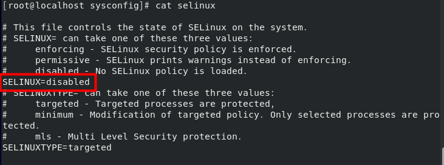

# <!-- 네트워크 관련 설정과 명령어 -->

# 네트워크 관련 설정과 명령어

### 요즘은 네트워크에 연결되지 않은 컴퓨터를 무용지물이라고 할 정도로 네트워크 연결은 모든 컴퓨터 환경의 기본이 되었다. 이번에는 CentOS 8의 네트워크 설정과 관련된 명령어와 파일을 간단하게 확인해본다.

## 네트워크 관련 필수 개념

### 네트워크와 관련된 내용은 상당히 방대하다.

### 이 책에서 모든것을 이야기하기에는 적절하지 않으므로, 더 깊은 네트워크 지식은 다른 책이나 인터넷을 통해 학습하자. 이 책에서는 후반부의 네트워크 서버 구축을 위한 최소한의 네트워크 관련 개념과 명령어 위주로 살펴본다.

## TCP/IP

### 컴퓨터끼리 네트워크사응로 의사소통하는 약속을 '프로토콜'이라고 부르는데, 그중 가장 널리 사용되는 프로토콜의 종류 중 하나이다.

### 통신의 전송/수신을 다루는 TCP(Transmission Control Protocol)와 데이터 통신을 다루는 IP(internet Protocol)로 구성된다.

## 호스트 이름과 도메인 이름

### 호스트 이름은 각각의 컴퓨터에 지정된 이름을 말한다.

### 도메인 이름(또는 도메인 주소)는 hanbit.co.kr과 같은 형식으로 표기하며 kr는 한국 , co는 회사, hanbit은 단체/회사 이름을 의미한다.

### 예시로 호스트 이름이 this이고 도메인 이름이 hanbit.co.kr이라면 전체 이름은 this.hanbit.co.kr로 붙여서 부른다 이를 FQDN(Fully Qualified Domain Name)이라고 부른다

### 즉 같은 회사 (도메인)에서 this.hanbit.co.kr이라는 호스트(=컴퓨터)는 중복 되지 않는다.

## IP 주소

### 각 컴퓨터의 랜 카드(Lan Card = 네트워크 카드 NIC, Network Interface Card)에 부여되며 중복되지 않는 유일한 주소다.

### 즉 네트워크에 연결된 모든 컴퓨터는 고유한 IP주소가 있으며, 이는 서로 다르기 때문에 특정 컴퓨터 IP 주소를 알면 그 컴퓨터가 전 세계 어디에 있든지 접속할 수 있다는 개념이다 (사설 IP는 예외)

### 4바이트로 이루어져 있으며 각 자리는 0~255까지의 숫자가 올 수 있다. 예를 들어 Server 의 IP 주소는 192.168.111.100이고 모든 컴퓨터에서 자기 자신을 의미하는 IP주소는 127.0.0.1이다.

## 네트워크 주소

### 같은 네트워크에 속해 있는 공통 주소다.

### 예를 들어 Server의 IP주소는 192.168.111.100, Server(B)는 192.168.111.200, Client는 192.168.111.131 , 호스트 컴퓨터는 192.168.111.1이다.

### 이 네대의 컴퓨터는 같은 네트워크에 있으며 서브넷 마스크는 C클래스(255.255.255.0)을 사용하므로 공통된 네트워크 주소는 앞자리인 192.168.111.0이 된다.

## 브로드캐스트 주소

### 네부 네트워크의 모든 컴퓨터가 수신하는 주소를 말한다.

### 현재 주소의 제일 끝자리를 255로 바꾼 주소다 (C클래스의 경우)

### 예를 들어 필자의 브로드캐스트(Broadcast)주소는 192.168.111.255다.

### 브로드캐스트 주소를 좀 더 쉽게 비유하자면 아파트의 스피커 또는 마을의 확성기 정도로 생각할 수 있다. 예를 들어 아파트 경비실에서 "차량 번호 7777 차를 다른 곳으로 이동시켜주세요"라고 말한다면 아파트 집집마다 스피커를 통해 전달된다. 하지만 모두가 다 응답하는 것은 아니다. 자신과 관련된 것이라면 반응을 보이겠지만 자신이 관련이 없다면 무시하고 지나칠 것이다. 브로드캐스트 주소도 이런 아파트의 스피커처럼 모든 컴퓨터가 들을 수 있는 주소라고 생각하면 쉽게 이해할 수 있다.

## 게이트웨이 (Gateway)

### 내부 네트워크를 외부로 연결하기 위한 컴퓨터 또는 장비다.

### Server , Server(B), Client 등 내부 네트워크에 있는 컴퓨터끼리 통신할 경우 외부로 나갈 필요가 없으므로 게이트 웨이가 없어도 되지만, 인터넷을 사용하기 위해 외부에 접속하려면 반드시 게이트웨이의 IP주소를 알아야한다. 게이트웨이는 쉽게말해 '외부 네트워크로 나가기 위한 통로'쯤으로 생각하면 된다. 그러므로 게이트웨이에는 내부로 향하는 문(네트워크 카드)과 외부로 향하는 문(네트워크 카드)이 있어야한다. 즉, 두개의 네트워크 카드가 장착되어 있어야한다.

### 우리의 경우 게이트웨이의 주소는 192.168.111.2로 고정되어 있다. 이것은 VMware 에서 제공하는 게이트웨이 주소이다.

### 게이트웨이를 별도로 추가하는 명령어 형식은 다음과 같다

\# route add default gw 게이트웨이 주소 dev 장치이름

### 예를 들어 게이트 웨이가 192.168.111.254로 변경되었을 때는 다음과 같이 사용 한다

\# route add default gw 192.168.111.254 dev ens160

## 넷마스크와 클래스

### 넷마스크(NetMask) : 네트워크의 규모를 결정한다.

### 이 책에서는 사설 네트워크에서 C클래스를 사용하므로 넷마스크를 255.255.255.0 로 한다.

### 필자의 경우 192.168.111.0 ~ 192.168.111.255 rKWL 256개의 IP주소를 사용할 수 있지만, 그중에서 네트워크 주소인 192.168.111.0, 브로드캐스트 주소인 192.168.111.255 , 게이트웨이로 사용할 IP주소(필자는 192.168.111.2)를 제외하면 총 253대의 컴퓨터를 네트워크 내부에서 연결할 수 있다.

## <참조> 네트워크 클래스

### 만약 우리의 사설 네트워크에 253대가 넘는 컴퓨터를 설치하고자 한다면 넷마스크를 255.255.255.0.0으로 변경해 B클래스를 사용하면 된다. 그러면 총 65536(2의 16승)개의 IP주소를 사용할 수 있으며 , 네트워크 주소는 192.168.0.0이 된다. A클래스로 변경하려면 255.0.0.0을 사용하면 된다.

## DNS 서버 주소

### 인터넷 사용 시 www.daum.net과 같은 URL을 해당 컴퓨터의 IP주소로 변환해주는 서버 컴퓨터를 말한다

### DNS(Domain Name System)서버 (=네임 서버)의 주소를 사용하지 않거나 잘못 입력되어 있으면 웹 사이트에 정상적으로 접속되지 않으므로 올바른 정보를 설정해야 한다.

### 설정 파일은 /etc/resolv.conf 이며, 내용중에 'nameserver DNS서버IP'형식으로 설정되어 있다.

### VMware을 사용하면 VMware가 게이트웨이 , DHCP 서버 , DNS 서버의 역할을 모두 가상으로 제공한다. 그림[1-64]를 보면 DNS 서버는 192.168.111.2 , DHCP 서버는 192.168.111.254로 설정되어 역할을 하는 것을 확인할 수 있다.

### GOOGLE 에서 제공하는 DNS 서버 8.8.8.8
### KT에서 제공하는 DNS 서버 168.126.63.1 과 168.126.63.2
### SK 브로드밴드의 219.259.26.130 과 210.220.163.82
### LG 유플러스의 164.126.101.2 와 203.248.252.2 중 사용해도 가능

## 리눅스에서의 네트워크 장치 이름

### 랜카트(NIC)가 리눅스에 장착되었을 때 CentOS 8 을 설치하면 자동으로 이 장치의 이름을 ens160으로 인식한다.

### 이전 버전의 CentOS와 리눅스 대부분은 랜카드를 eth0 , eth1 , ens32 , ens33 등으로 인식했다. 참고로 CentOS 8도 VMware, 진짜 컴퓨터 중 어느 장비에 설치하느냐에 따라 ens160 , ens161 , ens32 , ens33 , eth0 , eth1 등으로 다양한 형태로 인식하기도 하며 VMware 버전에 따라서는 완전히 다른 이름으로 인식하기도 한다.

### 이 랜카드의 이름은 앞으로 네트워크 정보를 파악하거나 네트워크를 정지 또는 가동할 때 자주 사용한다. 예를 들어 다음과 같은 명령을 종종 사용하게 된다.

|     명령어      |           내용            |
| :-------------: | :-----------------------: |
| ifconfig ens160 | 네트워크 설정 정보를 출력 |
|   ifup ens160   |    네트워크 장치 기동     |
|  ifdown ens160  |    네트워크 장치 정지     |

# <!-- 중요한 네트워크 관련 명령어 -->

# 중요한 네트워크 관련 명령어

### 네트워크와 관련된 명령어는 많지만 꼭 외우자

## nmtui

### Network Mananger Text User Interface 의 약자로, 네트워크와 관련된 작업 대부분은 이 명령을 기반으로 실행할 수 있다.

- 자동 IP 주소 또는 고정 IP 주소 사용 결정
- IP 주소, 서브넷 마스크 , 게이트웨이 정보 입력
- DNS 정보 입력
- 네트워크 카드 드라이버 설정
- 네트워크 장치 (ens160) 설정

## <참조> nmtui 명령과 ifconfig-ens160 파일

### nmtui 명령은 그놈(GNOME)그래픽 모드를 제공하지 않는다. X 윈도의 그래픽 모드를 완전하게 사용하면서 네트워크를 설정하려면 gnome-control-center network 명령 또는 nm-connection-editor 명령을 사용한다. 하지만 이 명령어들은 Server(B)와 같은 텍스트 모드에서 사용할 수 없으므로 되도록 nmtui를 사용하거나 직접 ifcfg-ens160 파일을 편집해서 네트워크를 설정하는 것을 권장한다.

## systemctl start/stop/restart/status NetworkManager

### 네트워크 설정을 변경한 후 변경된 내용을 시스템에 적용시키는 명령이다. 그러므로 nmtui 명령을 실행한 후 또는 직접 ifcfg-ens160 파일을 편집한 후에는 꼭 systemctl restart NetworkManager 명령을 실행해야 한다고 기억하자.

### restart 옵션은 stop 옵션과 start 옵션이 합쳐진 것이다. status 옵션은 현재 작동 (active) 또는 정지 (inactive)상태를 표시한다.

## ifup 장치이름

### 해당 장치를 작동시키는 명령어다. 만약 네트워크 장치가 장착되었으나 작동하지 않는다면 이 명령어로 네트워크 장치를 작동시킬 수 있다. 장치 이름에느 주로 ens-160이 사용된다.

## ifdown 장치이름

### ifup과 반대로 네트워크 장치를 끄는 명령어다.

## ifconfig 장치이름

### 해당 장치의 IP 주소와 관련된 정보를 출력하는 명령어다.

## nslookup

### DNS 서버의 작동을 테스트하는 명령어다.

## ping IP 주소 또는 URL

### 해당 컴퓨터가 네트워크상에서 응답하는지 테스트하는 간편한 명령어다. 즉, 상대 컴퓨터가 아무런 이상 없이 작동되는지를 네트워크 상에서 체크할 때 주로 사용된다.

## 요약 정리

|                       명령어                       |                                 내용                                  |
| :------------------------------------------------: | :-------------------------------------------------------------------: |
|                       nmtui                        |  네트워크와 관련된 작업 대부분은 이 명령을 기반으로 실행할 수 있다.   |
| systemctl start/stop/restart/status NetworkManager | 네트워크 설정을 변경한 후 변경된 내용을 시스템에 적용시키는 명령이다. |
|                   ifup 장치이름                    |                   해당 장치를 작동시키는 명령어다.                    |
|                  ifdown 장치이름                   |                    네트워크 장치를 끄는 명령어다.                     |
|                 ifconfig 장치이름                  |        해당 장치의 IP 주소와 관련된 정보를 출력하는 명령어다.         |
|                      nslookup                      |                DNS 서버의 작동을 테스트하는 명령어다.                 |
|               ping IP 주소 또는 URL                |  해당 컴퓨터가 네트워크상에서 응답하는지 테스트하는 간편한 명령어다.  |

# 네트워크 설정과 관련된 주요 파일

### nmtui 명령을 실행하고 나서 변경되는 관련 파일들이다. 주용한 파일들이므로 꼭 알아두자

## /etc/sysconfig/network

### 네트워크 기본 정보가 설정되어 있는 파일이며 네트워크 사용 여부가 써 있다.

## /etc/sysconfig/network-scripts/ifcfg-ens160

### ens160 장치에 설정된 네트워크 정보가 모두 들어있는 파일이다. chapter 03 실습에서 이 파일을 직접 편집했었다.

## /etc/resolv.conf

### DNS 서버의 정보와 호스트 이름이 들어 있는 파일이다.
### IP 주소, 게이트웨이 주소 등의 정보를 변경한 후에는 systemctl restart NetworkManager 명령을 실행해야 시스템에 적용되지만, /etc/resolv.conf의 nameserver 부분을 수정한 후에는 systemctl restart NetworkManager 명령을 실행할 필요가 없다. 그 이유는 웹 브라우저 또는 nslookup 명령을 사용하여 URL 을 조회할 경우 실시간으로 /etc/resolv.conf 의 파일을 열어서 확인하기 때문이다.

## /etc/hosts

### 현재 컴퓨터의 호스트 이름과 FQDN 이 들어있는 파일이다.

## 요약 , 정리

|                    파일                     |                                   내용                                    |
| :-----------------------------------------: | :-----------------------------------------------------------------------: |
|           /etc/sysconfig/network            | 네트워크 기본 정보가 설정되어 있는 파일이며 네트워크 사용 여부가 써 있다. |
| /etc/sysconfig/network-scripts/ifcfg-ens160 |       ens160 장치에 설정된 네트워크 정보가 모두 들어있는 파일이다.        |
|              /etc/resolv.conf               |            DNS 서버의 정보와 호스트 이름이 들어 있는 파일이다.            |
|                 /etc/hosts                  |          현재 컴퓨터의 호스트 이름과 FQDN 이 들어있는 파일이다.           |

## <참조> ifconfig 와 route 명령
### 네트워크 정보를 설정하기 위해 nmtui 명령어나 에디터에서 직접 설정하는 방법 외에 ifconfig나 route 명령어로 설정할 수 도 있다. root 사용자 권한으로 차례로 실행하면 된다.
ifconfig ens160 192.168.111.100 netmask 255.255.255.0 boradcast 192.168.111.255 up 
route add -net 192.168.111.0 netmask 255.255.255.0 ens160 
route add default gw 192.168.111.2 dev ens160
----------------------------------------------

# <!-- 네트워크 보안을 위한 SELinux -->
# 네트워크 보안을 위한 SELinux
### SELinux(Security Enhanced Linux)는 보안에 취약한 리눅스를 보호하기 위해 탄생했다. 시스템에서 보안에 영향을 미치는 서비스 , 권한 등을 제어할 수 있다.
### SELinux 환경에서는 해커가 어떤 경로로 시스템 침입에 성공하든, 침입한 경로의 애플리케이션 사용 이상의 권한을 얻지 못한다.
### 예를 들어 FTP 서버의 경로로 침입할 경우 FTP와 관련된 디렉터리나 파일 외에는 다른 서버에 접근할 수 없으므로 해킹에 대한 피해를 FTP 서버만으로 제한할 수 있다. 즉, 만약의 사태가 발생해도 피해를 최소화 할 수 있다.
### SELinux 의 사용 여부는 강제 (enforcing) , 허용 (permissive) , 비활성 (disabled) 이라는 3가지 레벨 중 선택할 수 있으며, 설정 파일은 /etc/systemconfig/selinux 파일이다.
### CentOS 8 을 설치하면 강제 (enforcing)로 기본 설정되어 있다

### 우리는 chapter 실습 1과 2에서 SELinux 기능을 비활성 (disabled)으로 변경했다.
### 이는 SELinux 사용 시 추후 네트워크 서비스가 원활하지 않을 수 있기 때문에 먼저 CentOS리눅스를 배우고 나서 보안을 고려하려고 설정한 것이다.
### 여기서도 알 수 있듯이 보안을 강화하면 여러가지 불편한 점이 발생할 수 있고 , 반대로 보안을 약화하면 편리해지지만 위험이 따를 수 있다.

### /etc/sysconfig/selinux를 직접 편집하지 않고 system-config-selinux 명령을 실행하여 설정할 수 도 있다.

## 강제 (enforcing)
### 강제는 시스템 보안에 영향을 미치는 기능이 감지되면 아예 그 기능이 작동되지 않도록 시스템에서 막는다.

## 허용 (permissive)
### 시스템 보안에 영향을 미치는 기능이 감지되면 허용은 하되 내용이 로그에 남고 화면상에도 출력된다.

## 비활성화 (disabled)
### SELinux를 사용하지 않는 것이여서 당연히 보안에 취약해진다.

### 설정을 변경한 후에는 컴퓨터를 재부팅해야 한다. SELinux에 관해 더 자세히 살펴보는 것은 책의 범위를 벗어난다 하지만 추후 실무에서 보안이 강화된 서비스를 제공하려면 잘 알아두는 것이 중요하다. man 페이지나 다른 관련 사이트 , 보안 관련 서적 등을 참조하자

