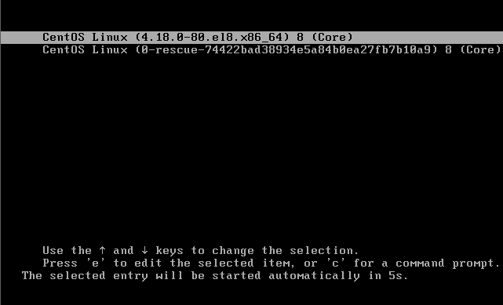
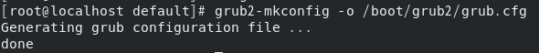
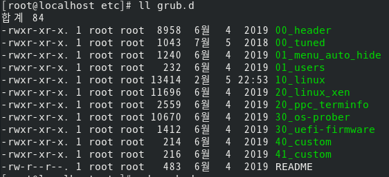
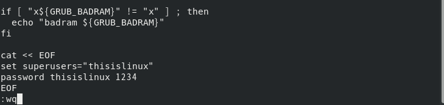

# <!-- 응급 복구 -->

# 응급 복구

### 시스템이 부팅되지 않는 이유는 무척 다양하다. 이때 해야하는 작업이 '응급 복구'이다.

### 이번에는 응급 복구 중에서 리눅스를 사용하다가 root 사용자의 비밀번호를 잊어버려 로그인하지 못하는 경우 해결하는 방법에 대해 배워보자

# 책 262 쪽 ~ 265쪽

### 여기서 의아하게 생각하는 독자가 있을 것이다. CentOS 리눅스는 지금 실습한 방법만 안다면 누구든지 ROOT 사용자의 권한을 얻어서 시스템에 접근할 수 있다는 말인가? 답은 그렇다 이다.

### 그래서 시스템을 보호하려면 처음 부팅할 때 나오는 GRUB 자체를 편집할 수 없도록 설정할 필요가 있다. 또 컴퓨터 BIOS의 CMOS 비밀번호를 이용한 보안도 고려할 수 있다

### 다음에는 GRUB 에 비밀번호를 설정해서 아무나 root 사용자의 권한을 얻는 것을 막아보자

# <!-- GRUB 부트로더 -->

# GRUB 부트로더

### CentOS 에서 기본적으로 제공하는 GRUB 부트로더를 살펴보자 . GRUB 부트로더란 CentOS를 부팅할 때 처음 나오는 선택 화면을 말한다.

### GRUB의 특징은 다음과 같다

- 부트 정보를 사용자가 임의로 변경해 부팅할 수 있다. 즉 부트 정보가 올바르지 않더라도 수정하여 부팅할 수 있다.
- 다른 여러가지 운영체제와 멀티 부팅을 할 수 있다.
- 대화형 설정을 제공하므로 커널 경로와 파일 이름만 알면 부팅이 가능하다

### 그런데 CentOS에서는 이전 GRUB보다 더 향상된 GRUB 2버젼을 사용한다. GRUB 2 는 셸 스크립트 문법을 사용하기 때문에 이전의 GRUB보다 설정을 변경하기가 훨씬 복잡해졌다 다음과 같은 장점도 있다.

- 셸 스크립트를 지원함으로써 조건식과 함수를 사용할 수 있다.
- 동적 모듈을 로드할 수 있다 동적 모듈은 /boot/grub2/i386-pc/ 디렉터리에 mod 파일로 존재한다 GRUB 2는 필요에 따랄 이 파일을 로드할 수 있다.
- 그래픽 부트 메뉴를 지원하며 부트 스플래시(boot splash)성능이 개선되었다
- ISO 이미지를 이용해서 바로 부팅할 수 있다.
- 설정 파일의 형식이 변경되었지만 더 향상된 내용을 포함할 수 있다.

### GRUB 2 의 설정파일은 /boot/grub2/grub.cfg 파일이며 /etc/grub2.cfg 는 링크 파일이다

### grub.cfg 파일은 일반 사용자에게 읽기 전용이며, root 사용자도 이 파일을 직접 편집해서는 안된다.

### 설정된 내용을 변경하려면 /etc/default/grub 파일과 /etc/grub.d/ 디렉터리의 파일을 수정한 후 grub2-mkconfig 명령을 실행한다.

### 우선 /etc/default/grub 파일의 설정 내용을 이해하자

|                       파일 위치                       |                                                            내용                                                            |
| :---------------------------------------------------: | :------------------------------------------------------------------------------------------------------------------------: |
|                 /boot/grub2/grub.cfg                  |    GRUB 2 의 설정파일 , grub.cfg 파일은 일반 사용자에게 읽기 전용이며, root 사용자도 이 파일을 직접 편집해서는 안된다.     |
|                    /etc/grub2.cfg                     |                                                         링크 파일                                                          |
| /etc/default/grub 파일과 /etc/grub.d/ 디렉터리의 파일 | 설정된 내용을 변경하려면 /etc/default/grub 파일과 /etc/grub.d/ 디렉터리의 파일을 수정한 후 grub2-mkconfig 명령을 실행한다. |

###

## /etc/default/grub 파일의 내용

1. GRUB_TIMEOUT=5  
2. GRUB_DISTRIBUTOR="$(sed 's, release .*$,,g' /etc/system-release)"  
3. GRUB_DEFAULT=saved  
4. GRUB_DISABLE_SUBMENU=true  
5. GRUB_TERMINAL_OUTPUT="console"  
   ?? . GRUB_CMDLINE_LINUX="crashkernel=auto <-- 이건 뭐지  
6. resume=UUID=6878ab8b-986d-4694-bd51-c19a1e1d40fe rhgb quiet"  
7. GRUB_DISABLE_RECOVERY="true"  
8. GRUB_ENABLE_BLSCFG=true

| 행  |                                                                                                                 내용                                                                                                                  |
| :-: | :-----------------------------------------------------------------------------------------------------------------------------------------------------------------------------------------------------------------------------------: |
| 1행 |                                            처음 화면이 나오고 자동으로 부팅되는 시간을 초 단위로 설정한다. -1로 하면 자동으로 넘어가지 않고 사용자가 직접 엔트리를 선택할 때 까지 기다린다                                            |
| 2행 |                                                 초기 부팅 화면의 각 엔트리 앞에 붙을 배포판 이름을 추출한다. 이 행의 경우 /etc/system-release 파일에서 'CentOS'라는 글자를 추출한다.                                                  |
| 3행 |                                                          saved는 이전에 선택한 엔트리가 기본으로 계속 선택되도록 한다는 뜻이다. 0번으로 지정하면 첫 번째 엔트리를 의미한다.                                                           |
| 4행 |                                                      서브 메뉴 사용 여부를 설정한다. 기본값을 true 로 설정해 두면 서브 메뉴를 사용하지 않는다. 특별히 설정을 변경할 필요는 없다.                                                      |
| 5행 |                                           GRUB이 나올 장치를 설정한다. 기본값을 console로 설정해 두면 모니터로 설정된다. 그 외 serial , gfxterm(그래픽 모드 출력) 등으로도 설정할 수 있따.                                            |
| 6행 | 부팅 시 커널에 전달할 파라미터를 지정한다. 이전에 사용하던 GRUB 1의 파라미터도 일부 사용할 수 있다. 앞에 나온 실습 16의 단일 사용자 모드(응급 복구 모드)로 접속하기 위해 이 해오가 관련된 제일 뒤에 'init=/bin/sh'를 붙여 부팅했었다. |
| 7행 |                                                                     true로 설정하면 메뉴 엔트리에서 복구와 관련된 것을 비활성화 한다. 특별히 변경할 필요는 없다.                                                                      |
| 8행 |                                                                             BLSFG는 Bootloader Spec for configuring의 약자인데 특별히 변경할 필요는 없다                                                                              |

# 중요!!!

### 설정이 끝나면 grub2-mkconfig -o /boot/grub2/grub.cfg 명령을 입력해야 변경된다.

 

## GRUB 에서 아무나 편집할 수 있었던 문제를 해결해보자 - 책 268쪽을 참조

### 파일 경로

| 파일 경로  | 내용 |
| :-: | :--: |
|/etc/grub.d/00_header|GRUB 설정 파일|

### /etc/grub.d/00_header 파일에 밑의 4줄을 주가한다. 의미는 thisislinux는 새로운 GRUB 사용자 이름이며 'GRUB사용자 새비밀번호'형식으로 설정된다.
 cat << EOF  
 set superusers="thisislinux"  
 password thisislinux 1234  
 EOF 

