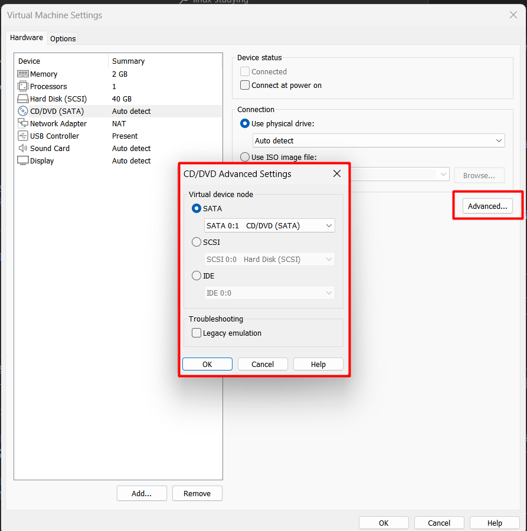

# <!-- 하드디스크 관리와 사용자별 공간 할당 -->

# 하드디스크 관리와 사용자별 공간 할당

# 하드 디스크 한개 추가하기

### 시스템의 하드디스크 공간이 부족할 때 가장 기본적으로 생각할 수 있는 방법은 하드디스크 1을 추가하는 것이다. 하드디스크 1개를 추가해 사용하는 방법을 익혀보자

### 기본적으로 우리가 운영하는 CentOS의 하드디스크는 [그림 6-1]과 같이 구성되어 있다.

### 여기에 하드디스크를 추가로 장착할 것이다. 실제 PC를 사용하는 독자는 여분의 물리 하드디스크를 장착하면 되고, 가상머신을 사용하는 독자는 실습을 통해 하드디스크를 장착해 보자

# IDE 장치와 SCSI 장치 구성

### 일단 기본 구성을 이해해보자.

### 메인보드의 IDE 0, IDE 1 슬롯 (메인보드에 케이블을 꽂을 수 있는 홈이라고 생각하면 된다.)에는 각각 2개의 IDE장치를 장착할 수 있다. 그래서 IDE 장치는 총 4개를 장착할 수 있다. 이 4개의 장치를 표기할때는 주로 IDE 0:0 , 0:1, 1:0 , 1:1 로 표기한다.

## <참조> IDE/SATA/SCSI/NVMe 장치

### 일반적으로 PC에서 사용되는 하드디스크나 CD/DVD 장치가 IDE 장치 (또는 EIDE)장치나 SATA 장치라고 생각하면 된다.서버용으로 주로 SCSI 하드디스크를 사용하며 SSD 형태의 플래시 메모리를 사용할 수 있는 NVMe 장치도 제공된다.

### 물론 IDE,SCSI , SATA , NVMe 모두 VMware에서는 어차피 가상으로 생성하기 때문에 진짜 컴퓨터의 하드디스크 종류와는 무관하다. 참고로 요즘에는 PC용 하드디스크나 CD/DVD 장치로 IDE 대신 SATA(Serial ATA)를 서버용으로 SCSI 대신 SA-SCSI(Serial Attached SCSI 줄여서 SAS)를 주로 사용한다. SCSI가 최대 16개의 장치를 연결할 수 있었다면, SA-SCSI는 최대 65,535개까지 연결할 수 있다.

---

### [그림 6-1] (책 333쪽 참조)를 보면 IDE 1:0에 CD/DVD장치가 장착되어 있다. VMware는 기본적으로 IDE 1:0에 CD/DVD 장치를 장착한다. 그러므로 IDE 장치(주로 하드디스크)를 추가하려면 나머지 비어있는 3개의 장치에 장착해야 한다.(하지만 우리는 IDE나 SATA 하드디스크가 아닌 SCSI 하드디스크를 사용할 것이다.)

### Server 에서 [Player] -> [Manage] -> [Virtual Machine Settings]를 선택해 IDE 장치를 확인할 수 있다.

### VMware 버전에 따라 CD/DVD가 SATA 또는 IDE 에 다르게 장착되어 있을 수 있다. 이 책은 ide 장치에 장착되어 있다고 가정하고 진행하며, 만약 SATA 일 경우 [그림 6-2]와 같이 변경할 수 있다. 사실 CD/DVD는 리눅스 안에서 /dev/cdrom 또는 /dev/sr0 장치로 접근하기 때문에 SATA 든 IDE든 상관이 없다.

### 나머지 빈 IDE 장치로 CD/DVD를 변경하거나 SCSI 장치로도 변경할 수 있지만 특별히 그럴 필요는 없다.

### VMware는 메인보드에 4개의 SCSI 슬롯을 제공한다. SCSI 0번의 슬롯의 경우 SCSI 0:0 ~ SCSI 0:15(SCSI 0:7 제외)까지 15개의 하드디스크를 장착할 수 있다. 또 그림에는 표현하지 않았지만 SCSI 1번 , 2번 , 3번 슬롯도 각각 사용할 수 있으므로 총 4 \* 15 = 60개의 SCSI 하드디스크를 사용할 수 있다.

### 역시 Server 에서 [Player] -> [Manage] -> [Virtual Machine Settings]를 선택해 SCSI 장치를 확인할 수 있다.

### 우리는 실습에서 10개 정도의 하드디스크를 사용할 것이므로 SCSI 0번 슬롯으로도 충분하다.

### 우리는 Server 가상머신에 80GB SCSI 하드디스크를 장착 했다. [책 28쪽] 그리고 이 하드디스크를 2개의 파티션으로 나눴다 [책 77쪽]

### 리눅스에서는 처음 장착된 SCSI 하드디스크의 이름을 /dev/sda라고 부른다. 또 추가로 SCSI 하드디스크가 장착되면 /dev/sdb , /dev/sdc , /dev/sdd 등으로 부른다. 그리고 /dev/sda 장치에서 파티션을 나누는데 이 파티션은 순차적으로 1,2,3,4를 붙여 /dev/sda1 , /dev/sda2 로 부른다.

### 그러므로 SCSI 하드디스크를 물리적으로는 /dev/sda , /dev/sdb , /dev/sdc .. 형식으로 부르면 되고, 그 장치에서 파티션이 나뉜것을 논리적으로는 /dev/sda1 , /dev/sda2 , /dev/sdb1 , /deb/sdb2 ... 형식으로 부르면 된다. 리눅스를 처음 접할 때 쉽게 혼동하는 개념이므로 잘 기억해 두자

# 하드디스크 추가하기

### [그림 6 - 1]을 보면 현재 SCSI 0:0에 Server 를 설치한 하드디스크가 1개 장착되어 있을 뿐이다. 지금부터 여기에 [그림 6 - 4]와 같이 추가 하드디스크를 새로 장착할 것이다.

### 용량이 큰 하드디스크를 장착하면 포맷하는 시간이 오래 걸리므로 작은 하드디스크 (1GB)를 하나 장착한다.(실제로는 가상이라서 큰 용량도 포맷이 오래 걸리지 않는다.) 추가한 하드디스크의 이름은 /dev/sdb가 된다. 추가 하드디스크 장치의 물리 이름인 /dev/sdb를 사용하려면 최소 1개이상의 파티션으로 나눠야한다.

### 특별히 파티션을 여러개 나눌 필요는 없으므로 1개의 파티션으로만 나눌것이다. 그래서 논리 파티션의 이름은 /dev/sdb1 이 된다.

### 리눅스에서는 이 파티션을 그냥 사용할 수 없으며 반드시 특정 디렉터리(=폴더)에 마운트(Mount)시켜야 사용할 수 있다. 그래서 우리는 /mydata 라는 디렉터리를 만들고 그 디렉터리에 마운트 할것이다.

### 리눅스에서는 하드디스크 파티션뿐만 아니라 CD/DVD나 USB메모리 등도 특정 디렉터리에 마운트해야만 사용할 수 있다. 168쪽 실습에서 CD/DVD를 넣으면 자동으로 /run/media/root/ 디렉터리 아래에 마운트되었던 것을 확인했다. 또 필요할 때는 별도의 디렉터리에 수동으로 마운트할 수도 있었다.

