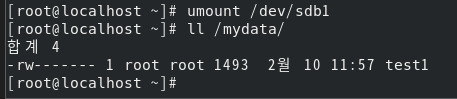

# <!-- 하드디스크 관리와 사용자별 공간 할당 -->

# 하드디스크 관리와 사용자별 공간 할당

# 하드 디스크 한개 추가하기

### 시스템의 하드디스크 공간이 부족할 때 가장 기본적으로 생각할 수 있는 방법은 하드디스크 1을 추가하는 것이다. 하드디스크 1개를 추가해 사용하는 방법을 익혀보자

### 기본적으로 우리가 운영하는 CentOS의 하드디스크는 [그림 6-1]과 같이 구성되어 있다.

### 여기에 하드디스크를 추가로 장착할 것이다. 실제 PC를 사용하는 독자는 여분의 물리 하드디스크를 장착하면 되고, 가상머신을 사용하는 독자는 실습을 통해 하드디스크를 장착해 보자

# IDE 장치와 SCSI 장치 구성

### 일단 기본 구성을 이해해보자.

### 메인보드의 IDE 0, IDE 1 슬롯 (메인보드에 케이블을 꽂을 수 있는 홈이라고 생각하면 된다.)에는 각각 2개의 IDE장치를 장착할 수 있다. 그래서 IDE 장치는 총 4개를 장착할 수 있다. 이 4개의 장치를 표기할때는 주로 IDE 0:0 , 0:1, 1:0 , 1:1 로 표기한다.

## <참조> IDE/SATA/SCSI/NVMe 장치

### 일반적으로 PC에서 사용되는 하드디스크나 CD/DVD 장치가 IDE 장치 (또는 EIDE)장치나 SATA 장치라고 생각하면 된다.서버용으로 주로 SCSI 하드디스크를 사용하며 SSD 형태의 플래시 메모리를 사용할 수 있는 NVMe 장치도 제공된다.

### 물론 IDE,SCSI , SATA , NVMe 모두 VMware에서는 어차피 가상으로 생성하기 때문에 진짜 컴퓨터의 하드디스크 종류와는 무관하다. 참고로 요즘에는 PC용 하드디스크나 CD/DVD 장치로 IDE 대신 SATA(Serial ATA)를 서버용으로 SCSI 대신 SA-SCSI(Serial Attached SCSI 줄여서 SAS)를 주로 사용한다. SCSI가 최대 16개의 장치를 연결할 수 있었다면, SA-SCSI는 최대 65,535개까지 연결할 수 있다.

---

### [그림 6-1] (책 333쪽 참조)를 보면 IDE 1:0에 CD/DVD장치가 장착되어 있다. VMware는 기본적으로 IDE 1:0에 CD/DVD 장치를 장착한다. 그러므로 IDE 장치(주로 하드디스크)를 추가하려면 나머지 비어있는 3개의 장치에 장착해야 한다.(하지만 우리는 IDE나 SATA 하드디스크가 아닌 SCSI 하드디스크를 사용할 것이다.)

### Server 에서 [Player] -> [Manage] -> [Virtual Machine Settings]를 선택해 IDE 장치를 확인할 수 있다.

### VMware 버전에 따라 CD/DVD가 SATA 또는 IDE 에 다르게 장착되어 있을 수 있다. 이 책은 ide 장치에 장착되어 있다고 가정하고 진행하며, 만약 SATA 일 경우 [그림 6-2]와 같이 변경할 수 있다. 사실 CD/DVD는 리눅스 안에서 /dev/cdrom 또는 /dev/sr0 장치로 접근하기 때문에 SATA 든 IDE든 상관이 없다.

### 나머지 빈 IDE 장치로 CD/DVD를 변경하거나 SCSI 장치로도 변경할 수 있지만 특별히 그럴 필요는 없다.

### VMware는 메인보드에 4개의 SCSI 슬롯을 제공한다. SCSI 0번의 슬롯의 경우 SCSI 0:0 ~ SCSI 0:15(SCSI 0:7 제외)까지 15개의 하드디스크를 장착할 수 있다. 또 그림에는 표현하지 않았지만 SCSI 1번 , 2번 , 3번 슬롯도 각각 사용할 수 있으므로 총 4 \* 15 = 60개의 SCSI 하드디스크를 사용할 수 있다.

### 역시 Server 에서 [Player] -> [Manage] -> [Virtual Machine Settings]를 선택해 SCSI 장치를 확인할 수 있다.

### 우리는 실습에서 10개 정도의 하드디스크를 사용할 것이므로 SCSI 0번 슬롯으로도 충분하다.

### 우리는 Server 가상머신에 80GB SCSI 하드디스크를 장착 했다. [책 28쪽] 그리고 이 하드디스크를 2개의 파티션으로 나눴다 [책 77쪽]

### 리눅스에서는 처음 장착된 SCSI 하드디스크의 이름을 /dev/sda라고 부른다. 또 추가로 SCSI 하드디스크가 장착되면 /dev/sdb , /dev/sdc , /dev/sdd 등으로 부른다. 그리고 /dev/sda 장치에서 파티션을 나누는데 이 파티션은 순차적으로 1,2,3,4를 붙여 /dev/sda1 , /dev/sda2 로 부른다.

### 그러므로 SCSI 하드디스크를 물리적으로는 /dev/sda , /dev/sdb , /dev/sdc .. 형식으로 부르면 되고, 그 장치에서 파티션이 나뉜것을 논리적으로는 /dev/sda1 , /dev/sda2 , /dev/sdb1 , /deb/sdb2 ... 형식으로 부르면 된다. 리눅스를 처음 접할 때 쉽게 혼동하는 개념이므로 잘 기억해 두자

# 하드디스크 추가하기

### [그림 6 - 1]을 보면 현재 SCSI 0:0에 Server 를 설치한 하드디스크가 1개 장착되어 있을 뿐이다. 지금부터 여기에 [그림 6 - 4]와 같이 추가 하드디스크를 새로 장착할 것이다.

### 용량이 큰 하드디스크를 장착하면 포맷하는 시간이 오래 걸리므로 작은 하드디스크 (1GB)를 하나 장착한다.(실제로는 가상이라서 큰 용량도 포맷이 오래 걸리지 않는다.) 추가한 하드디스크의 이름은 /dev/sdb가 된다. 추가 하드디스크 장치의 물리 이름인 /dev/sdb를 사용하려면 최소 1개이상의 파티션으로 나눠야한다.

### 특별히 파티션을 여러개 나눌 필요는 없으므로 1개의 파티션으로만 나눌것이다. 그래서 논리 파티션의 이름은 /dev/sdb1 이 된다.

### 리눅스에서는 이 파티션을 그냥 사용할 수 없으며 반드시 특정 디렉터리(=폴더)에 마운트(Mount)시켜야 사용할 수 있다. 그래서 우리는 /mydata 라는 디렉터리를 만들고 그 디렉터리에 마운트 할것이다.

### 리눅스에서는 하드디스크 파티션뿐만 아니라 CD/DVD나 USB메모리 등도 특정 디렉터리에 마운트해야만 사용할 수 있다. 168쪽 실습에서 CD/DVD를 넣으면 자동으로 /run/media/root/ 디렉터리 아래에 마운트되었던 것을 확인했다. 또 필요할 때는 별도의 디렉터리에 수동으로 마운트할 수도 있었다.

# [실습을 해보자!!]

### 하드 디스크 선택

### SCSI 선택

### CREATE a new virtual Disk 를 선택한 후 1GB 와 Store virtual disk as a single file 선택

### [Specify Disk file]에서 'scsi0-1/vmdk'를 입력해고 finish 클릭

### 확인 (SCSI 0:1)

### 컴퓨터를 부팅 시키면 하드 디스크가 2개가 장착된 것을 확인할 수 있다.

 

## 파티션

### 하드디스크를 처음 장착하면 그냥 기계일 뿐이다. 그래서 하드디스크를 사용하려면 먼저 파티션(Partition)을 설정해야 한다. 만약 하드디스크를 통째로 하나의 파티션으로 사용하려면 1개의 파티션으로 전체를 설정하면 되고, 2개로 나눠서 사용하려면 2개의 파티션을 설정하면 된다.

### 파티션은 Primary 파티션과 Extended 파티션 두가지가 있는데, 1개의 하드디스크는 4개의 Primary 파티션까지 설정할 수 있다. 만약 파티션을 5개 이상 설정하고 싶다면 3개의 Priamry 파티션과 1개의 Extended 파티션으로 설정한 후 Extended 파티션을 2개 이상의 Logical 파티션으로 설정해야 한다.

| 순서 |         명령어         |                                 내용                                  |
| :--: | :--------------------: | :-------------------------------------------------------------------: |
|  1   |    # fdisk /dev/sdb    |                       SCSI 0:1 하드디스크 선택                        |
|  2   |      Command : n       |                          새로운 파티션 분할                           |
|  3   |       Select : p       |                          Primary 파티션 선택                          |
|  4   |  Partition number : 1  |     파티션 번호 1번 선택(Primary 파티션은 최대 4개까지 생성 가능)     |
|  5   | First sector : [Enter] |    시작 섹터 번호 입력(1개의 파티션만 계획중이므로 첫 섹터로 설정)    |
|  6   | Last sector : [Enter]  | 마지막 섹터 번호 입력(1개의 파티션만 계획중이므로 마지막 섹터로 설정) |
|  7   |      Command : p       |                          설정된 내용을 확인                           |
|  8   |      Command : w       |                               설정 저장                               |

### CentOS 리눅스에서 섹터 하나는 512바이트로 설정되어 있다. 그러므로 512 \* 2097152 = 1,024MB(=1GB)가 된다.

### 이는 VMware의 가상 하드디스크에 적용되는 크기일 뿐, 실제 하드디스크라면 상황이 다를 수 도 있다. 그리고 시작 섹터가 2048번인 이유는 제일 앞의 0 ~ 2047(=1MB) 부분이 시스템 성능 향상을 위해 사용하지 않는 부분이기 때문이다. 또 Blocks의 단위는 1kb(=1024바이트)로 설정되어 있다.

### 이로써 할당된 파티션 장치의 이름은 /dev/sdb1이다. 파일 시스템을 ext4형식으로 생성하자(이 과정이 포맷이라고 생각하면 된다.) mkfs -t 파일시스템 파티션장치 명령을 입력하거나 간단히 mkfs.파일시스템 파이션장치 명령을 입력한다.

### CentOS 는 ext2 , ext3 , ext4 ,xfs 파일 시스템을 사용할 수 있다. ext4 및 xfs는 ext2 나 ext3 파일 시스템보다 여러 면에서 향상된 파일 시스템이므로 swap 을 제외하고는 ext4나 xfs 파일 시스템을 사용하는 것이 바람직 하다. 이 책에서 추가하는 디스크의 파일 시스템은 주로 ext4 파일 시스템이다.

| 순서 |        명령어         |             내용             |
| :--: | :-------------------: | :--------------------------: |
|  9   | # mkfs.ext4 /dev/sdb1 | ext4파일 시스템생성 (= 포맷) |

 

## /dev/sdb1 파일 시스템을 사용하기 위해 디렉터리에 마운트 하자

### 먼저 mkdir /mydata 명령을 입력해 마운트할 디렉터리를 만들고 cp anaconda0ks.cfg /mydata/test1 명령을 입력해 anaconda-ks.cfg 파일을 test1이라는 이름의 파일로 바꿔 /mydata 디렉터리에 복사해보자 (아무 파일이나 상관없다). ls -l /mydata/ 명령을 입력하면 test1 파일을 확인할 수 있다.

### /mydata 디렉터리에 있는 test1 이라는 파일은 기존의 /dev/sda2에 저장된 상태다. (아직 /dev/sdb1 에서 마운트되지 않았기 때문)

### 이제 mount /dev/sdb1 /mydata 명령을 입력해 포맷이 완료된 /dev/sdb1 장치를 /mydata 디렉터리에 마운트 하자 그리고 ls -l /mydata 명령을 입력해 /mydata 디렉터리 안을 확인한다. 다음에는 cp anaconda-ks.cfg /mydata/test2 명령을 입력해 anaconda-ks.cfg 파일을 test2 라는 이름의 파일로 바꿔 /mydata 디렉터리에 복사하자.

### lost+found 디렉터리는 fsck 등의 명령어로 파일 스스템을 점검할 때 생성되는 파일이 저장되는 곳이다 그냥 없는 것처럼 무시하면 된다.

### 이제 /mydata 디렉터리는 /dev/sda2가 아닌 /dev/sdb1에 있다. 즉 /mydata 디렉터리에 어떤 파일을 복사한다는 것은 /dev/sdb1 장치에 파일을 저장한다는 의미다. 앞에서 복사한 test2파일은 /de/sdb1 장치에 저장되어 있다.

### /dev/sda2에 있던 test1 파일은 없어진것이 아니라 /mydata 디렉터리가 /dev/sdb1에 마운트 되어 있기 때문에 잠시 /dev/sda2에 숨어있다고 생각하면 된다

### 따러서 umount 를 진행하면 test1 파일이 다시 보이게 된다.

### 또한 test2 파일도 없어진 것이 아니라 /dev/sdb1 장치에 그대로 보관되어 있다. 언제든지 /dev/sdb1을 아무 디렉터리에나 마운트하면 다시 test2 파일을 사용할 수 있다.

| 순서 |          명령어           |                     내용                      |
| :--: | :-----------------------: | :-------------------------------------------: |
|  10  | # mount /dev/sdb1 /mydata | 나눴던 하드디스크1번을 아무 디렉터리에 마운트 |

 

## 이번에는 컴퓨터를 켤때 /dev/sdb1 장치가 항상 /mydata에 마운트 되어 있도록 설정하자

### /etc/fstab 파일을 vi 에디터나 gedit으로 열어서 제일 아랫부분에 다음을 추가하자

/dev/sdb1 /mydata ext4 defaults 0 0

### /etc/fstab 파일은 리눅스가 부팅될 때마다 자동으로 읽는 중요한 파일이다. 이 파일에는 마운트 정보가 수록되어 있으며, 글자가 틀릴 경우 아예 부팅이 되지 않을 수 있으므로 수정시 주의를 요한다.

### 6개의 필드는 장치 이름, 마운트될 디렉터리 , 파일 시스템 , 속성 dump 사용 여부 , 파일 시스템 체크 여부를 의미한다.

### 파일 시스템과 속성을 defaults 로 설정하면 읽기/쓰기/실행 등 대부분 작업이 가능하다. dump 사용 여부를 1로 설정하면 리눅스 dump 명령을 이용한 백업이 가능하다. 파일 시스템 체크 여부를 1 또는 2로 설정하면 부팅 시 이 파티션을 체크하는데, 1인 파일 시스템을 먼저 체크하고 2는 1을 체크한 후에 체크한다. 3은 없다. 일반적으로 / 파일 시스템을 1로 설정하고 그 외에는 2로 설정하거나 별로 중요하지 않다면 0으로 설정한다. 0으로 설정하면 파일 시스템 체크를 생략하므로 부팅 속도가 향상된다.

 

# 여러개의 하드디스크를 하나처럼 사용하기

### 독자가 시슽메 관리자라고 가정해보자. 회사 시스템의 저장 공간이 부족하다면 아마 구매 담당 부서에 하드디스크 구매를 요청할 것이고, 구매 담당자는 요구한 용량의 하드디스크를 구매해서 시스템 관리자인 독자에게 전달할 것이다.

### 그런데 40TB 용량을 요청했는데 하드디스크는 10TB 2개와 20TB 1개가 들어왓다. 독자는 40TB 하나를 추가하기를 원했던 것이다.

### 하드디스크 3개를 사용하면 불편한 점이 발생한다. 총 용량은 40TB 지만 각 하드디스크의 용량을 넘지 않도록 파일을 잘 분배해야한다. 그렇지 않아도 할 일이 많은 리눅스 시스템 관리인데 할 일이 하나 더 생긴것이다. 이럴 땐 차라리 누가 하드디스크 3개를 40TB 하드디스크 하나로 바꿔준다면 당장 그렇게 할 것이다.

### 이번에는 여러개의 하드 디스크를 하나의 하드디스크처럼 사용할 수 있는 RAID 와 LVM에 대해 알아보자

 

# RAID 의 정의와 개념

### 서버 컴퓨터의 저장 장치 대부분은 하드웨어 RAID 또는 소프트웨어 RAID 방식을 사용한다. 그렇다면 RAID 가 무엇인지 왜 필요한지 알아보자

### RAID(Redundant Array of Inexpensive/independent Disks)는 여러 개의 하드디스크를 하나의 하드디스크처럼 사용하는 방식이다. 비용을 절감하면서도 신뢰성을 높이며 성능까지 향상시킬 수 있다. RAID 종류는 크게 하드웨어 RAID 와 소프트웨어 RAID 로 나뉜다.

## 하드웨어 RAID

### 하드웨어 RAID는 하드웨어 제조업체에서 여러개의 하드디스크를 연결한 장비를 만들어 그 자체를 공급하는 것이다. 하드웨어 RAID는 좀 더 안정적이고 각 제조업체에서 기술 지원을 받을 수 있기 때문에 많이 선호하는 방법이다. 최근에는 저렴한 가격의 제품도 출시되고 있지만, 안정적이고 성능 좋은 제품은 상당히 고가다.

### 대개 하드웨어 RAID 는 고가의 경우 SA-SCSI 하드디스크를, 중저가는 SATA 하드디스크를 사용해 만들어 진다. 하드웨어 RAID는 각 제조업체에 따라 조작 방법이 다를 수 있으므로 여기서는 논외로 한다.

## 소프트웨어 RAID

### 고가 하드웨어 RAID의 대안으로, 하드디스크만 여러개 있으면 운영체제에서 지원하는 방식으로 RAID를 구성하는 방법을 말한다. 하드웨어 RAID와 비교하면 신뢰성이 속도 등이 떨어질 수 있지만, 아주 저렴한 비용으로 좀 더 안전하게 데이터를 저장할 수 있다는 점에서 적극 고려해볼 수 있는 방식이다. 앞으로 소개하는 방식은 모두 소프트웨어 RAID 방식이지만 하드웨어 RAID도 같은 개념으로 하드웨어에 구현한 것일 뿐 별반 다르지 않다.

## RAID 레벨

### RAID 는 기본적으로 구성 방식에 따라 Linear RAID, RAID 0 ,RAID 1 , RAID 2 , RAID 3 , RAID 4 , RAID 5의 일곱가지로 분류 할 수 있다. 실무에서 주로 사용하는 방식은 Linear RAID, RAID 0 , RAID 1, RAID 5의 변형인 RAID 6, 그리고 RAID 1과0의 혼합인 RAID 1+0 등이다. 여기서는 실제로 많이 사용하는 구성 방식 위주로 살펴본다. 앞에서 실습했던 단순 볼륨과 많이 쓰이는 RAID 방식인 Linear RAID, RAID 0 ,RAID 1 , RAID 5 , RAID 6울 비교하면 [그림 6 -23]과 같다

### 참조 348쪽 그림

|           하드디스크 구성 방식            |                                         내용                                          |
| :---------------------------------------: | :-----------------------------------------------------------------------------------: |
| 단순 볼륨 (단, RAID 방식에 포함되지 않음) |                          사용량 1T(N)   1개 하드디스크만                           |
|                Linear RAID                |            사용량 2T(N)   2개 이상 , 1번째부터 저장 , 디스크 추가 기능             |
|                  RAID 0                   |            사용량 2T(N)   2개 이상 , 동시 저장 , 가장 빠름 , stripping             |
|                  RAID 1                   |           사용량 1T(N/2)   2개 , 동시 저장 , 결함 허용 제공 , Mirroring            |
|                  RAID 5                   |  사용량 2T(N-1)   3개 이상 , 결함 허용 제공 , 패리티 정보 사용 , 공간 호율이 좋음  |
|                  RAID 6                   | 사용량 2T(N-2)   4개 이상 , 결함 허용 제공 , RAID 5의 개선 , 중복 패리티 정보 사용 |

## 단순 볼륨

### 하드디스크 하나를 볼륨(Volume) (묶음) 하나로 사용하는 방법이며 RAID 방식에는 포함되지 않는다. chapter 6 실습에서 이미 해봤다.

## Linear RAID 와 RAID 0

### 두 방식 모두 최소 2개의 하드디스크가 필요하다 2개 이상의 하드디스크를 1개의 볼륨을 사용한다는 점은 비슷해 보인다. 하지만 가장 큰 차이점은 저장 방식이다.

### Linear RAID 방식은 2개 이상의 하드디스크를 1개의 볼륨으로 사용하며 파일이 저장되는 방식은 앞 하드디스크에 데이터가 완전히 저장된 후 다음 하드디스크에 데이터를 저장한다. 즉, 앞 하드디스크에 데이터가 완전히 저장되지 않으면 다음 하드디스크는 전혀 사용 되지 않는 것이다.

### 이와 달리 RAID 0 방식은 모든 하드디스크를 동시에 사용한다. 3개의 하드디스크를 사용할 경우 단순화한 예를 들면 "안녕하세요?우재남입니다"(12 바이트라고 가정하자)라는 내용은 밑과 같이 저장된다.

| 하드디스크 구성 방식 |                           내용                           |
| :------------------: | :------------------------------------------------------: |
|     Linear RAID      | DISK1 : 안녕하세요? 우재남입니다   DISK2:   DISK3: |
|        RAID 0        | DISK1 : 안세우입   DISK2:녕요재니   DISK3:하?남다  |

### Linear RAID 는 1번째 하드디스크가 모두 채워진 후에 2번째 하드디스크를 사용하기 시작한다. 이와 달리 RAID 0는 1번째 , 2번째 ,3번째 하드디스크에 동시에 저장된다.

### 여기서 '동시에'라는 말은 중요한 의미를 갖는다. Linear RAID에서 위의 문자열을 저장되는 시간이 한글자당 1초라고 가정한다면 Linear RAID의 경우 저장되는 데 총 12초의 시간이 소요된다. 하지만 RAID 0 의 경우에는 동시에 하드디스크 3개를 사용하므로 각 하드디스크당 4 글자만 저장된다. 즉 4초면 저장이 완료된다.

### 이렇게 여러개의 하드디스크에 동시에 저아되는 방식을 '스트라이핑(stripping)' 방식 이라고 부른다.

### RAID 0 방식은 저장되는 시간 또는 석도면에서 RAID 방식 중 성능이 가장 뛰어나며 하드디스크 개수가 가진 총 용량을 모두 사용하므로 공간 효율이 아주좋다. 즉, 1TB 3개를 사용하면 3TB의 요량을 사용할 수 있으므로 100% 공간의 효율성을 가진다.(이럴때는 100%인것이다.)

### 다만 단점을 보자. RAID 0의 경우 3개의 하드디스크중 하나가 고장나면 문제가 발생한다. 즉, 모든 데이터를 잃어버린다는 것이다. 예를 들어 두 번째 하드디스크가 고장났다면 글자는 '안X하세X?우X남입X다'가 될 것이다.

### 그러므로 RAID 0 방식을 사용하는 데이터는 '빠른 성능을 요구하되, 혹시 전부 잃어버려도 큰 문제가 되지 않는 자료'를 저장하는데 적절한 방식이다.

### Linear RAID의 장점은 각 하드디스크의 용량이 달라도 전체 용량을 문제없이 사용할 수 있어 공간 효율성이 100%이다. RAID 0 이라면 100TB 와 1TB 하드디스크 2개로 구성했을 때 사용할 수 있는 총 용량은 2TB밖에 되지 않는다. 저장 속도를 높이려고 언제나 데이터를 나눠서 각 하드디스크에 동시에 저장하도록 설계되었기 때문이다. 하지만 Linear RAID는 1번째 하드디스크부터 순차적으로 데이터를 저장하기 때문에 총 용량이 101TB가 된다.

 

## RAID 1

### RAID 1 방식의 핵심은 '미러링(Mirroring)'이라고 할 수 있다. 즉, 똑같은 데이터의 거울을 만들어 놓는 것이다. 예를 들어 하드디스크 2개를 RAID 1 방식으로 구성한 후 "안녕하세요?우재남입니다"를 저장하면 [그림 351쪽]과 같다. 그런데 12바이트를 저장하는 데 2배의 용량인 24바이트가 소요되었음을 확인할 수 있다. 즉, 데이터를 저장하는 데 2배의 용량을 사용한다. 이 말은 결국 총 하드디스크 용량의 절반 밖에 사용하지 못한다는 말과 같다.

| 하드디스크 구성 방식 |                                 내용                                  |
| :------------------: | :-------------------------------------------------------------------: |
|        RAID 1        | DISK1 : 안녕하세요? 우재남입니다   DISK2: 안녕하세요? 우재남입니다 |

### RAID 1의 장점은 2개의 하드디스크 중 하나가 고장나도 데이터가 손상 되지 않는 다는 것이다. 이것을 '결함 허용(Fault-tolerance)을 제공한다'라고 표현한다.

### 반대로 단점은 실제 계획보다 2배 큰 저장공간이 필요하다는 것이다(즉, 비용이 2배다) 따라서 공간 효율이 50%밖에 되지 않는다. 이를 '공간 효율이 떨어진다'라고도 표현한다.

### RAID 1 방식을 사용하는 데 적당한 경우는 '하드디스크가 고장나도 없어져서는 안 될 중요한 데이터'가 있을 때라고 생각하면 된다. 즉, 비용이 많이 들더라도 중요도가 높은 데이터들을 저장할 때 사용한다.

### 이번에는 저장 속도를 생각해보자. 똑같은 데이터를 2번 저장하므로 2배의 시간이 걸린다고 생각되지만, 똑같은 데이터가 다른 하드디스크에 동시에 저장되는 것이므로 저장속도는 빠르지도 느리지도 않다. 이 예에서 12바이트를 저장하는 데 12초가 걸린다면, 각각 저장되는 것이므로 총 12초의 시간이 걸린다.

 

## RAID 5

### 각각의 장점이 명확하다. 그래서 RAID 1처럼 데이터의 안정성이 어느정도 보장되면서 RAID 0 처럼 공간 효율성도 좋은 방식을 요구하게 되었다. 이를 어느정도 포용하는 방식이 RAID 5이다.

### RAID 5는 최소한 3개 이상의 하드디스크가 있어야 구성할 수 있으며 대부분 5개 이상의 하드디스크로 구성한다. 하드디스크에 오류가 발생하면 패리티(Parity)를 이용해서 데이터를 복구할 수 있다.

### 예를 들어보자 이번에는 '000 111 010 011'이라는 12 bit 데이터를 4개의 하드디스크로 구성된 RAID 5에 저장해본다.

### [그림 352쪽 과 353쪽]에서 네모로 표시된 데이터는 패리티 데이터다. 각 행에 하나씩 패리티 데이터를 사용하며 첫번째 행은 sdd , 두번째 행은 sdc , 세번째 행은 sdb와 같은 순서로 패리티 사용 공간을 비워놓는다. 처음 3bit인 000을 저장할 때는 sda에 0 , sdb에 0 , sdc에 0을 저장하고 sdd에는 패리티를 저장할 공간으로 비워둔다. 두번째 3bit인 111을 저장할 때는 sda에 1 ,sdb에 1, sdc는 패리티 데이터로 비워두고 sdd에 1을 저장한다. 이렇게 데이터를 저장한 상태가 [그림 책 353쪽]이다.

### 예의 [그림]의 경우 짝수 패리티를 사용했는데 짝수 패리티란 각 행이 짝수가 되게 만들려고 숫자를 채워 넣는것이다.

### 짝수 패리티를 사용하기로 했으므로 첫 행의 '0+0+0+Parity'는 짝수가 되어야 한다. 그러므로 첫행의 패리티는 0이 입력된다. 두번째 행도 '1+1+Parity+1 = 짝수'이므로 패리티는 1이 된다. 세번째 010 과 네번째 011도 마찬가지다. 이렇게 저장이 완료된 RAID 5는 어느정도 결함을 허용한다. 네 개의 하드디스크 중 1개가 고장나도 원래의 데이터를 추출할 수 있는 것이다.

### 이번에는 두 번째 하드디스크인 sdb가 고장났다고 가정하고 sdb의 데이터 저장 상태를 유추해보자

### [그림 354쪽]... 뭔말이야 이게 ㅋㅋㅋㅋㅋㅋㅋㅋㅋㅋㅋㅋㅋ

### RAID 5의 장점은 어느 정도 결함을 허용하며 저장 공간 효율도 좋다는 것이다. 각 하드디스크의 용량이 1TB라고 가정하면 총 사용할 수 있는 공간은 3TB로 전체 용량의 75%다. 만약 RAID 5를 하드디스크 10개로 구성했다면 전체 10TB 중 1개의 패리티로 사용하는 1TB 용량을 제외하고 나머지 9TB를 사용할 수 있으므로 전체 용량의 90%를 사용할 수 있다.(하드디스크의 개수를 N개라고 하면 N-1만큼의 공간을 사용할 수 있다). 그러므로 여러개의 하드디스크로 RAID 5를 구성할 수록 저장공간의 효율을 높일 수 있다.

## RAID 6

### RAID 5 방식을 사용할 때는 하드디스크 1개가 고장나고 데이터에 이상이 없다는 것을 확인했다. 그렇다면 10개의 하드디스크로 RAID 5를 구성할 때 2개의 하드디스크가 동시에 고장난다면 어떻게 될까?

### 불행히도 모든 데이터를 전혀 복구할 수 없게 된다. 이런 경우 여러개의 하드디스크로 RAID 5를 구성할 때 아무래도 신뢰성을 좀 더 높이고 싶을 것이다.

### RAID 6 방식은 RAID 5 방식이 개선된 것으로, RAID 5는 1개의 패리티를 사용하지만 RAID 6은 2개의 패리티를 사용한다. 공간은 효율은 RAID 5보다 약간 낮지만 2개의 하드디스크가 동시에 고장나도 데이터에는 이상이 없도록 한다.

### 10개의 하드디스크로 RAID 6을 구성할 때 1개당 1TB라고 가정한다면 '하드디스크 개수 - 2'인 8TB의 용량을 사용할 수 있다. RAID 5의 경우 최소 3개의 하드디스크로 구성해야 했지만 RAID 6는 최소 4개의 하드디스크로 구성해야 한다는 점도 기억하자.

### 결론적으로 RAID 6은 공간 효율이 RAID 5보다 약간 낮은 반면, 데이터의 신뢰도는 더욱 높아지는 효과를 갖는다. 또 RAID 5는 패리티를 1개만 생성하면 되지만, RIAD 6패리티를 2개 생성해야 하므로 내부적인 쓰기(Write)알고리즘이 복잡해져 RAID 5와 비교했을 때 성능(속도)이 약간 떨어진다.

## 그외 RAID를 조합하는 방법

### 앞에서 익힌 기본적인 RAID 방식을 조합해서 구성할 수도 있다. 그 중 많이 사용하는 예로 RAID 1+0 방식이 있다. RAID 1(Mirroring)로 구성한 데이터를 다시 RAID 0(stripping)으로 구성하는 방법이다. 신뢰성(안정성)과 성능(속도)을 동시에 확보할 수 있다.

| 하드디스크 구성 방식 |                              기본 데이터                              | 미러링                                                                |
| :------------------: | :-------------------------------------------------------------------: | --------------------------------------------------------------------- |
|       RAID 1+0       | DISK1 : 안녕하세요? 우재남입니다   DISK2: 안녕하세요? 우재남입니다 | DISK1 : 안녕하세요? 우재남입니다   DISK2: 안녕하세요? 우재남입니다 |

### RAID 1+0 방식은 전체 12글자 (12바이트)를 저장하는 데 각 하드디스크당 6글자만 저장하면 되므로 총 6초밖에 걸리지 않았다. 또 왼쪽 RAID 1과 오른쪽 RAID 1에서 각각 하드디스크가 1개씩 고장나도 데이터는 안전하므로 신뢰성(안정성)까지 얻을 수 있다. 이 외에도 아주 중요한 데이터일 경우 RAID 1+6 방식을 사용할 수도 있다.

 
 

## [실습 356쪽]

### 하드 디스크를 추가한다. (SCSI)

| 순서 |         명령어         |                                 내용                                  |
| :--: | :--------------------: | :-------------------------------------------------------------------: |
|  1   |    # fdisk /dev/sdb    |                       SCSI 0:1 하드디스크 선택                        |
|  2   |      Command : n       |                          새로운 파티션 분할                           |
|  3   |       Select : p       |                          Primary 파티션 선택                          |
|  4   |  Partition number : 1  |     파티션 번호 1번 선택(Primary 파티션은 최대 4개까지 생성 가능)     |
|  5   | First sector : [Enter] |    시작 섹터 번호 입력(1개의 파티션만 계획중이므로 첫 섹터로 설정)    |
|  6   | Last sector : [Enter]  | 마지막 섹터 번호 입력(1개의 파티션만 계획중이므로 마지막 섹터로 설정) |
|  7   |      Command : t       |                         파일 시스템 유형 선택                         |
|  8   |     Hex Code : fd      |  'Linux raid autodetect' 유형 번호 (L을 입력하면 전체 유형이 출력됨)  |
|  9   |      Command : p       |                          설정된 내용을 확인                           |
|  10  |      Command : w       |                               설정 저장                               |

## 계속 /dev/sdb ~ /dev/sdj 까지 나머지 하드디스크 8개의 파티션을 생성

 

# Linear RAID 구축

### 준비가 완료되었다면 본격적으로 RAID 장치를 만들어 보자

### 사용할 하드디스크는 SCSI 0:1[/dev/sdb] 과 SCSI 0:2[/dev/sdc]

1. 부팅하고 root 에 접속하고 fdisk -l /dev/sdb; fdisk -l /dev/sdc 명령을 파티션 상태를 화면에 출력해준다. 그리고 명령어 사이를 세미콜론(;)으로 구분했는데 명령을 연속으로 실행할 때 사용한다. (확인 용도)

- fdisk -l /dev/sdb; fdisk -l /dev/sdc
  

2. mdadm 명령어를 사용해서 실제 RAID를 구성 하자 /dev/sdb1과 /dev/sdc1을 Linear RAID 장치인 /dev/md9로 생성하고 잘 생성되었는 지 확인한다.

- mdadm --create /dev/md9 --level=linear --raid-devices=2 /dev/sdb1 /dev/sdc1
- mdadm --detail --scan
  

### <참조> mdadm 명령

mdadm 명령은 CentOS 에서 RAID 장치를 생성/관리하는 명령어다. 이 명령의 옵션이 갖는 의미는 다음과 같다.
|옵션|내용|
|:--:|:--:|
|--create /dev/md9|md9 장치에 RAID 생성|
|--level=linear|Linear RAID 지정. 0은 RAID 0 , 1은 RAID 1 등으로 지정|
|--raid-devices=2 /dev/sdb1 /dev/sdc1| 2개의 하드디스크를 사용하며, 이어서 나오는 것은 장치 이름|
|mdadm --stop /dev/md9|RAID 장치인 /dev/md9 중지|
|mdadm --run /dev/md9|중지된 RAID 장치 가동|
|mdadm --detail /edv/md9|/dev/md9 장치의 상세 내역 출력|

3. mkfs.ext4 /dev/md9 또는 mkfs -t ext4 /dev/md9/ 명령을 입력해 /dev/md9 파티션 장치의 파일 시스템을 생성한다. 즉 , 포맷하는 과정이다.

- mkfs.ext4 /dev/md9 또는 mkfs -t ext4 /dev/md9/

4. mkdir /raidLinear 로 마운트할 디렉터리를 생성하고 mount /dev/md9 /raidLinear 명령을 입력해 마운트 시킨다.

- df 명령을 입력해서 보면 /raidLinear 디렉터리에 약 2.8GB 가량 여유 공간이 있음을 확인할 수 있다. /dev/sdb는 2GB /dev/sdc는 1GB 용량이므로 Linear RAID는 2개의 하드디스크 용량을 모두 사용하기 때문에 3GB 정보가 나왔다.
  

5. 이번에는 컴퓨터를 켤때 언제든지 /dev/md9 장치가 /raidLinear 디렉터리에 마운트 되어 있도록 설정하자 /etc/fstab 파일을 vi 에디터로 열어 다음 부분을 추가하자

- /dev/md9 /raidLinear ext4 defaults 0 0
  

6. mdadm --detail /dev/md9 명령을 입력해 구축한 Linear RAID를 자세히 확인해 보자
   

### RAID 레벨은 linear , Array Size (옹량)은 3GB , Raid Devices (장치 개수)는 2개이다. 현재 작동 중인 장치 (하드디스크)는 2개이며, 맨 아래에는 장치의 상세한 내용과 함께 /dev/sdb1 과 /deb/sdc1을 사용한다는 내용이 출력된다.

### 이상으로 Linear RAID 를 구성했다.

 

# RAID 0 구축

### 이번에는 앞에서 구성한 Linear RAID와 거의 비슷한 방법으로 RAID 0을 구성해본다.

### 차이점은 RAID 장치를 /dev/md0 으로 사용하는 것과 mdadm 명령을 사용할 때 '--level=0'으로 설정하며 마운트할 디렉터리는 /raid0 정도라는 것 뿐이다.

### 명령어

| 순서 |                                 명령어                                 |                              내용                               |
| :--: | :--------------------------------------------------------------------: | :-------------------------------------------------------------: |
|  1   | mdadm --create /dev/md0 --level=0 --raid-devices=2 /dev/sdd1 /dev/sde1 |     /dev/sdd1 과 /dev/sde1을 RAID 0장치인 /dev/md0으로 생성     |
|  2   |                         mdadm --detail --scan                          |                      잘 생성되었는지 확인                       |
|  3   |             mkfs.ext4 /dev/md0 또는 mkfs -t ext4 /dev/md0              |                   /dev/md0 파티션 장치를 포맷                   |
|  4   |                               mkdir /raid0                                |                     마운트할 디렉터리 생성                      |
|  5   |                         mount /dev/md0 /raid0                          |                             마운트                              |
|  6   |                                   df                                   |                              확인                               |
|  7   |          /etc/fstab 에   /dev/md0 /radi0 ext4 defaults 0 0          | 컴퓨터를 켤때 언제든지 /dev/md0 장치가 /raid0 디렉터리에 마운트 |

 

# RAID 1 구축

### 앞의 RAID 0와 거의 동일하다. (/dev/sdf 와 /dev sdg를 사용)

### 명령어

| 순서 |                                 명령어                                 |                              내용                               |
| :--: | :--------------------------------------------------------------------: | :-------------------------------------------------------------: |
|  1   | mdadm --create /dev/md1 --level=1 --raid-devices=2 /dev/sdf1 /dev/sdg1|     /dev/sdf1 과/dev/sdg1을 RAID 1장치인 /dev/md1으로 생성   Continue creating array 메시지에 y(yes)를 누름     |
|  2   |                         mdadm --detail --scan                          |                      잘 생성되었는지 확인                       |
|  3   |             mkfs.ext4 /dev/md1 또는 mkfs -t ext4 /dev/md1              |                   /dev/md1 파티션 장치를 포맷                   |
|  4   |                               mkdir /raid1                                |                     마운트할 디렉터리 생성                      |
|  5   |                         mount /dev/md1 /raid1                          |                             마운트                              |
|  6   |                                   df                                   |                              확인                               |
|  7   |          /etc/fstab 에   /dev/md1 /radi1 ext4 defaults 0 0          | 컴퓨터를 켤때 언제든지 /dev/md1 장치가 /raid1 디렉터리에 마운트 |

### RAID 0인 /radi0 디렉터리 용량이 약 2GB인데 RAID 1인 /raid1 디렉터리는 1GB 정도 밖에 되지 않는다는 것을 확인할 수 있다.
### 동일한 데이터를 2회 저장하므로 실제 가용 용량은 2GB의 절반인 1GB정도로 나온다.

 

# RAID 5 구축
### 이번에는 RAID 5를 만들다 방법은 앞서 진행한 것과 거의 비슷하며, 하드디스크 개수만 최소 3개 이상으로 구성하면 된다.
### 책 370쪽을 참조해 그림으로 확인해보자
### 명령어

| 순서 |                                 명령어                                 |                              내용                               |
| :--: | :--------------------------------------------------------------------: | :-------------------------------------------------------------: |
|  1   | mdadm --create /dev/md5 --level=5 --raid-devices=3 /dev/sdh1 /dev/sdi1 /dev/sdj1|     /dev/sdh1 과/dev/sdi1 /dev/sdj1을 RAID 5장치인 /dev/md5으로 생성   만약 경고 창이 나오면 그냥 두고 약 1 - 2분 정도 기다리자. 자동으로 없어진다.     |
|  2   |                         mdadm --detail --scan                          |                      잘 생성되었는지 확인                       |
|  3   |             mkfs.ext4 /dev/md5 또는 mkfs -t ext4 /dev/md5              |                   /dev/md5 파티션 장치를 포맷                   |
|  4   |                               mkdir /raid5                                |                     마운트할 디렉터리 생성                      |
|  5   |                         mount /dev/md5 /raid5                          |                             마운트                              |
|  6   |                                   df                                   |                              확인                               |
|  7   |          /etc/fstab 에   /dev/md5 /radi5 ext4 defaults 0 0          | 컴퓨터를 켤때 언제든지 /dev/md5 장치가 /raid5 디렉터리에 마운트 |

### RAID 5는 '하드디스크 개수-1'만큼의 용량을 사용할 수 있다. 지금은 3개를 설치했으므로 2개의 용량인 2GB만 사용할 수 있다. 10개를 설치할 경우 9GB의 용량을 사용할 수 있다.

 

# Linear RAID , RAID 0 , RAID 1 , RAID 5에서의 문제 발생과 조치 방법
### 이제 각 RAID 장치들이 우리가 기대하는 것 처럼 잘 작동하는지 테스트해볼 차례다.
### Linear RAID나 RAID 0은 하드디스크 중 하나라도 고장 나면 해당 하드디스크에 저장된 데이터를 모두 복구할 수 없다고 이미 말했다. 또 RAID 1과 RAID 5는 하드디스크 중 하나가 고장나도 데이터가 안전하다는 점도 말했다

 

## Linear RAID , RAID 0 , RAID 1, RAID 5의 문제 발생 테스트
### RAID의 개념에서도 배웟듯이 RAID 1 , 5는 '결함 허용' 기능이 있다. 테스트를 위해 각 RAID 구성과 연결된 하드디스크를 1개씩 고장내보자

### [그림 책 374쪽]을 보면 기존에 /dev/sdb ~ /dev/sdj 까지 9개 였던 장치를 /dev/sdb ~ /dev/sdf 까지 5개만 보인다. 즉 기존에 /dev/sdc(SCSI 0:2)가 없어지면 /dev/sdc 장치가 없어지는 것이 아니라 /dev/sdc(SCSI 0:3)처럼하나씩 밀리는 것이다.

### 아무 파일이나 해당 경로들에게 복사해보자

### 현재는 RAID 가 모두 정상적으로 작동하는 상태다. 

### 이번에는 하드디스크를 고장내보자 SCSI 0:2(HardDisk 3) , SCSI 0:4(HardDisk 5) , SCSI 0:6 (HardDisk 7), SCSI 0:9(HardDisk 9)를 삭제해본다.

### 다시 setting을 누르면 네개의 하드디스크가 제거되고 순번이 다시 바뀌는 것을 볼수 있다. (HardDisk6 번이 SCSI 0:10번이 된다. ) 
### 따라서 기존의 [SCSI 0:0]을 제외한 5개의 하드디스크만 남아있는 상태다.

### 잠시 기다리면 정상적으로 부팅되지 않고 응급모드 (Emergency mode)로 접속될 것이다. RAID로 구성된 하드디스크가 고장나면 일단 응급모드로 접속된다.

### 일단 접속을 위해 사용자와 비번을 입력하고 [Enter]를 누르자

### 먼저 ls -l /dev/sd* 명령을 입력해 장치 이름을 확인해 보자 9개가 아닌 /dev/sdb ~ /dev/sdf 까지 5개만 남았다.

### df 명령을 입력해서 확인하면 기존의 /raidLinear , /raid0 디렉터리는 보이지 않고 결함 허용을 하는 /raid1 , /raid5만 보인다.

### mdadm --detail /dev/md1 명령을 입력해 RAID 1 장치가 어떻게 작동하는지 상세히 보자

### 총 2개의 하드디스크 중 1개가 작동하는 것을 확인할 수 있다. RAID 1에서 작동되는 장치는 374쪽 과 같이 /dev/sdd 가 작동한다. 비록 2개중 하나만 작동하지만 결함 허용 기능으로 인해 데이터가 안전하게 보관된 것이 확인되었다.

### 이번엔 RAID 5도 확인해보자

### 이번에는 결함 허용을 제공하지 않는 RAID 장치를 다시 가동시켜 보자
- 명령어 mdadm --run /dev/md9 - Linear RAID 장치 실행
- 명령어 mdadm --run /dev/md0 - RAID 0 장치 실행

### 이미 학습 했듯이 두 장치의 경우 1개의 하드디스크로는 작동 자체를 하지 않는다.
### 우선 시스템이 정상적으로 가동되도록 Linear RAID 와 RAID 0 를 중지 시키고 /etc/fstab 파일을 수정하자
- mdadm --stop /dev/md9
- mdadm --stop /dev/md0
- vi /etc/fstab
- reboot

### 다시 부팅해서 df 명령어를 실행

### df 명령어를 입력해서 확인하면 /raid1과 /raid5 디렉터리는 작동하고 있고, ls 명령으로 확인하면 기존의 데이터도 안전하다 하지만 각 하드디스크가 하나씩 고장난 상태라서 완전한 상태는 아니다. 
### Linear RAID 와 RAID 0 는 가동조차 안된다. 

 
 

# Linear RAID , RAID 0 , RAID 1 , RAID 5의 원상복구
### 지금은 RAID 1 과 RAID 5의 데이터를 정상적으로 사용할 수 있지만, 만약 RAID 1 또는 RAID 5에서 정상 작동 중인 다른 하드디스크까지 고장낸다면 영구히 복구할 수 없게된다. 그러므로 되도록 빨리 고장난 하드디스크를 제거하고 새로운 하드디스크로 교체해주자
### 또 Linear RAID 와 RAID 0의 구성은 원상 복구 할 수 있지만, 당연히 그 안의 데이터는 살릴 수 없다.

### [그림은 책 383쪽을 참조하자!!!]

 

# 원상복구 (하드디스크를 새로운 하드디스크로 교체)
### VMware 의 settings 에서 하드디스크를 추가하자 [그림은 책 384쪽을 참조]

### 각각 [SCSI 0:2] , [SCSI 0:4] , [SCSI 0:6] , [SCSI 0:9] 장치명을 갖는다.

### 하드디스크를 추가하면 비어있는 SCSI 장치에 차례대로 장착한다. 현재는 [SCSI 0:2] , [SCSI 0:4] , [SCSI 0:6] , [SCSI 0:9] 가 비어있는 상태이었으므로 차례대로 들어간다.

### 부팅을 시켰지만 새로운 하드디스크를 추가했다고 자동으로 RAID 장치가 복구되는 것은 아니다. 직접 수동으로 복구를 해야한다.

### 하지만 새 하드디스크를 교체하기 전과 약간의 차이를 확인할 수 있다 비교하면 장치가 /dev/sdd 에서 /dev/sdf로 변했다 이유는 [그림 374쪽과 383쪽을 확인하자!! 꼭!!]

 

## 이제 복구를 해보자!! (Linear 와 RAID 0)
### [SCSI 0:2] (/dev/sdc) , [SCSI 0:4] (/dev/sde) , [SCSI 0:6] (/dev/sdg) , [SCSI 0:9] (/dev/sdi)의 파일 시스템을 만들자
| 순서 |         명령어         |                                 내용                                  |
| :--: | :--------------------: | :-------------------------------------------------------------------: |
|  1   |    # fdisk /dev/sd?    |                       SCSI 0:? 하드디스크 선택                        |
|  2   |      Command : n       |                          새로운 파티션 분할                           |
|  3   |       Select : p       |                          Primary 파티션 선택                          |
|  4   |  Partition number : 1  |     파티션 번호 1번 선택(Primary 파티션은 최대 4개까지 생성 가능)     |
|  5   | First sector : [Enter] |    시작 섹터 번호 입력(1개의 파티션만 계획중이므로 첫 섹터로 설정)    |
|  6   | Last sector : [Enter]  | 마지막 섹터 번호 입력(1개의 파티션만 계획중이므로 마지막 섹터로 설정) |
|  7   |      Command : t       |                         파일 시스템 유형 선택                         |
|  8   |     Hex Code : fd      |  'Linux raid autodetect' 유형 번호 (L을 입력하면 전체 유형이 출력됨)  |
|  9   |      Command : p       |                          설정된 내용을 확인                           |
|  10  |      Command : w       |                               설정 저장                               |

### 모든 파티션이 작성되었는 지 확인한다.
### mdadm --stop 명령을 입력해 Linear RAID (/dev/md9)을 중지하고 밑의 명령을 입력해 다시 구성하자 확인 메시지가 나오면 y를 누른다 (여기까지 왓으면 ?는 알잘딱깔센이죠?)
- mdadm --stop /dev/md?
- mdadm --create /dev/md? --level=? --raid-devices=? /dev/sd?1 /dev/sd?1

예시) mdadm --create /dev/md9 --level=linear --raid-devices=2 /dev/sdb1 /dev/sdc1 (Linear RAID 재구성)

### 같은 방식으로 RAID 0 도 똑같이 해보자
### 그 후 mdadm --detail /dev/md0 와 /md9을 확인해 보자

 

## 이제 복구를 해보자!! (RAID 1 과 RAID 5)
### 이번에는 결함 허용이 있는 RAID 1 과 RAID 5를 재구성하자

### RAID 1 재구성하자 그런데 RAID 1은 하드디스크가 1개 빠졌을 뿐 잘 작동한다. 그러므로 하드디스크만 추가하는 명령인 --add 명령을 입력해야 한다.
- mdadm /dev/md1 --add /dev/sdg1

### mdadm /dev/md1 --add /dev/sdg1 명령어는 /dev/md1 이라는 RAID 장치에 /dev/sdg1 파티션을 추가(add)하라는 의미다. 여기서 우리는 기존에 [SCSI 0:6] (/dev/sdg)가 고장났으므로 [SCSI 0:6]에 새로운 하드디스크를 반드시 장착할 필요는 없다는 것을 알수 있다. 
### 즉, 고장난 것이 [SCSI 0:6] (/dev/sdg)이고 새로 장착할 하드디스크가 [SCSI 0:9] (/dev/sdi)라면 mdadm /dev/md1 --add /dev/sdi1 명령을 실행할 수 있다.

### 위와 같은 방식으로 mdadm /dev/md1 --add /dev/sdi1 를 입력해 RAID 5를 재구성 하자
- mdadm /dev/md5 --add /dev/sdi1
- mdadm /dev/md5 --remove /dev/sdi1 로 구성을 뺄수도 있다.

### 이제 mdadm --detail 명령어로 RAID 장치를 확인하자

### /etc/fstab 파일을 변경하자

### 이제 정상적으로 X 윈도 화면이 부팅될 것이다!!

### <참조> RAID 0
ls 명령으로 /raid0 디렉터리를 확인하면 당연히 testFile은 보이지 않아야 한다.
만약 파일이 보인다면 이 파일은 정상 파일이 아닌 50%만 정상인 파일이다.(파일 크기가 기존과 동일해도 실제 내용의 50%는 비었다고 보면 된다.) 그러므로 RAID0를 복구한 후에는 mkfs 명령으로 깨끗이 포맷하는 것이 좋다.

### <참조> Linear RAID
파일이 있다면 이것은 운 좋게 복구된 것뿐이다. 처음에 2GB(SCSI 0:1)와 1GB(SCSI 0:2)를 사용했고, 데이터가 얼마 저장되지 않은 상태에서 1GB가 고장 났기 때문이다. 즉 데이터는 모두 2GB에만 있었기 때문에 복구됬을 수도 있다. Linear RAID 역시 RAID 0과 같이 결함 허용 기능이 없으므로 운 좋은 경우를 기대하지 말자 ㅋ..

### <참조> RAID 1 , RAID 5
/raid1 과 /raid5 디렉터리의 데이터는 정상적으로 안전하게 있을 것이다. 결함 허용을 제공하므로 다시 하드디스크가 고장나도 데이터는 안전하다.

### 난 왜 다있지 뭐야 운 개 좋노

 
 

# 고급 RAID 레벨
### 이제 기본적인 Linear RAID , RAID 0 , RAID 1 , RAID 5는 이해했을 것이다. 이번에는 RAID 5보다 신뢰도를 높인 RAID 6와 신뢰도와 속도 두마리 토끼를 잡기 위한 RAID 1+0, 그리고 성능은 떨어지고 비용도 많이 들지만 신뢰도를 훨씬 높인 RAID 1+6을 차례로 구성해 보자
|           하드디스크 구성 방식            |                                         내용                                          |
| :---------------------------------------: | :-----------------------------------------------------------------------------------: |
| 단순 볼륨 (단, RAID 방식에 포함되지 않음) |                          사용량 1T(N)   1개 하드디스크만                           |
|                Linear RAID                |            사용량 2T(N)   2개 이상 , 1번째부터 저장 , 디스크 추가 기능             |
|                  RAID 0                   |            사용량 2T(N)   2개 이상 , 동시 저장 , 가장 빠름 , stripping             |
|                  RAID 1                   |           사용량 1T(N/2)   2개 , 동시 저장 , 결함 허용 제공 , Mirroring            |
|                  RAID 5                   |  사용량 2T(N-1)   3개 이상 , 결함 허용 제공 , 패리티 정보 사용 , 공간 호율이 좋음  |
|                  RAID 6                   | 사용량 2T(N-2)   4개 이상 , 결함 허용 제공 , RAID 5의 개선 , 중복 패리티 정보 사용 |

## RAID 6와 RAID 1+0의 개념
### RAID 5는 패리티를 1개 사용하기 때문에 3개의 하드디스크 이상이면 구성할 수 있지만, RAID 6은 패리티를 2개 사용하기 때문에 최소 4개의 하드디스크가 필요하다. 하지만 실무에서는 7 ~ 8개 이상의 하드디스크를 구성해야 어느정도 효과를 볼 수 있다.
### 예를 들어 하드디스크 4개를 구성할 때는 공간 효율이 '하드디스크 개수 -2' 이므로 4 - 2 =2TB만 사용할 수 있다. 또 'RAID 1+0' 은 'RAID 1(안전성) + RAID 0(속도)'의 개념이라고 설명했다 그래서 공간 효율은 50%이다.

### RAID 6는 기존 RAID 5의 구성과 구현 방법이 거의 동일하다. 단, 하드디스크가 최소 4개이상 필요한것 뿐이다.
### RAID 0+1의 구현 방법은 약간 다르다. 각 2개씩 먼저 RAID 1로 구성한 후 , 2개의 RAID 1 장치를 다시 RAID 0 으로 묶는 방식을 사용한다.
### 이는 [책 392쪽 그림을 참조하자]

 

# RAID 6을 구성해보자

### 먼저 디스크 SCSI 0:1 ~ SCSI 0:9 까지 하드디스크를 만들고 파티션을 분리한다. 방법은 위와 동일하다.

### 다음과 같이 RAID 6 장치인 /dev/md6를 생성하자
- mdadm --create /dev/md6 --level=6 --raid-devices=4 /dev/sdb1 /dev/sdc1 /dev/sdd1 /dev/sde1
- mdadm --detail /dev/md6
- mkfs.ext4 /dev/md6
- mkdir /raid6
- mount /dev/md6 /raid6
- df (확인)

### 결과를 보면 /raid6 디렉터리애 약 2GB 정도의 공간이 있는 것을 확인할 수 있다. RAID 개념에서 설명했듯이 RAID 6 는 '하드디스크개수 - 2' 만큼의 용량을 사용할 수 있다.

 

# RAID 1+0을 구성해보자
### 먼저 /dev/sdf 와 /dev/sdg를 /dev/md2에 RAID 1로 구성하자.
-  mdadm --create /dev/md2 --level=1 --raid-devices=2 /dev/sdf1 /dev/sdg1

### /dev/sdh 와 /dev/sdi 도 /dev/md3에 RAID 1로 구성하자
-  mdadm --create /dev/md3 --level=1 --raid-devices=2 /dev/sdh1 /dev/sdi1

### 두개의 RAID 1 장치를 하나의 RAID 0 장치(/dev/md10)으로 묶는다. 이 상태가 RAID 1+0이 구성된 경과다
-  mdadm --create /dev/md10 --level=0 --raid-devices=2 /dev/md2 /dev/md3

### 그 뒤는 같다.
- mkfs.ext4 /dev/md10
- mkdir /raid10
- mount /dev/md10 /raid10
- df (확인)

### 결과를 보면 /raid10 디렉터리에 약 2GB정도의 공간이 있는 것을 확인할 수 있다. RAID 1+0 는 RAID 1과 마찬가지로 공간 효율이 '하드디스크개수 % 2'가 된다는 것을 확인할 수 있다. 
### 이제 RAID 방식 중에서 성능(속도)이 가장 빠른 RAID 0의 효과를 내면서 , 안정성은 RAID 1만큼 확보된 RAID 1+0 장치를 사용할 수 있다.

### vi 에디터로 /etc/fstab 파일을 수정하자
- /dev/md6 /raid6 ext4 defaults 0 0
- /dev/md10 /raid10 ext4 defaults 0 0

 
 

# RAID 6과 RAID 1+0의 문제 발생 테스트
### 아무 파일을 넣어보았다.

### 이제 [SCSI 0:2] , [SCSI 0:4] , [SCSI 0:6] , [SCSI 0:8] 4개를 고장내보자 (하드디스크 제거) 5개의 디스크만 남는다.

### 컴퓨터를 실행시키고 mdadm --detail 로 장치 구성을 확인하자
- mdadm --detail /dev/md6

- mdadm --detail /dev/md10

### 결과를 보면 현재 /dev/md6 장치의 상태가 잘 나타난다. 현재 /dev/sdb1 , /dev/sdc1 두 장치만 작동중인 상태임을 확인할 수 있다.
### RAID 1 장치인 /dev/md2 , /dev/md3도 역시 1개씩만 작동하고 있을 것이며, RAID 1+0 은 잘 작동하고 있을 것이다.
### RAID 6과 RAID 1+0 에는 각각 하드디스크가 2개씩 고장났지만 결국 [그림 책 398쪽]과 같은 상황임을 알 수 있다.

### 이를 해결하는 방법은 위의 원상복구와 동일하다. 디스크 4개를 새로 만들어 sdc1 과 sde1 은 md6에 , sdg1 은 md2 에 , sdh1 은 md3에 추가한 후 재부팅 한다.