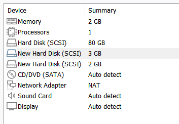
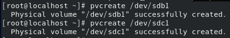
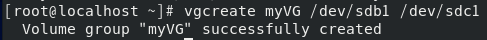
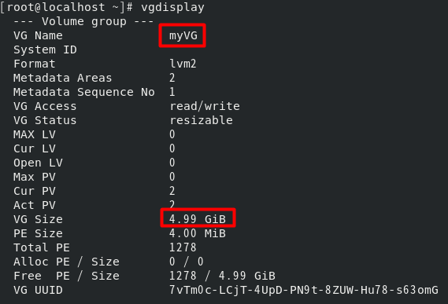
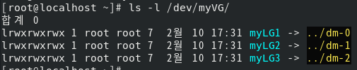
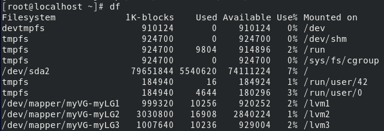
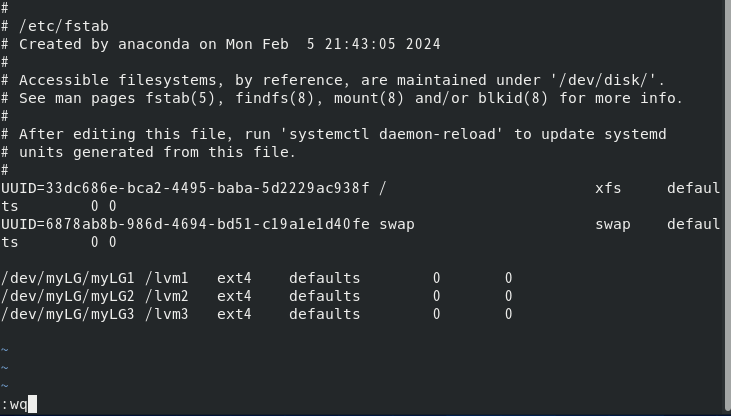

# <!-- LVM : LVM2 패키지 -->
# LVM 개념의 이해 : LVM2 패키지
### LVM은 Logical Volume Manager의 약자로 '논리 하드디스크 관리자'란 의미다. LVM은 앞에서 배운 Linear RAID와 기본 기능은 비슷해 보이지만 더 많은 기능이 있다. 그래서 CentOS는 기본적으로 설치 시 LVM으로 하드디스크를 분할해서 설치한다.

chapter 3에서 Server 와 Server(B)를 설치할 때 LVM을 사용하지 않고 표준 파티션을 사용했다. 하지만 chapter 03 실습 2에서 Client는 파티션 스키마를 기본값인 LVM으로 사용했다.

### LVM은 주요 용도는 여러개의 하드디스크를 합쳐서 1개의 파티션으로 구성 후, 다시 필요에 따라 나누는 것이다. 또는 1개의 하드디스크를 LVM으로 구성하고 다시 파티션을 구분할 수도 있다 
### 일례로 2TB 하드디스크 2개를 합친 후 다시 1TB 와 3TB로 나눠서 사용이 가능하다. RAID 와 달리 LVM에서는 새로운 용어가 몇개 나온다

### 물리 볼륨(Pysical Volume)
- /dev/sda1 , /dev/sdb1 등의 파티션을 말한다.
### 볼륨 그룹(Volume Group)
- 물리 볼륨을 합쳐서 1개의 물리 그룹으로 만든것이다.
### 논리 볼륨(Logical Volume)
- 볼륨 그룹을 1개 이상으로 나눈 것으로 논리적 그룹이라고도 한다.

### 이번에 구성할 하드디스크 구성도는 [책 403쪽]이다

### 물리볼륨인 2TB 와 3TB, 2개의 하드디스크를 합쳐 5TB의 볼륨 그룹으로 묶었다. 그리고 5TB를 1TB, 3TB ,1TB로 분할해서 각 /lvm1 , /lvm2 , /lvm3 디렉터리에 마운트한 상태를 보여준다.
### 결국 LVM은 여러개의 하드디스크 (물리 볼륨)을 묶어서 1개의 볼륨 그룹으로 만든 후, 다시 필요한 용량의 파티션(논리 그룹)으로 나눠서 사용하는 것이라고 보면 된다.

 

# LVM의 구현
### 이번 실습은 RAID 구성과는 명령어가 조금 다르다. [책 404쪽 그림을 참조하자]

### SCSI 하드디스크 2GB 와 3GB 두개를 추가하자

### 장착한 SCSI 하드디스크에 파티션을 할당하자 이번 시스템 유형은 8e(Linux LVM)으로 지정해야 한다.
| 순서 |         명령어         |                                 내용                                  |
| :--: | :--------------------: | :-------------------------------------------------------------------: |
|  1   |    # fdisk /dev/sdb    |                       SCSI 하드디스크 선택                        |
|  2   |      Command : n       |                          새로운 파티션 분할                           |
|  3   |       Select : p       |                          Primary 파티션 선택                          |
|  4   |  Partition number : 1  |     파티션 번호 1번 선택(Primary 파티션은 최대 4개까지 생성 가능)     |
|  5   | First sector : [Enter] |    시작 섹터 번호 입력(1개의 파티션만 계획중이므로 첫 섹터로 설정)    |
|  6   | Last sector : [Enter]  | 마지막 섹터 번호 입력(1개의 파티션만 계획중이므로 마지막 섹터로 설정) |
|  7   |      Command : t       |                         파일 시스템 유형 선택                         |
|  8   |     Hex Code : 8e      |  'Linux LVM' 유형 번호 (L을 입력하면 전체 유형이 출력됨)  |
|  9   |      Command : p       |                          설정된 내용을 확인                           |
|  10  |      Command : w       |                               설정 저장                               |

### 같은 방식으로 /dev/sdb 와 /dev/sdc 의 파티션을 나눈다.

### pvcreate 명령을 이용해 물리적인 볼륨을 생성한다.
- pvcreate /dev/sdb1
- pvcreate /dev/sdc1

### 2개의 물리 볼륨을 하나로 묶어주자. 즉 볼륨 그룹을 생성하는 단계며 명령어는 'vgcreate 볼륨그룹이름 물리적인볼륨1 물리적인볼륨2'이다.
- vgcreate myVG /dev/sdb1 /dev/sdc1

### 생성한 myVG 볼륨 그룹은 현재 물리 볼륨 (Cur PV)이 2개로 구성되어 있으며, 2GB+3GB=5GB인것을 확인할 수 있다. 이제 /dev/myVG를 하나의 하드디스크처럼 생각하고 작업하면 된다.

- vgdisplay (볼륨 그룹 확인)

### 일반적인 하드디스크의 파티션을 생성할 때는 fdisk 명령이었지만, 볼륨 그룹의 파티션을 생성할 때는 lvcreate 명령을 사용한다.
### 일반적인 하드디스크(/dev/sdb)를 /dev/sdb1과 /dev/sdb2로 파티션을 나눠 생성하는 것과 마찬가지로 볼륨 그룹(/dev/myVG)을 /dev/myVG/myLG1 , /dev/myVG/myLG2 , /dev/myVG/myLG3 이라는 논리 그룹으로 파티션을 나눠 생성하는 것이다.

### 논리 그룹을 1GB , 3GB , 1GB로 나누기 위해 다음 명령어를 입력하고 /dev/myVG 디렉터리를 확인해 보자
- lvcreate --size 1G --name myLG1 myVG
- lvcreate --size 3G --name myLG2 myVG
- lvcreate --extents 100%FREE --name myLG3 myVG
- ls -l /dev/myVG

### /dev/myVG/myLG1은 사실 /dev/dm-0이라는 파일에 링크 되어 있다. 하지만 이 장치 파일의 이름은 lvcreate 버전마다 달라질수 있으므로 /dev/myVG/myLG1 이라고 생각하는 것이 좋다.

### 이제 파일 시스템을 생성하자
- mkfs.ext4 /dev/myVG/myLG1
- mkfs.ext4 /dev/myVG/myLG2
- mkfs.ext4 /dev/myVG/myLG3

### 디렉터리 세개를 생성하고 각각 마운트하자 마운트한 후에는 아무 파일이나 하나 복사해놓고 df 명령을 입력해 여유 공간을 확인해보자
- mkdir /lvm1
- mkdir /lvm2
- mkdir /lvm3
- mount /dev/myVG/myLG1 /lvm1
- mount /dev/myVG/myLG2 /lvm2
- mount /dev/myVG/myLG3 /lvm3
- cp /boot/vmlinuz-4* /lvm1/testFile
- cp /boot/vmlinuz-4* /lvm2/testFile
- cp /boot/vmlinuz-4* /lvm3/testFile
- df

### 컴퓨터를 켤 때 항상 myLG1 ~ 3 장치가 /lvm1 ~ 3에 마우느 되도록 설정하자 /etc/fstab 파일을 수정하자

- /dev/myLG/myLG1 /lvm1   ext4    defaults        0       0
- /dev/myLG/myLG2 /lvm2   ext4    defaults        0       0
- /dev/myLG/myLG3 /lvm3   ext4    defaults        0       0

