# <!-- 셸 스크립트 프로그래밍 -->

# 셸의 기본

### 셸은 사용자가 입력한 명령을 해석해 커널로 전달하거나 , 커널의 처리 결과를 사용자에게 전달하는 역할을 한다. 쉽게 말해 Server(B)의 "텍스트 모드"나 X윈도의 '터미널'처럼 명령을 입력하는 환경이 셸이라고 생각해도 무방하다.

<br>

# CentOS 의 bash 셸

### CentOS에서 기본적으로 사용하는 셸은 bash(Bourne Again SHell)이다. "배시 셸"이라고 읽으며 Bourne Shell 을 기반으로 Korn Shell 과 C Shell 의 좋은 점을 합한 것이라고 보면 된다.

### bash 셸의 특징은 다음과 같다

- Alias 기능 (명령어 단축 기능)
- History 기능 (업 키 또는 다운 키)
- 연산 기능
- Job Controll 기능
- 자동 이름 완성 기능 (tab 키)
- 프롬프트 제어 기능
- 명령 편집 기능

alias 명령은 긴 명령을 줄여서 사용할 때 편리하다. 예를 들어 ls al 을 ls2라는 명령어로 사용하고 싶다면 alias ls2="ls -al"명령으로 정의하면 된다.

<br>

# 셸 명령문 처리 방법

### 셸 명령문은 명령문과 함께 여러가지 옵션이나 인자(Argument)를 사용할 수 있으며 형식은 다음과 같다

- (프롬프트) 명령어 [옵션..] [인자..]

### 예를 들면 다음과 같이 다양한 옵션과 인자를 사용할 수 있다

- ls -l
- rm -rf 파일

<br>

# 환경변수

### 셸은 여러가지 환경 변수 값을 갖는데, 설정된 환경 변수는 echo $환경변수 이름 형식으로 명령을 실행하면 확인할 수 있다. 예를 들어 호스트 이름을 출력하려면 echo $HOSTNAME 명령을 실행한다. 주요 환경변수와 그 설명은 다음과 같다.

| 환경변수 |           설명            |   환경변수   |              설명              |
| :------: | :-----------------------: | :----------: | :----------------------------: |
|   HOME   | 현재 사용자의 홈 디렉터리 |     PATH     | 실행 파일을 찾는 디렉터리 경로 |
|   LANG   |    기본 지원되는 언어     |     PWD      |  사용자의 현재 작업 디렉터리   |
|   TERM   |    로그인 터미널 타입     |    SHELL     |     로그인에서 사용하는 셸     |
|   USER   |     현재 사용자 이름      |   DISPLAY    |       X 디스플레이 이름        |
| COLUMNS  |   현재 터미널의 컬럼 수   |    LINES     |       현재 터미널 라인수       |
|   PS1    |  1차 명령 프롬프트 변수   |     PS2      | 2차 명령 프롬프트 (대개는 '>') |
|   BASH   |      bash 셸의 경로       | BASH_VERSION |           bash 버젼            |
| HISTFILE |   히스토리 파일의 경로    |   HISTSIZE   | 히스토리 파일에 저장되는 개수  |
| HOSTNAME |       호스트의 이름       |   USERNAME   |        현재 사용자 이름        |
| LOGNAME  |        로그인 이름        |  LS_COLORS   |  ls 명령어의 확장자 색상 옵션  |
|   MAIL   |   메일을 보관하는 경로    |    OSTYPE    |         운영체제 타입          |

### 환경 변수의 값을 변경하려면 export 환경변수=값 형식을 실행한다. 그 외의 환경 변수는 printenv 명령을 실행하면 출력된다. 단, 일부 환경 변수는 printenv 명령을 실행해도 나타나지 않는다는 사실에 주의 하자.

|       명령어       |          설명          |
| :----------------: | :--------------------: |
|   echo $환경변수   | 설정된 환경 변수 확인  |
| export 환경변수=값 | 환경 변수의 값을 변경  |
|      printenv      | 그 외의 환경 변수 확인 |

<br>

# 셸 스크립트 프로그래밍 실습

### 셸 스크립트를 공부하면 좋은 이유는 리눅스의 많은 부분이 셸 스크립트로 작성되었기때문이다.

### 예를 들어 GRUB 2의 설정 파일인 /boot/grub2/grub.cfg 파일도 셸 스크립트 문법을 사용한다.

# 셸 스크립트 작성과 실행

### vi name.sh 나 gedit name.sh 명령을 실행해 다음과 같은 간단한 셸 스크립트를 작성해보자

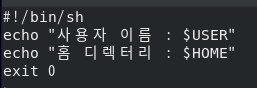

### 소스 설명

| 행  |                                                                                                                                                                                설명                                                                                                                                                                                 |
| :-: | :-----------------------------------------------------------------------------------------------------------------------------------------------------------------------------------------------------------------------------------------------------------------------------------------------------------------------------------------------------------------: |
| 1행 |                                                                                                                                          특별한 형태의 주석 (#!)으로 bash를 사용하겠다는 의미다. 첫행에 꼭 써주어야 한다.                                                                                                                                           |
| 2행 |                                                                                                                     echo 명령은 화면에 출력하는 명령이다. 먼저 "사용자 이름 : "이라는 글자를 출력하고 옆에는 $USER 라는 환경변수내용을 출력한다                                                                                                                     |
| 4행 | 종료 코드를 반환하게 해준다. 만약 다른 스크립트에서 이 스크립트를 호출한 후 제대로 실행되었는지 확인하려면 적절한 종료 코드를 반환하는 것이 중요하다. 즉 이행은 실제 스크립트 실행과 무관하지만, 셸 스크립트는 실행 중간에 문제가 생겨도 무조건 성공했다는 메시지를 반환하기 때문에 직접 마지막 행에서 성공인지 실패인지를 반환하는 것이 좋다. 0은 설공을 의미한다. |

### 셸 스크립트를 실행하는 방법에는 두가지가 있다.

<br>

## 1. sh 명령으로 실행

### sh 스크립트파일 명령으로 실행할 수 있다. 셸 스크립트 파일의 속성을 변경할 필요가 없다는 장점이 있다.

sh 파일명.sh

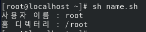

## 2. '실행 가능' 속성으로 변경한 후 실행

### 먼저 셸 스크립트 파일의 속성을 '실행 가능'으로 변경한 후 ./스크립트파일 명령을 실행한다.

### chmod +x 파일명 명령은 현재 파일의 속성에 '실행 가능' 속성을 추가하라는 의미다.

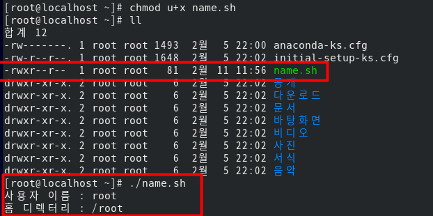

### ./스크립트파일 명령에서 '.'은 현재 디렉터리를 의미한다. 그러므로 현재 디렉터리의 스크립트 파일을 실행하라는 의미다.

### 반드시 현재 디렉터리인 './'을 입력하는 이유는 현재 디렉터리 (이 예에서는 /root)가 $PATH 환경 변수에 설정되어 있지 않기 때문이다. 일반적으로 명령이나 스크립트 이름을 입력하면 셸은 $PATH 환경 변수에 설정된 디렉터리만 찾아 본다.

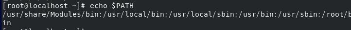

### <참조> 셸 스크립트 사용

지금 작성한 셸 스크립트는 root 사용자 권한으로 작성한 것이므로, root 사용자만 사용할 수 있다. 이 셸 스크립트를 다른 사용자도 사용하게 하려면 /usr/local/bin/ 디렉터리에 복사하고 권한을 755로 변경하면 된다.
보안상 위험할 수도 있으므로 이 작업은 root 사용자만 할 수 있다.

<br>
<br>

# 변수

### 변수는 필요한 값을 계속 변경해 저장한다는 개념이다.

### 셸 스크립트의 구조는 변경할 필요가 없는데 설정해야 하는 값이 상황에 따라 다르다면 변수에 필요한 값을 계속 바꿔가는 방법으로 프로그래밍 해서 다양한 상황에 대처할 수 있다.

## 변수의 기본

- 셸 스크립트에서는 변수를 사용하기 전에 미리 선언하지 않으며, 처음 변수에 값이 할당되면 자동으로 변수가 생성된다.
- 변수에 넣는 모단 값을 문자열(String)로 취급한다. 즉, 숫자를 넣어도 문자로 취급한다.
- 변수 이름은 대소문자를 구분한다. 즉 $aa라는 변수 이름과 $AA라는 변수 이름은 다르다
- 변수를 대입할 때 '=' 좌우에는 공백이 없어야 한다. <br>
  따라서 주의해야함

|      오류       |                  내용                   |      고치기       |
| :-------------: | :-------------------------------------: | :---------------: |
| testval = hello |      오류! '=' 앞뒤에 공백이 있다.      |   testval=hello   |
| testval=Yes Sir |  오류! 값의 공백은 " " 로 묶어야한다.   | testval="Yes sir" |
|   testval=7+5   | 정상이지만 "7+5"라는 문자열로 인식한다. |                   |

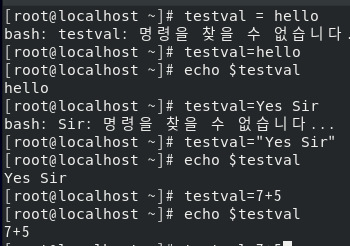

## 변수의 입력과 출력

### '$'이라는 문자가 들어간 글자를 출력하려면 ''로 묶어주거나 앞에 '\'를 붙여야 한다. 또한 " "로 변수를 묶어줘도 되며 묶어 주지 않아도 된다.

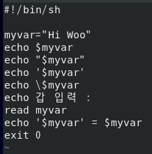
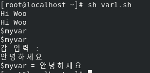

### 소스 설명

| 행  |                           설명                            |
| :-: | :-------------------------------------------------------: |
| 3행 |           'Hi Woo'라는 정상적인 값을 출력한다.            |
| 4행 |                   3행과 동일한 효과다.                    |
| 5행 |               '$myvar'라는 글자를 출력한다.               |
| 6행 | \\$는 $를 글자로 취급하게 한다. 결국 5행과 동일한 효과다. |
| 8행 |       변수 myvar 에 키보드로 값(문자열)을 입력한다.       |

### <참조>

'$변수'와 "$변수"는 일반적으로 동일하게 인식한다. 하지만 변수에 입력된 값에 공백이 포함될 수 있다면, 공백 때문에 발생할 수 있는 논리 오류를 방지하는데 도움이 되는 "$변수"형식으로 사용하는 것이 좋다.

<br>
<br>

## 숫자 계산

### 변수에 넣은 값은 모두 문자열로 취급한다고 했다. 만약 변수에 들어있는 값에 + , - , \* , / 등의 연산을 하려면 expr 키워드를 사용하면 된다. 단, 수식과 함께 꼭 키보드 숫자 1 왼쪽에 있는 역 따옴표(``)로 묶어 주어야 한다.

### 또한 각 단어마다 띄어쓰기를 해야한다.

- \`expr\` - 역따옴표 + expr
- \\\* 곱하기 역슬래시
- \\( \\) 괄호도 역슬래시

### 그리고 수식에 괄호를 사용하려면 그 앞에 꼭 역슬래시 \\( \\)를 부여 주어야 한다. 또 + , - , / 와 달리 곱하기 (\*)기호도 예외 적으로 앞에 역슬래시 (\\)를 붙여줘야 한다.

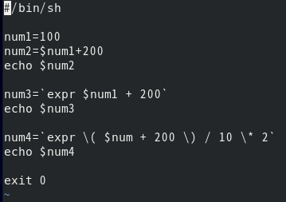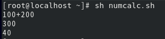

| 소스 |                            설명                            |
| :--: | :--------------------------------------------------------: |
| 3행  |          문자열로 취급함 -> 모두 붙여서 써야한다.          |
| 5행  | 숫자로 취급해서 계산함 -> 각 단어마다 띄어쓰기를 해야한다. |
| 7행  |         괄호와 '\*' 앞에는 역슬래시 '\\'를 붙인다.         |

<br>

## 파라미터 변수

### 파라미터(Parameter) 변수는 $0 ,$1 , $2 등의 형태를 갖는다. 이는 실행하는 명령의 부분 하나하나를 변수로 지정한다는 의미다. 예를 들어 dnf -y install gftp 명령을 실행한다고 가정하면, 바라미터 변수는 다음과 같이 지정할 수 있다.

|  명령   | 파라미터 변수 |
| :-----: | :-----------: |
|   dnf   |      $0       |
|   -y    |      $1       |
| install |      $2       |
|  gftp   |      $3       |

### 즉 $0에는 dnf 가 , $1 에는 -y 를 저장한다. 그리고 명령 전체의 파라미터 변수는 \$\* 로 표현한다.

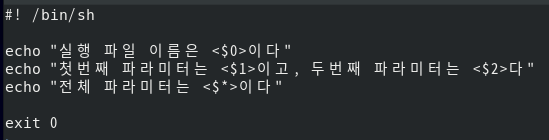
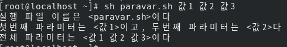

<br>
<br>

# if 문과 case 문

### if 문과 case문의 기본 사용법을 살펴 보자

## 기본 if 문

### 대부분의 프로그래밍 언어에서 지원하는 if문을 살펴보자 기본문법은 다음과 같다.

```bash
if [조건]
then
  참일 경우 실행
fi
```

### 주의 해야 할 점은 '[조건]'사이의 각 단어에는 모두 공백이 있어야한다는 것이다. 실수하기 쉬우므로 꼭 기억하자

```bash
#! /bin/sh
if [ "woo" = "woo" ]
then
  echo "참입니다."
fi
exit 0
```

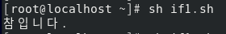

| 소스 |                                                                                                                                        설명                                                                                                                                        |
| :--: | :--------------------------------------------------------------------------------------------------------------------------------------------------------------------------------------------------------------------------------------------------------------------------------: |
| 2행  | '[]' 사이에는 참과 거짓을 구분하는 조건식이 들어간다 '='은 문자열이 같은지를 비교하며 '!= 은 문자열이 같지 않은지 비교한다. if1.sh에서는 조건식이 참이므로 4행을 실행한다. 또 '[]' 대신에 test 라는 키워드를 사용할 수도 있다. <br> 2행과 if test"woo" = "woo" 는 동일한 구문이다. |

## if ~ else 문

### 참인 경우와 거짓인 경우를 구분해서 실행한다. 형식은 다음과 같다

```bash
if [조건]
then
  참인 경우 실행
else
  거짓인 경우 실행
fi
```

```bash
#!/bin/sh
if [ "woo" != "woo" ]
then
  echo "참입니다."
else
  echo "거짓입니다."
fi
exit 0
```

### 중복 if문을 위해서 else if가 합쳐진 elif 구문도 사용이 가능하다.

```bash
#!/bin/sh
if [ "woo" != "woo" ]
then
  echo "거짓입입니다."

elif [ "woo" = "woo" ]
then
        echo "참입니다."
fi
exit 0
```

### 조건문에 들어가는 비교 연산자에는 문자열 비교 연산자와 산술 연산자가 있다.

|      문자열 비교       |                 설명                 |
| :--------------------: | :----------------------------------: |
| "문자열1" = "문자열2"  |        두 문자열이 같으면 참         |
| "문자열1" != "문자열2" |      두 문자열이 같지 않으면 참      |
|      -n "문자열"       | 문자열이 NULL(빈 문자열)이 아니면 참 |
|      -z "문자열"       |   문자열이 NULL(빈 문자열)이면 참    |

|   산술 연산자   |                설명                 |
| :-------------: | :---------------------------------: |
| 수식1 -eq 수식2 |   두 수식(또는 변수)이 같으면 참    |
| 수식1 -ne 수식2 | 두 수식(또는 변수)이 같지 않으면 참 |
| 수식1 -gt 수식2 |          수식1이 크다면 참          |
| 수식1 -ge 수식2 |      수식1이 크거나 같으면 참       |
| 수식1 -lt 수식2 |          수식1이 작으면 참          |
| 수식1 -le 수식2 |       수식이 작거나 같으면 참       |
|      !수식      |         수식이 거짓이면 참          |

<br>

```bash
#!/bin/sh
if [ 100 -eq 200 ]
then
  echo "100과 200은 같다."
else
  echo "100과 200은 다르다"
fi
exit 0
```

### if문에서 파일을 처리하는 조건은 다음과 같다.

|  파일 조건  |                설명                |
| :---------: | :--------------------------------: |
| -d 파일이름 |        파일이 디렉터리면 참        |
| -e 파일이름 |         파일이 존재하면 참         |
| -f 파일이름 |      파일이 일반 파일이면 참       |
| -g 파일이름 | 파일에 set-group-id 가 설정되면 참 |
| -r 파일이름 |      파일이 읽기 가능이면 참       |
| -s 파일이름 |    파일이 크기가 0이 아니면 참     |
| -u 파일이름 | 파일에 set-user-id 가 설정되면 참  |
| -w 파일이름 |     파일이 쓰기 가능 상태면 참     |
| -x 파일이름 |     파일이 실행가능 상태면 참      |

<br>

```bash
#!/bin/sh
fname=/lib/systemd/system/sshd.service
if [ -f $fname ]
then
  head -5 $fname
else
  echo "sshd 서버가 설치되지 않았습니다."
fi
exit 0
```

| 소스 |                                                          설명                                                           |
| :--: | :---------------------------------------------------------------------------------------------------------------------: |
| 2행  |                        fname 변수에 httpd 서버 실행 파일인 /lib/systemd/system/sshd.service 저장                        |
| 3행  | fname 변수에 저장된 /lib/systemd/system/sshd.service 파일이 일반 파일이면 참이므로 5행을 실행, 그렇지 않으면 7행을 실행 |
| 5행  |                                           fname에 들어잇는 파일의 앞 5줄 출력                                           |

<br>
<br>

# case ~ esac 문

### if 문은 참과 거짓이라는 두 가지 경우만 사용할 수 있다 이를 이중 분기라고 부른다. 그런데 여러가지 경우의 수가 있다면 if 문을 계속 중복해서 사용해야 하므로 구문이 복잡해진다.

### 이때 case 문을 사용하며 이를 다중 분기라고 부른다.

```bash
#!/bin/sh
case "$1" in
  start)
    echo "시작~~";;
  stop)
    echo "중지~~";;
  restart)
    echo "다시 시작";;
  *)
    echo "뭔지 모름~~";;
esac
exit 0
```

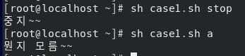

<br>

```bash
#!/bin/sh
echo "리눅스가 재미있나요? (yes / no)"
read answer
case $answer in
  yes | y | Y | Yes | Yes)
    echo "다행입니다."
    echo "더욱 열심히 하세요 ^^";;
  [nN]*)
    echo "안타깝네요. ㅠㅠ";;
  *)
    echo "yes 아니면 no 만 입력했어야죠"
    exit 1;;
esac
exit 0
```

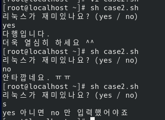
| 소스 | 설명 |
| :--: | :--: |
|3행| answer 변수에 입력한 값을 받는다.|
|5행 | 입력된 값이 yes , y , Y , Yes , YES 중 하나면 6 ~ 7행 실행|
|7행| 실행할 구문이 더는 없으므로 뒤에 ;;을 붙인다.|
|8행|[nN]\*)는 앞에 n 또는 N이 들어가는 모든 단어를 다 인정해준다는 의미다.|
|12행|정상적인 종료가 아니므로 exit 1로 종료한다.(꼭 해야하는 사항은 아님)|

<br>
<br>

# AND , OR 관계 연산자

### 조건문에서는 and 와 or의 의미를 갖는 관계 연산자를 사용할 수 있다. and는 -a 또는 &&를 사용하며, or 은 -o 또는 || 을 사용한다.

### -a 나 -o는 테스트 문 '[]' 안에서 사용할 수 있는데 이때 괄호 등의 특수 문자 앞에는 역슬래시 '\\'를 붙여 줘야한다.

| 관계 연산자 |    설명    |
| :---------: | :--------: |
| -a 또는 &&  | AND 연산자 |
|   -o 또는   | OR 연산자  |

```bash
#!/bin/sh
echo "보고 싶은 파일명을 입력하세요"
read fname
if [ -f $fname ] && [ -s $fname ] ; then
  head -5 $fname
else
  echo "일반 파일이 아니거나, 크기가 0입니다."
fi
exit 0
```

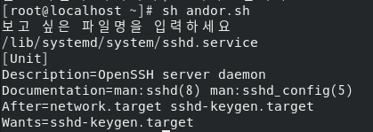
| 소스 | 설명 |
| :--: | :--: |
|4행|then 구문은 다음줄에 작성해도 되며, 세미콜론 (;) 이후에 작성해도 된다. <br> 세미콜론은 앞뒤 구문을 행으로 분리하는 기능이다. <br> 또 이 구문은 if [ \\( -f $fname \\) -a \\( -s $fname \\) ] ; then 과 동일하다.

<br>
<br>

# 반복문

## for ~ in 문

### for ~ in 문은 다음 형식과 같이 변수에 각각의 값을 넣은 후 do 안에 있는 "반복할 문장"을 실행한다 그러므로 값의 개수만큼 반복 실행하게 된다

```bash
for 변수 in 값1 값2 값3
do
  반복할 문장
done
```

<br>

Example)

```bash
#!/bin/sh
hap=0
for i in 1 2 3 4 5 6 7 8 9 10
do
  hap=`expr $hap + $i`
done
echo "1부터 10까지의 합 :" $hap
exit 0
```

결과 : 1부터 10까지의 합 : 55

### 기존의 for 문과 비슷하게 for((i=1;i<=10;i++))로 변경해서 사용할 수도 있다. (변경할 때 괄호가 2개인것에 주의한다.)

### 또는 'seq' 명령을 사용할 수도 있다 예를 들어 seq 1 10은 1에서 10까지의 숫자르 돌려준다.

### 다음은 현재 디렉터리에 있는 셸 스크립트 파일(\*.sh) 의 파일 이름과 앞 3줄을 출력하는 프로그램이다.

```bash
#!/bin/sh
for fname in $(ls *.sh)
do
  echo "------$fname------"
  head -3 $fname
done
exit 0
```

| 소스 |                                                    설명                                                     |
| :--: | :---------------------------------------------------------------------------------------------------------: |
| 2행  | fname 변수에 ls \*.sh 명령의 실행결과를 하나씩 넣어서 4 ~ 5행을 반복한다. 즉 파일 개수만큼 실행을 반복한다. |
| 4행  |                                            파일 이름을 출력한다.                                            |
| 5행  |                                          파일의 앞 3출을 출력한다.                                          |

<br>
<br>

## While 문

### while 문은 조건식이 참인 동안만 계속 반복하는 특성을 갖는다.

```bash
#!/bin/sh
while [ 1 ]
do
  echo "이것이 리눅스다.^^"
done
exit 0
```

| 소스 |                                                       설명                                                        |
| :--: | :---------------------------------------------------------------------------------------------------------------: |
| 2행  | 조건식 위치에 [ 1 ] 또는 [ : ]이 오면 항상 참이다. 그러므로 4행을 무한히 반복 실행한다. 취소는 ctrl + c를 누른다. |

<br>

Example)

```bash
#!/bin/sh
hap=0
i=1
while [ $i -le 10 ]
do
  hap=`expr $hap + $i`
  i=`expr $i + 1`
done
echo "1부터 10까지의 합 : " $hap
exit 0
```

<br>

Example2)

```bash
#!/bin/sh
echo "비밀번호를 입력하세요"
read mypass
while [ $mypass != "1234" ]
do
  echo "틀렸음 다시 입력하세요"
  read mypass
done
echo "통과~~"
exit 0
```

<br>
<br>

## until 문

### while 문과 용도가 거의 같지만, until문은 조건식이 참일 때까지 (= 거짓인 동안) 계속 반복한다. 예시는 다음과 같다

```bash
until [ $i -gt 10 ]
```

<br>
<br>

## break , continue , exit , return

### break 는 주로 반복문을 종료할 때 사용되며, continue 는 반복문의 조건식으로 돌아가게 한다.

### exit는 해당 프로그램을 완전히 종료한다. retrun 은 함수 안에서 사용될 수 있으며 함수를 호출한 곳으로 돌아가게 한다.

```bash
#!/bin/sh
echo "무한반복 입력을 시작합니다 (b: break , c: continue , e: exit)"
while [ 1 ] ; do
  read input
  case $input in
  b | B)
    break;;
  c | C)
    echo "continue를 누르면 while의 조건으로 돌아감"
    continue ;;
  e | E)
    echo "exit를 누르면 프로그램(함수)를 완전히 종료함"
    exit 1;;
  esac
done
echo "break를 누르면 while을 빠져나와 지금 이 문장이 출력됨"
exit 0
```

<br>
<br>

# 기타 알아둘 내용

## 사용자 정의 함수

### 사용자가 직접 함수를 작성하고 호출할 수 있다. 형식은 다음과 같다.

```bash
함수이름 () {
  내용들...
}

함수이름 -> 함수를 호출
```

<br>

Example)

```bash
#!/bin/sh
myFunction () {
  echo "함수 안으로 들어 옴"
  return
}

echo "프로그램을 시작합니다."
myFunction
echo "프로그램을 종료합니다"
exit 0
```

## 함수의 파라미터 사용

### 함수의 파라미터 (Parameter) 즉 인자를 사용하려면 함수를 호출할 때 뒤에 파라미터를 붙여서 호출하며 함수 안에서는 $1 , $2 , ... 로 사용한다. 형식은 다음과 같다.

```bash
함수이름 () {
  $1 , $2 .. 등을 사용
}

함수이름 파라미터1 파라미터2 -> 함수 호출
```

<br>

Example)

```bash
#!/bin/sh
hap () {
  echo `expr $1 + $2`
}

echo "10 더하기 20을 실행합니다."
hap 10 20
exit 0
```

<br>

## eval

### 문자열을 명령문으로 인식하고 실행한다.

```bash
str="ls -l eval.sh"
echo $str
eval $str
exit 0
```

| 소스 |                             설명                              |
| :--: | :-----------------------------------------------------------: |
| 3행  |  str 변수의 값인 "ls -l eval.sh"라는 글자를 그대로 출력한다.  |
| 4행  | str 변수의 값인 "ls -l eval.sh"를 명령으로 인식하고 실행한다. |

<br>

## export

### 외부 변수로 선언한다. 즉 선언한 변수를 다른 프로그램에서도 사용 할 수 있게 한다.

```bash
- exp1.sh
#!/bin/sh
echo $var1
echo $var2
exit 0

- exp2.sh
#!/bin/sh
var1="지역변수"
export var2="외부변수"
sh exp1.sh
exit 0
```

## printf

### C 언어의 prinf() 함수와 비슷하게 형식을 지정해서 출력할 수 있다.

```bash
#!/bin/sh
var1=100.5
var2="재미있는 리눅스~~"
printf "%5.2f \n\n \t %s \n" $var1 "$var2"
exit
```

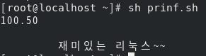
| 소스 | 설명 |
| :--: | :--: |
|3행|공백이 있으몰 ""로 묶어주어야 한다.|
|4행|C언어와 비슷하다. 주의할 점은 $var2의 경우 값 중간에 공백이 있으므로, 변수 이름을 " "로 묶어줘야 오류가 발생하지 않는 다는 것이다.|

<br>

## set 과 $(명령)

### 리눅스 명령을 결과로 사용하려면 '$(명령)'형식을 사용해야 한다. 또, 결과를 파라미터로 사용하고자 할때는 set 명령과 함께 사용한다.

```bash
#!/bin/sh
echo "오늘 날짜는 $(date)입니다."
set $(date)
echo "오늘은 $4 요일 입니다."
exit 0
```

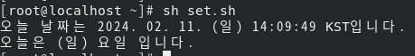

| 소스 |                                설명                                |
| :--: | :----------------------------------------------------------------: |
| 2행  |           $(date)는 date 명령을 실행한 경과를 보여준다.            |
| 3행  | $(date)의 결과가 $1 , $2 , $3 ... 등의 파라미터의 변수에 저장된다. |
| 4행  |                 4번째 파라미터인 요일이 출력된다.                  |

<br>

## shift

### 파라미터 변수를 왼쪽으로 한 단계 씩 아래로 시프트 (이동)한다.

```bash
#!/bin/sh
myfunc () {
  str=""
  while [ "$1" != "" ] ; do
    str="$str $1"
    shift
  done
  echo $str
}

myfunc AAA BBB CCC DDD EEE FFF GGG HHH III JJJ KKK
exit 0
```
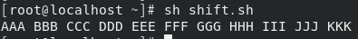
| 소스 | 설명 |
| :--: | :--: |
|3행|결과를 누적할 str변수를 초기화 시킨다.|
|4행|$1 파라미터가 비어있지 않은 동안에 반복 실행한다 (처음 $1은 AAA 이고, 한번 반복 실행하면 5, 6행에 의해 $1이 BBB가 됨)
|5행| str 변수에 $1을 추가한다.|
|6행| 전체 파라미터를 왼쪽으로 시프트 시킨다 즉 $2 -> $1 , $3 -> $2 , $4 -> $3 , ... 의 형탤 작업이 일어난다.|
|8행|while 작업이 끝나면 누적한 str 변수를 출력한다.|

### 필자가 소개한 것 외에도 셀 스크립트의 내용은 훨씬 방대하며 셸 스크립트 내용만으로 별도의 책이 출간되어 있을 정도다. 추후에 고급 리눅스 프로그래머가 되려면 꼭 필요한 내용이므로 잘 익혀둬야 한다.