# <!-- 원격지 시스템 관리 -->

# 원격지 시스템 관리

### 이장에서는 멀리 있는 장소의 PC에서 리눅스 서버에 접속하는 원격 접속에 대해서 학습한다. 접속 서버의 종류로 텔넷, SSH , VNC 서버를 구축한다.

### 텔넷 서버는 23번 , FTP 서버는 21번 , 웹 서버는 80번, SSH의 포트 번호는 22번 등으로 포트번호가 예약되어 있다.

 
 

# 텔넷 서버

### 지금은 인기가 좀 떨어졌지만, 텔넷은 오랫동안 전통적으로 사용되어 온 원격 접속 방법이다. 좀 오래돼서 보안 등에 취약하기 때문에 요즘은 텔넷만 사용하지 않으며 보안 기능을 더해서 사용한다.

### 그래도 텔넷은 가장 기본적인것이므로 꼭 알아두자

 
 

## 텔넷 서버의 개요

### 리눅스 서버에 텔넷 서버를 설치했다면, 원격지에서 리눅스 서버에 접속할 PC 에는 텟넷 클라이언트 프로그램이 필요하다.

### 대부분의 운영체제에는 기본적으로 텔넷 클라이언트 프로그램이 내장되어 있으므로 별 문제가 없다

### [그림 481쪽]과 같이 원격지의 PC(텔넷 클라이언트)에서 리눅스 서버에 접속하면 서버 앞에 앉아서 직접 텍스트 모드로 작업하는 것과 완전히 동일한 효과를 낼 수 있다. (인터넷이 접속되어 있어야함)

### <참조> 서버와 클라이언트 개념

서버(Server)/클라이언트(Client)는 아주 흔한 용어지만, 처음 서버를 구축하는 사람들은 개념이 완전하지 않을 수 있으므로 짚고 넘어가자. 예를 들어 많은 사람이 네이버를 사용하는데 이것 역시 서버/클라이언트의 개념이다.

네이버라는 웹 서버(리눅스 웹 서버라 가정해보자 [아마 httpd같은걸건데 ㅋ..])가 작동하고 있고, 사람들은 웹 브라우저 (주로 인터넷 익스플로러, 크롬 등)라는 웹 클라이언트 프로그램을 이용해서 웹 서버에 접속하는 것이기 때문이다. 즉, 서버 프로그램이 작동할 때 서버를 사용하려면 클라이언트 프로그램이 필요하다. 텔넷 서버도 마찬가지다.

텔넷 서버 프로그램이 작동할 때 텔넷 서버에 접속하려면 텟넷 클라이언트 프로그램이 있어야한다. 다른 서버 프로그램 대부분도 각각의 클라이언트 프로그램이 있어야 서버에 접속해서 사용할 수 있는 것과 같다.

즉, 서버와 클라이언트 특징은 다음과 같다

- 서버에 접속하려면 꼭 클라이언트 프로그램이 필요하다
- 서버가 리눅스라고 클라이언트도 리눅스 일 필요는 없다. 즉, 서버의 OS와 클라이언트 OS가 같아야 하는 것은 아니다.
- 각각의 서버 프로그램은 자신에게 맞는 별도의 클라이언트 프로그램이 필요하다.

|           서버            |                 클라이언트 프로그램                 |
| :-----------------------: | :-------------------------------------------------: |
| 웹 서버 (아파치 또는 llS) | 웹 클라이언트 (인터넷 익스플로러, 크롬 , 사파리 등) |
|         텔넷 서버         |       텔넷 클라이언트 (telnet, 한글 putty 등)       |
|         FTP 서버          |   FTP 클라이언트 (알 FTP , wsFTP , ftp , fgtp 등)   |
|         VNC 서버          |      VNC 클라이언트 (vncviewer , TightVNC 등)       |
|         SSHD 서버         |        SSH 클라이언트 (ssh , 한글 putty 등)         |
|        오라클 서버        |             오라클 클라이언트 (sqlplus)             |

 

## 텔넷 서버를 구축해보자

### 자 우리가 갑자기 내일부터 아프리카로 출장을 가게 되었다 우리 회사의 리눅스 서버를 관리할 사람은 나 뿐이라고 가정해보자 ㅋㅋ..

### 아무런 걱정하지 말고 잠깐 시간을 내서 다음과 같은 과정으로 텔넷 서버를 구축하자.

| 순서 |          주제           |                명령어                 |
| :--: | :---------------------: | :-----------------------------------: |
|  1   |     텔넷 서버 설치      |      dnf install telnet -server       |
|  2   |    텔넷 서비스 시작     |     systemctl start telnet.socket     |
|  3   |  텔넷 전용 사용자 생성  | adduser 사용자 이름 , passwd 비밀번호 |
|  4   | 방화벽 설정 (포트 열기) |            firewall-config            |
|  5   |  텔넷 서비스 상시 가동  |    systemctl enable telnet.socket     |
|  6   |   클라이언트에서 접속   |          C:\\> telnet 서버IP          |

## 실습을 해보자!!

### 1. rpm -qa telnet-server 명령을 입력해 텔넷 서버가 설치 됐는지 확인

- 기본적으로 설치되어 있지 않으니 dnf -y install telnet-server 명령을 입력해 설치하자

<참조> rpm 명령의 -qa 옵션은 패키지가 설치되었는지 확인하는 명령이다. 패키지 이름이 정확히 기억나지 않으면 rpm -qa | grep 일부문자 명령을 입력해 설치 여부를 확인 할 수 있다.

### 2. 다음을 입력해 텔넷 서버 서비스를 시작하자

- systemctl start telnet.socket
- systemctl status telnet.socket

<참조> systemctl 작동옵션 서비스또는 소켓이름 명령으로 서비스를 실행할 수 있다. 작동옵션은 start , 중지 stop , 재시작 restart , 상태 확인 status 을 사용할 수 있으며 , systemctl 명령을 멈추려면 [Q]를 누른다.

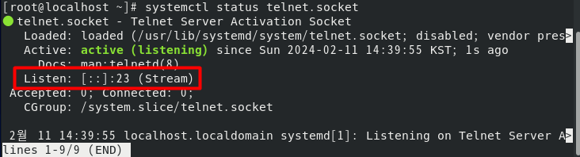
따라서 서비스 상태는 작동(ACTIVE)중이며, 포트 번호는 23번을 사용한다는 것을 확인할 수 잇다.

<참조> 포트  
포트(Port)란 TCP 포트 또는 UDP 포트를 줄여서 부르는 것인데 , 가상의 논리적인 통신 연결 번호를 말한다. 컴퓨터를 건물이라고 가정하면 IP 주소는 건물의 정문이고, 포트 번호는 건물 안의 각 방 번호라고 생각하면 된다.  
모든 컴퓨터는 0 ~ 65535까지 포트 번호가 있다. 그런데 일반적으로 0 ~ 1023까지는 예약된 포트번호가 많다. 지금 구축한 텔넷 서버는 23번 , FTP 서버는 21번 , 웹 서버는 80번 등으로 예약되어 있다.

### 3. adduser 명령을 입력해 접속 테스트를 위한 사용자를 만들고 passwd teluser 명령을 입력하자

- adduser teluser
- passwd teluser

### 4. 자신의 컴퓨터에서 teluser로 접속해 보자

- telnet 서버IP주소 (server의 서버IP주소 : 192.168.111.100)
- whoami
- exit

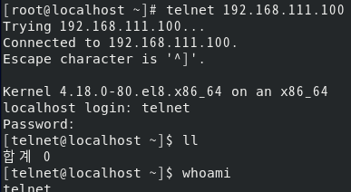

 
 

## 이번에는 호스트 컴퓨터 또는 Windows 클라이언트 에서 외부에서 접속해보자

### 1. 호스트 컴퓨터 윈도우 창에서 검색기능에 window 기능을 켜보자

### 2. [Window 기능]에서 [텔넷 클라이언트] 또는 [Telnet Client]에 체크하고 <확인>을 클락하면 설치가 진행된다.

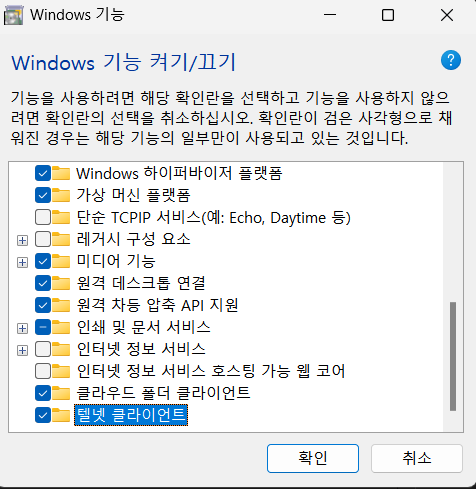

### 3. powershell 을 열어 ping 192.168.111.100 명령을 입력해 Server 와 네트워크로 연결되는 지 확인한 후 , telnet 192.168.111.100 명령을 입력해 텔넷 접속을 시도하자

- ping 192.168.111.100
- telnet 192.168.111.100

그런데 네트워크는 응답하지만 한참을 기다려도 텔넷이 연결 되지 않는다. 이는 Chapter 03에서 CentOS를 설치했을 때 기본적으로 서버 서비스 대부분을 허용하지 않는 상태로 설치했기 때문이다. 즉, 자체 방화벽이 설치되어있다. 이렇게 설정된 '보안 수준 설정'을 변경해줘야한다.

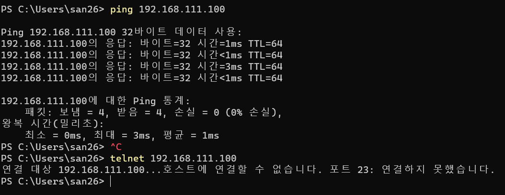

### 4. 텔넷 서비스의 포트 23번을 연다

- firewall-config 명령입력
- [방화벽 설정] 이 나오면 [public] 이 선택된 상태에서 [설정]을 [영구적]으로 변경하고 [서비스] 탭의 [telnet]을 클릭해서 체크하자. 그리고 선택한 내용을 적용하기 위해 메뉴의 [옵션] -> [Firewalld 다시 불러오기]를 선택한 후 [방화벽 설정] 창을 닫는다.

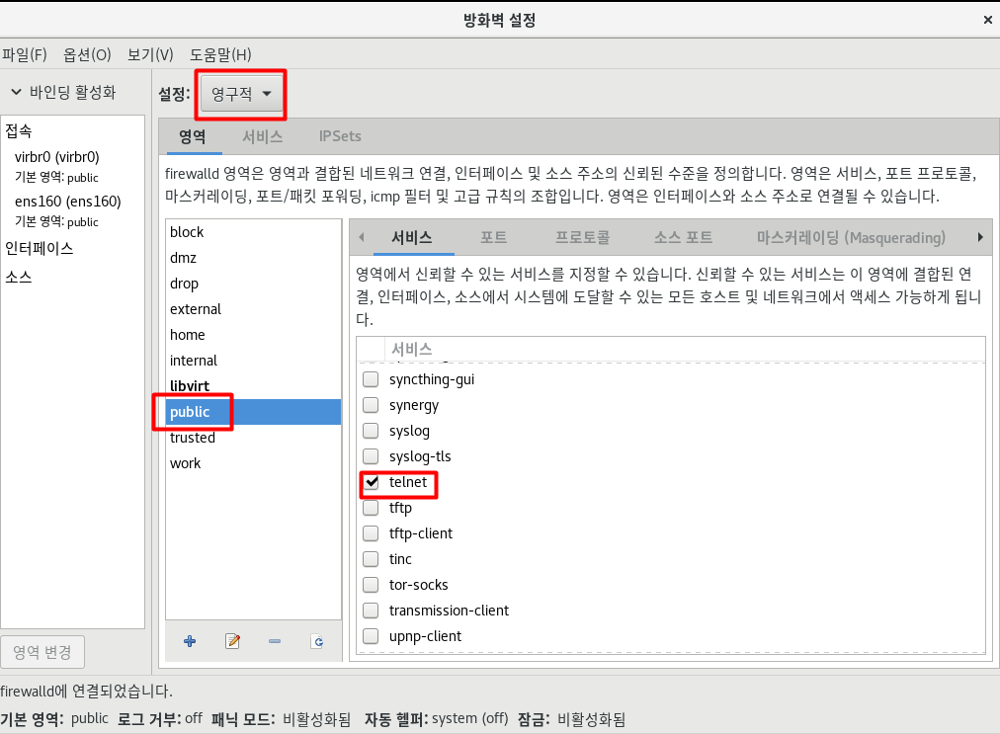

 

<참조>  
텍스트 모드에서 방화벽을 설정하려면

- firewall-cmd --add-service=서비스이름 또는 firewall-cmd --add-port=포트번호/프로토콜 명령을 실행한다.

따라서 이번 실습에서는

- firewall-cmd --add-service=telnet 혹은
- firewall-cmd --add-port=23/tcp 중 하나를 입력 실행

만약 재부팅 후에도 방화벽 설정을 유지하려면 --permanent 옵션을 붙인다.

- firewall-cmd --permanent --add-service=telnet 명령을 실행해 텔넷 설정 유지
- firewall-cmd -reload 명령을 실행해 방화벽을 리로딩

### 5. 텔넷을 상시 가동 설정

systemctl enable telnet.socket 명령을 입력해 재부팅후에도 계속 텔넷 서버가 가동되도록 설정

- systemctl enable telnet.socket

### 6. 다시 호스트 컴퓨터에서 접속

- ping 192.168.111.100
- telnet 192.168.111.100

### ifconfig ens160 명령을 입력해 IP 주소를 확인하면 Server 의 IP 주소 등을 확인할 수 있을 것이다. 즉 Server 로 잘 접속되었다.

 
 

# OpenSSH 서버

### 이번에는 텔넷과 용도는 동일하지만 보안이 강화된 SSH 서버를 알아본다. 텔넷은 오래전 부터 사용되어 왔으나 요즘 들어 문제가 발생하고 있다. 서버와 클라이언트 사이에서 데이터 전송 시 암호화 하지 않아 해킹 위험에 노출되는 것이다.

### 실제 텔넷으로 접속한 컴퓨터가 전송하는 데이터의 값을 알아내는 것은 별로 어려운 일이 아니다. 앞의 실습이라면 Windows에서 리눅스로 접속할 때 사용하는 아이디와 비밀번호가 네트워크상에 그대로 전송되는 일을 예로 들수 있다.

### 이를 해결하려고 사용하는 것이 바로 리눅스에서 지원하는 openssh 서버다.

### [그림 469쪽]을 보면 텔넷과 거의 동일하지만, 데이터 전송시 암호화 한다는 차이점을 확인할 수 잇다.

OpenSSH 서버 \$보안 <- (인터넷) -> \$보안 SSH 클라이언트

### 또한 앞에서 언급한 사실을 접한 독자라면 텔넷 서버를 다음과 같이 생각 할 수도 있다.

요즘 어느 회사가 해킹돼서 회사 기밀이 유출됐다는 예기가 많던데 우리 회사 역시 텔넷 서버 해킹이 걱정된다. 그런데 지금까지 사용해온 텔넷이 편하니, 텔넷과 같으면서 해킹당할 걱정 없는 방법은 없을까?

### OpenSSH 서버 설치 과정 요약

|        순서        |            주제            |                    명령어                     |
| :----------------: | :------------------------: | :-------------------------------------------: |
|         1          |     OpenSSH 서버 확인      |             systemctl status sshd             |
|         2          |        방화벽 설정         |                firewall-config                |
|       3 - 1        | 리눅스 클라이언트에서 접속 |             ssh 사용자명@서버 IP              |
|       3 - 2        | Window 클라이언트에서 접속 |                4번으로 이어짐                 |
| (3 - 2와 이어짐) 4 |      한글 putty 설치       | http://kdlp.net/projects/iputty 에서 다운로드 |
|         5          |    클라이언트에서 접속     |              SSH 클라이언트 사용              |

## OpenSSH 실습을 해보자!!

### 1. 패키지가 설치되고 가동되는 지 확인하자 패키지 이름은 'openssh-server'이고 서비스 (데몬)이름은 'sshd'이다.

- rpm -qa openssh-server 패키지 설치 여부 확인
- systemctl status sshd 서비스 가동 여부 확인

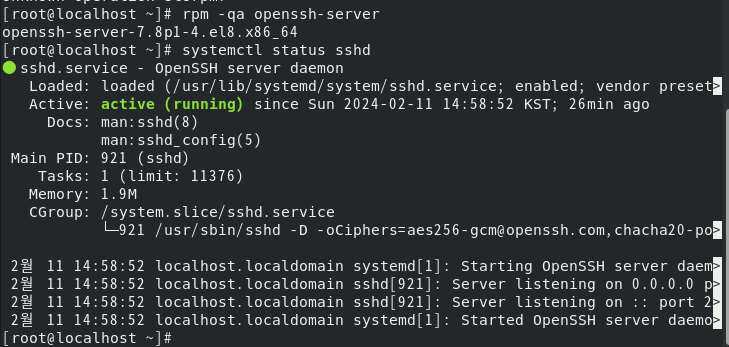

### 2. Client (리눅스) 를 실행한 후 Server 의 SSH 서버에 접속해보자

ssh 사용자이름@호스트이름 또는 ssh 사용자이름@IP주소 명령으로 접속해보자

- ssh telnet@192.168.111.100

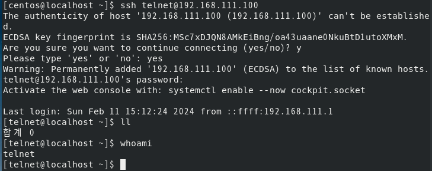

<참조>  
처음 접속할 때 'ECDSA Key'와 관련된 메시지가 나오면 yes를 입력한다.

### 지금까지 Client 에서 바로 접속할 수 있었던 이유는 Server 에서 SSH 서버 사용을 이미 허용했기 때문이다. firewall-config 명령을 입력해서 확인하면 [ssh] 항목에 체크되어 있을 것이다. 확인해보자

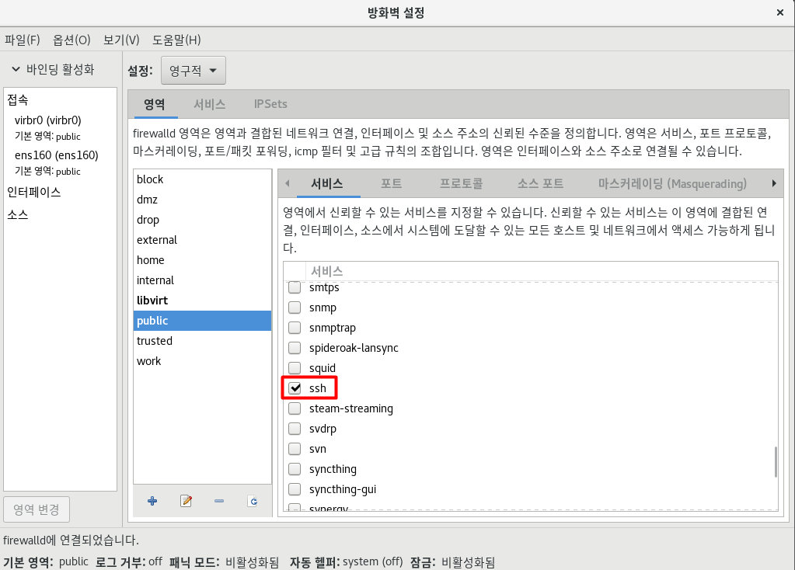

### SSH의 포트 번호는 22번이다. 자주 사용되므로 기억해 두자

### 3. 호스트 컴퓨터 또는 WinClient (윈도우 windows) 접속

putty를 설치(설치 되있음 ㅋ..)

- putty 설정에서 [Host Name (for IP addree)]에 Server ip 주소를 입력하자.
- [port]번호는 22번
- [접속 형식]은 SSH가 이미 선택되어 있을것이다.

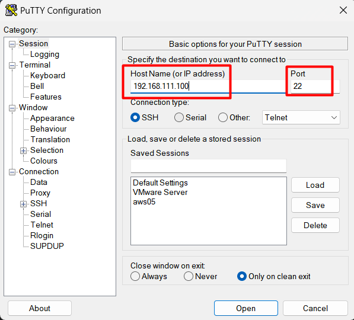

<참조>  
한글 PuTTY는 SSH 클라이언트 뿐만 아니라 텔넷 클라이언트로도 사용할 수 있다. PuTTY 설정의 [접속 형식]에서 telnet을 선택하면 된다.

 
 
 

# XRDP 서버

### 앞의 내용을 통해 텔넷 서버 대신 SSH 서버를 설치한 독자라면 이제 다음과 같은 욕심이 생길것이다.

SSH 서버까지 설치하니 출장지에서도 해킹 걱정없이 작업할 수 있어서 안심 되기는 하지만, 아무래도 X 윈도 환경에서 작업할 일이 생길 것 같다. 어떻하지??

### 실제로 텔넷 서버 및 ssh 서버를 설치하고 나면 모든 작업을 다 할 수 있지만, X 윈도 환경은 지원하지 않으므로 X 윈도 전용 명령을 사용할 수 없다.

### 최근 추세에 따라 X 윈도 환경에서 사용되는 유틸리티나 명령어가 많으므로 이제는 X 윈도 환경 자체를 원격지에서도 사용할 수 있어야 한다.

### 이번에는 그래픽 모드로 원격 관리를 지원하는 XRDP 서버를 알아보자 XRDP 서버는 지금 예기 한 것 처럼 원격지에서 X 윈도 환경 자체를 사용할 수 있게 하는 서버 프로그램이다. 특히 XRDP는 Windows 의 '원격 데스크톰 연결' 프로그램을 사용해서 리눅스에 그래픽 환경으로 접속한다. 그래픽을 네트워크로 전송해야하므로 텍스트만 전송하는 텔넷과 비교했을때 속도가 느린 단점이 있다.

<참조>  
리눅스에 X 윈도 환경으로 접속하는 데에는 XRDP 외에 VNCSERVER 등의 방식도 사용할 수 있다. 특히 VNCSERVER의 경우 클라이언트가 리눅스든 Windows든 상관없이 서버에 접속할 수 있다.
다만 CentOS 8의 VNCSERVER는 약간의 버그로 인해 VMware 환경에서 잘 작동하지 않을 수 있다.

### CentOS는 xrdp 라는 패키지를 제공한다.
| 순서 | 주제 | 명령어 |
| :--: | :--: | :----: |
|1|XRDP 서버 설치|dnf install xrdp|
|2|서비스 시작|systemctl start xrdp|
|3|방화벽 설정|firewall-config|
|4|원격 데스크톱에서 접속||

## XRDP 실습을 진행해보자!!
### 1. 먼저 EPEL 저장소에서 추가 설치를 허용하자
EPEL (Extra Packages for Enterprise Linux) 저장소란, CentOS 8 및 RHEL 8에서 제공하는 패키지 외에 추가 패키지를 제공하는 저장소며 Fedora Community에서 관리한다. CentOS 8에서는 xrdp 를 기본으로 제공하지 않지만 EPEL 을 통해 설치하면 잘 작동한다.
- dnf install epel-release

### 2. CentOS 에서 제공하는 xrdp 패키지를 설치한다.
xrdp를 설치하는 다른 방법으로는 책의 Q&A 사이트 (http://cafe.naver.com/thisisiLinux)에서 xrdp-0.9.11-5.el8.x86_64.rpm 파일을 직접 다운로드 받아 rpm 으로 실행하자
- dnf -y install xrdp

### 3. 서비스를 시작하고 상시 가동시키자
- systemctl start xrdp 
- systemctl enable xrdp

### 4. 방화벽 설정
- firewall-config 명령으로 방화벽 설정창을 연다.
- 설정을 [영구적]으로 변경한 후 [포트] 탭을 클릭한다. <추가>를 클릭해서 3389 (tcp)포트를 추가한다.
- 메뉴의 [옵션] -> [Firewall 다시 불러오기]를 선택해서 추가한 포트를 적용시킨다.

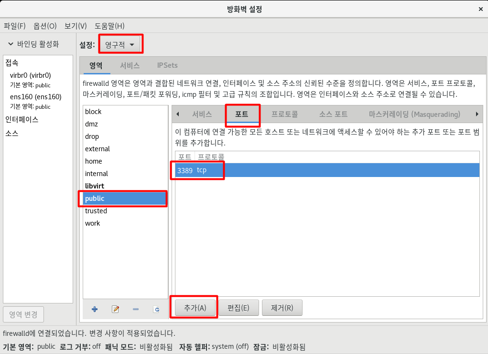

### 5. 호스트 컴퓨터 또는 WinClient 원격 데스크톱을 실행해서 연결하자.
- [시작] -> [Windows 보조 프로그램]에 있는 [원격 데스크톱 연결]을 실행하고 Server 의 IP인 192.168.111.100 을 입력후 연결을 클릭한다.
- 보안 인증서와 관련된 경고 창이 나오면 <예>를 눌러 진행한다.
- 접속된 로그인 창에서 Session 은 Xvnc 를 넣고 유저 이름과 패스워드를 입력한다.
- 언어 설정이 나오면 기본값을 사용하면 된다.

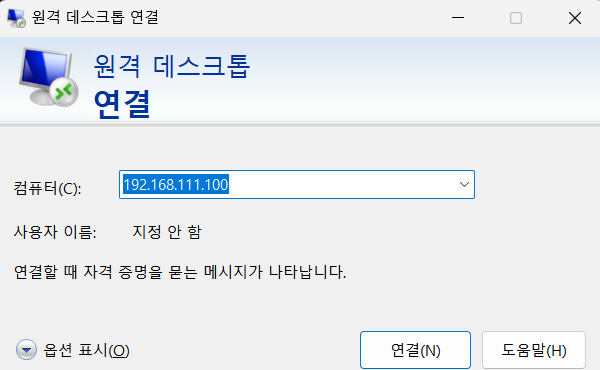

 
 

# <!-- 지금까지 구축한 세가지 서버를 비교 -->
# 지금까지 구축한 세가지 서버를 비교
### 지금까지 구축한 서버들을 비교해보자
||텔넷 서버|SSH 서버|XRDP 서버|
|:--:|:--:|:--:|:--:|
|속도|빠르다|빠르다|약간 느리다|
|그래픽 지원|x|x|o|
|보안|취약하다.|강하다.|보통이다.|
|사용 가능 명령|텍스트 모드의 명령만 사용가능|텍스트 모드의 명령만 사용가능|제한이 없다.|
|클라이언트 프로그램|대게의 운영체제가 기본적으로 있다| 리눅스는 기본적으로 있다. Windows 는 별도 설치해야한다.|Windows에 포함되어 있다.