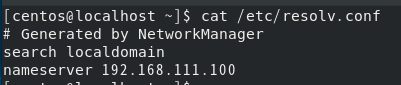

# <!-- 네임 서버 설치와 운영 -->
### 들어가기 앞서서..
이 부분은 첫실습 부분에 문제가 진짜 조금이지만 있어요 그래서 뒤에도 안됨 ㅋㅋㅋㅋ.. 다음에 좀 더 알아보고 잘 해봅시다. (근데 ch10에서는 네임 서버 잘 작동함 ㅋㅋㅋㅋㅋ) 그 부분 제외하면  개념이나 실습 이런 디테일 적인 것들은 좋으니 읽어도 안심하세요.

# 네임 서버 의 개념

### 이 절에서는 네임 서버가 어떤 역할을 하는 지, 인터넷에서 어떻게 작동하는 지 파악해보자. 작도 원리만 파악된다면 설치와 운영은 그다지 어렵지 않다.

<br>
<br>

## 네임 서버 개요

### 네임 서버는 DNS(Domain Name Service) 서버라고도 한다. 우리가 웹 브라우저나 FTP 클라이언트를 사용할 때 http://www.nate.com 과 같은 URL을 사용하는데, 실제 원하는 서버에 접근하려면 이 URL 을 해당 컴퓨터의 IP 주소로 변환 시켜야 한다. 바로 이 일을 담당하는 것이 네임서버 또는 DNS 서버라고 부르는 컴퓨터이다.

### 이렇게 www.nate.com 을 IP 주소로 변환하는 과정을 이름 해석(Name resolution)이라고 한다.

www.nate.com -> 120.50.132.112

### 네트워크에서 컴퓨터를 구분하는 유일한 방법은 IP 주소다. 즉 인터넷에 연결된 모든 컴퓨터에는 중복되지 않는 IP 주소가 있다. 그러므로 독자가 자주 접속하는 웹 서버나 FTP 서버의 IP 주소를 모두 안다면, 독자는 DNS 서버(네임서버) 를 사용할 필요가 없다. 오히려 www.nate.com 을 120.50.132.112와 같은 IP 주소로 알아내는 과정이 생략되므로 인터넷 속도가 더 빨라질 것이다 그러나 특수 목적외는 이러지는 않는다 ㅋ..

### 인터넷에 연결된 컴퓨터가 수십, 수백 대가 되면서 수첩에 적어놓는 방식이나 외우는 방식으로는 한계를 느꼈을 것이다. 이에 펜으로 적어두던 수첩을 각자의 컴퓨터에 저장해놓는 방식으로 생각을 전환 했다. 이 파일이 'hosts' 파일이다.

### hosts 파일의 예를 보면 다음과 같다.

102.54.94.97 rhino.acme.com <br>
38.25.63.10 x.acme.com <br>
127.0.0.1 localhost <br>
::1 localhost <br>

### hosts 파일은 Windows 에서는 C:\\Windows/system32/drivers/etc/hosts/로, 리눅스에서는 /etc/hosts 로 존재한다. 지금도 hosts 파일은 종종 사용된다.

| 운영체제 |               hosts 파일                |
| :------: | :-------------------------------------: |
|  윈도우  | C:\\Windows/system32/drivers/etc/hosts/ |
|  리눅스  |               /etc/hosts                |

### hosts 파일이 존재함에 따라 웹 브라우저에서 URL 주솔르 입력했을 때 hosts 파일을 검색하여 해당 URL에 대응하는 IP 주솔르 얻을 수 있게 되었다. 예를 들어 웹 브랑저에서 rhino.acme.com을 입력하면 102.54.94.97의 IP를 얻게 되어 해당 컴퓨터로 접속할 수 있다.

### 다만 네트워크 상의 컴퓨터가 기하급수적으로 늘어나게 되면서 모든 IP 정보를 파일 하나에 기록하는 것은 무리가 되었다. 또한 이전에 1.1.1.1이라는 IP를 가진 컴퓨터 이름이 AAA이었는데 IP가 1.1.1.2로 바뀌었다면 사용자가 hosts 파일을 열어 새로운 정보로 수정해야했다.

### 그래서 이름 해석(name resolution)을 전문으로 하는 서버 컴퓨터가 필요해 졌고 이를 네임 서버 또는 DNS 서버로 부르게 되었다.

### 네임서버는 인터넷에서 변화하는 모든 컴퓨터의 URL 과 IP 정보를 거의 실시간으로 제공하므로 사용자는 네임 서버의 IP 주소만 알면 언제든지 해당하는 URL 의 IP 를 알아낼 수 있다.

<br>
<br>

## /etc/hosts 파일 실습을 해보자!

### 현재 PC가 사용하는 네임 서버의 IP 정보를 확인해보자 nslookup 명령을 입력한 다음 'server'를 입력해 현재 Server 에 설정된 네임서버를 확인하자.

이어서 네이트 , 서강대, 다움을 차례로 입력해 IP주소를 확인해보자

- nslookup
- www.nate.com
- www.daum.net
- www.sogang.ac.kr
- exit


<참조> <br>
이미 몇 번 나온 얘기 지만, 한번 더 짚고 넘어가자. 지금 Server에서 확인한 DNS 서버(=네임 서버)의 주소는 chapter 01에서 설정한 192.168.111.2 이다. <br>
필자의 경우 chapter 03에서 CentOS 설치시 Server IP 주소는 192.168.111.100 , 게이트웨이는 192.168.111.2, 네임 서버도 192.168.111.2를 입력했다 <br>
파일 정보는 /etc/sysconfig/network-scripts/ifcfg-ens160을 열어 확인하자 <br>
그리고 우리가 사용하는 VMware는 게이트웨이 , 네임서버, DHCP 서버 역할을 모두 제공하는데, 게이트웨이와 네임 서버의 주소는 192.168.111.2 고, DHCP 서버의 주소는 192.168.111.254 로 고정되어 있다.

### 조금 전 확인한 네임 서버인 192.168.111.2를 확인해보자

네임 서버가 설정된 파일은 /etc/resolv.conf 이다.


### 네임 서버에 문제가 생기거나 주소를 잘못 입력했을때

파일 편집기로 /etc/resolv.conf 파일의 nameserver 부분을 주석처리해보자

<참조> 이 파일은 수정해도 상관 없지만, 컴퓨터가 재부팅되거나 네트워크가 재시작되면 다시 /etc/sysconfig/network-scriptsifcfg-ens160 파일에 설정된 내용으로 초기화 된다.


- www.sogang.ac.kr에 접속해보자 안될것이다.
  

- 이번에는 IP 주소로 접속해보자
  

### 이번에는 /etc/hosts 파일을 활용해 보자

에디터로 /etc/hosts 파일을 열어서 서강대학교 웹 사이트의 IP 주소를 추가한 후 저장하고 닫자


뭐.. 연결을 가니깐?

주소창에 URL 을 입력했을 때 웹 브라우저는 /etc/resolv.conf 파일에 적혀있는 nameserver를 통해 IP 주소를 얻기 전 /etc/hosts 파일을 조사하고, 해당하는 URL 주소와 IP 정보가 있는지 확인한다는 것을 알 수 잇따

### 이번에는 웹 브라우저를 속여 URL 을 입력했을 때 다른 사이트에 접속하게 만들어 보자

/etc/hosts 파일의 www.sogang.ac.kr에 해당하는 IP 주소를 엉뚱한 사이트 (한양대학교) IP 로 변경하고 저장하자


<참조> <br>
만약 보안과 관련된 창이 나오면 <Advanced>를 클릭한 후 <Add Exception> -> <Confirm Security Exception>을 차례로 클리갛면 된다.

## 지금까지의 정리

| 순서 |                    주제                    |                                                                                                                                                                                                                                                                                            내용                                                                                                                                                                                                                                                                                             |
| :--: | :----------------------------------------: | :-----------------------------------------------------------------------------------------------------------------------------------------------------------------------------------------------------------------------------------------------------------------------------------------------------------------------------------------------------------------------------------------------------------------------------------------------------------------------------------------------------------------------------------------------------------------------------------------: |
|  1   |          URL 입력 (www.nate.com)           |                                                                                                                                                                                                                                                       사용자가 웹 브랑저 등에서 URL을 입력한다 (FTP 나 ping 등의 명령도 모두 해당됨)                                                                                                                                                                                                                                                        |
|  2   |  /etc/hosts.conf 조회 (order hosts.bind)   | /etc/host.conf 파일을 조회해 우선순위가 무엇인지 확인 <br> /etc/host.conf 파일에는 URL 입력시 IP 주소를 얻기 위해 먼저 확인해야할 것이 결정 되어 있다. <br> 기본적으로 'order hosts.bind'라고 입력됐거나 생략되었으면 /etc/hosts 파일을 찾아본다.<br> <br> 만약 관련 정보가 없다면 bind (DNS 클라이언트 즉, /etc/resolv.conf에 설정된 네임 서버에 질의하라는 의미)를 이용한다. <br><br> 만약 네임 서버에 먼저 질의 한 후 없을 경우 /etc/hosts 파일을 확인하게 하고 싶으면 'order bind.hosts'로 변경한다. <br><br> 또 'multi on'은 /etc/hosts 파일에 여러개의 URL을 사용할 수 있다는 의미다. |
|  3   |                 /etc/hosts                 |                                                                                                                                                                                                                                                                                        IP 주소 확인                                                                                                                                                                                                                                                                                         |
|  4   |           있다면 - IP 주소 획득            |                                                                                                                                                                                                                                                                                          10번으로                                                                                                                                                                                                                                                                                           |
|  5   |         없다면 - /etc/resolv.conf          |                                                                                                                                                                                                                                                                                       네임 서버 조회                                                                                                                                                                                                                                                                                        |
|  6   |          네임 서버가 있다면 - 8번          |                                                                                                                                                                                                                                                                                                                                                                                                                                                                                                                                                                                             |
|  7   | 네임 서버가 없다면 - 호스트이름 알 수 없음 |                                                                                                                                                                                                                                                                                            에러                                                                                                                                                                                                                                                                                             |
|  8   |                    질의                    |                                                                                                                                                                                                                                                                                      네임 서버에 질의                                                                                                                                                                                                                                                                                       |
|  9   |                 응답 - ok                  |                                                                                                                                                                                                                                                                                     네임 서버에서 응답                                                                                                                                                                                                                                                                                      |
|  10  |                응답 - 실패                 |                                                                                                                                                                                                                                                                                 호스트 이름 알수 없음 에러                                                                                                                                                                                                                                                                                  |

<br>
<br>

# 네임 서버 구축

## 도메인 이름 체계

### 네트워크에 연결된 컴퓨터를 구분하는 유일한 방법은 IP 주소다. 따라서 웹 브라우저로 웹 서버에 접속하려면 120.50.132.112 등과 같은 IP 주소를 알아야 한다.

### 이런 IP 주소는 외우기 어려우므로, 각 컴퓨터에 IP 주소에 이우기 쉬운 이름을 부여하면 된다.

### 한 발 더 나아가서 IP 주소와 이름을 관리하는 전용 컴퓨터가 있을 경우 '이름 관리 전용 컴퓨터' IP 주소만 알면 다른 여러가지 IP 주소를 모르더라도 언제든지 '이름 관리 전용 컴퓨터'에서 확인할 수 있다.

### 이제 '이름 관리 전용 컴퓨터 (네임 서버)'에 관해 이야기 해보자
인터넷 초창기에는 전 세계 인터넷에 연결된 컴퓨터가 그렇게 많지 않았으므로 1대의 네임 서버만으로도 IP 주소와 이름을 충분히 관리 할 수 있었다. 

하지만 인터넷이 폭발적으로 확장되면서 인터넷에 연결된 컴퓨터는 기하급수적으로 늘어나 몇 대의 네임서버로는 인터넷상의 컴퓨터를 도저히 관리가 불가능하게 되었다.

그래서 [그림 495쪽]와 같은 트리 구조 형태의 도메인 이름 체계가 고안되었다. 음영이 들어간 사각형을 네임 서버 컴퓨터라고 생각하자.

또 음영이 없는 사각형은 실제로 운영되는 컴퓨터라고 보면 된다.

즉, ROOT(.) 네임 서버는 1단계 네임 서버인 com 네임 서버, net 네임 서버, org 네임 서버 ,edu 네임 서버 등과 국가 도메인인 kr , fr , sp 등을 관리한다.

그리고 1단계 네임 서버는 자신의 하위에 있는 2단계 네임서버를 관리 한다.

예를 들어 com 네임 서버는 nate , google , naver 등 2단계 도메인을 관리하는 네임 서버들만 관리하면 되는 것이다.

### 네이트 (회사 이름)의 도메인 이름은 무엇인가?
이 질문에 종종 www.nate.com 이라고 대답하지만, 틀린말이다. 네이트의 도메인 이름은 'nate.com'이다. www.nate.com 은 nate.com 도메인에 속한 컴퓨터다 (아마도 웹 서버 컴퓨터일 것이다.)

## 로컬 네임 서버가 작동하는 순서
### 리눅스에는 각자 사용하는 네임 서버가 /etc/resolv.conf 파일에 'nameserver IP 주소' 형식으로 설정되어 있다. 이 네임 서버를 로컬 네임 서버라고 부른다.

### 그런데 로컬 네임 서버는 이외로 아는것이 별로 없다. 로컬 네임 서버 혼자서 전 세계 모든 컴퓨터의 도메인 이름을 관리할 수는 없기 때문이다. 

### 따라서 로컬 네임 서버는 자신이 아는 도메인 이름이면 바로 알려주지만 자신이 모를 경우는 [그림 496쪽]과 같이 작업을 수행한다.

1. PC의 웹 브라우저 주소창에서 www.nate.com 입력
2. PC 가 리눅스 일 경우 /etc/resolv.conf 파일을 열어서 'nameserver 네임서버IP'부분을 차장 로컬 네임 서버 컴퓨터를 알아 낸다.
3. 로컬 네임 서버에 www.nate.com의 IP 주소를 물어본다.
4. 로컬 네임 서버는 자신의 캐시 DB를 검색해 www.nate.com 의 정보가 들어 있는지 확인한다. (만약 정보가 있다면 바로 응답하지만 대개는 정보가 없다.)
5. 로컬 네임 서버가 'ROOT 네임 서버'에 www.nate.com 의 주소를 물어본다.
6. 'ROOT 네임 서버'도 www.nate.com 의 주소를 모르므로 'com 네임 서버'의 주소를 알려주면서 'com 네임 서버'에 물어보라고 한다.
7. 로컬 네임 서버가 'com 네임 서버'에 www.nate.com 의 주소를 물어본다
8. 'com 네임 서버'도 www.nate.com의 주소를 모르므로 'nate.com'을 관리하는 네임 서버의 주소를 알려주면서 'nate.com' 네임 서버에 물어보라고 한다.
9. 로컬 네임 서버가 'nate.com 네임 서버'에 www.nate.com 의 주소를 물어본다
10. 'nate.com 네임 서버'는 네이트에서 구축한 네임 서버이므로 ooo.nate.com 이라는 이름을 가진 컴퓨터의 목록이 모두 있다. www.nate.com의 IP 주소도 알기 때문에 IP 주소를 알려준다.
11. 로컬 네임 서버는 www.nate.com 의 Ip 주소를 요구한 PC에 IP 주소를 알려준다.
12. PC는 획득한 IP 주소로 접속을 시도한다.

## 캐싱 전용 네임 서버
### 캐싱 전용 네임 서버(Caching-only Nameserver)는 PC에서 URL 로 IP 주소를 얻고자 할 때 해당하는 URL의 Ip 주소를 알려주는 네임 서버를 말한다. 

### [그림 498쪽]을 예로 들면 '로컬 네임 서버'라고 지칭한 컴퓨터가 캐싱 전용 네임 서버의 역할을 수행한다.

원래 Client와 Server (B)에 설정된 DNS 서버는 외부에서 운영되는 네임 서버인 192.168.111.2로 설정되어 잇다. 이제는 이를 사용하지 않고 독자가 직접 구축할 네임 서버 (192.168.111.100)을 이용해서 인터넷을 사용해보자.

<참조> <br>
지금 외부에서 운영되는 네임 서버의 IP 를 192.168.111.2라고 했다 이는 VMware 가 운영하는 가상 네임 서버다. 이번에는 VMware 내부에 설치된 가상머신에서 실습을 진행하므로 '사설 네트워크'입장에서는 192.168.111.2 컴퓨터가 자신의 네트워크 외부에 존재하는 컴퓨터 인 것이다.

이 192.168.111.2 컴퓨터가 외국에 있는 컴퓨터든 사설 네트워크 바로 밖에 있는 컴퓨터든 관계없다. 어차피 멀든 가깝든 사설 네트워크 밖에 있는 컴퓨터이기 때문이다.

<참조> 네임 서버 IP 주소 <br>
네트워크에 어느 정도 익숙한 독자일 수록 혼란스러울 수 있을 것 같아 조금 더 설명한다. 192.168.111.2 대신 호스트 운영체제(Windows)의 명령 프롬프트에서 NSLOOKUP 명령을 입력해 나오는 ip 주소를 외부의 공인된 네임 서버 ip 주소로 사용해도 관계없다. 이 공인된 네임 서버 (8.8.8.8 및 168.126.63.1)는 VMware 가 운영하는 것이 아닌 정말로 먼 곳에 실제 존재하는 네임 서버의 IP 주소다. 하지만 어떤 주소든지 우리의 사설 네트워크 밖에 잇으므로 사설 네트워크 안의 컴퓨터 입장에서는 어떤 것을 사용하든 관계 없다

# 캐싱 전용 네임 서버를 구축해 보자 
### Server 를 캐싱 전용 네임 서버로 구축하자 그리고 Client 와 Server(B) 에서 독자가 직접 구축한 Server 를 네임 서버로 사용하자.

### 1. 네임 서버와 관련된 패키지 설치
- dnf -y install bind bind-chroot

### 2. 캐싱 전용 네임 서버와 관련된 설정 파일인 /etc/named.conf를 vi 에디터로 열어서 수정하고 저장하자

- 11행 : listen-on port 53 {127.0.0.1;};  >> listen-on port 53 {any;};
- 12행 : listen-on-v6 port 53 { ::1 ;}; >> listen-on-v6 port 53 { none ;};
- 19행 : allow-query {localhost;};  >> allow-query {any;};
- 34행 : dnssec-validation yes; >> dnssec-validation no;

지금 편집한 내용은 VMware 네트워크 주소 안에 있는 모든 컴퓨터가 네임 서버를 사용할 수 있게 설정하는 것이다.


### 3. 서비스를 작동시키자 네임 서버 의 서비스(데몬) 이름은 'named'다.
- systemctl restart named
- systemctl enable named - 서비스 상시화
- systemctl status named


<참조> 서비스와 소켓 <br>
서비스(데몬)과 관련된 스크립트 파일은 /usr/lib/systemd/system/ 디렉터리에 있다. 파일 이름은 대부분 '서비스이름.service'이다.

이 서비스를 부팅 시 자동으로 작동하게 하려면 systemctl enable 서비스이름 명령을 실행한다. 그러면 /usr/lib/systemd/system/named.service 파일이 /etc/systemd/system/multi-user.target.wants/named.service 링크 파일로 생성된다.

CentOS 가 부팅되면 /etc/systemd/system/multi-user.target.wants/ 디렉터리의 링크 파일들을 자동으로 가동시켜 준다.

### 4. 방화벽 설정
- firewall-config 명령을 실행한다.
- [설정] - [영구적] 으로 설정한뒤 [영역]에서 [public]이 선택된 상태로 오른쪽 [서비스] 탭 [dns] 의 체크를 켜서 DNS 서버를 열어주자. 설정을 적용하기 위해 [옵션] - [Firewall 다시 불러오기]를 누르고 종료한다. 


### 5. 네임 서버가 잘 작동하는 지는 dig @네임서버IP 조회할URL 형식으로 확인할 수 잇다. 
- dig @192.168.111.100 www.nate.com

### 6. nslookup 명령을 이용하는 방법도 있다.
- nslookup
- server 테스트할네임서버IP (192.168.111.100)
- 조회할URL (www.nate.com)
- exit

## [ 2 ] 1. Client를 실행한 후 앞에서 구축한 Server를 네임 서버로 사용해보자.
- nslookup
- server 테스트할네임서버IP (192.168.111.100)
- 조회할URL (www.nate.com)
- exit


### [ 2 ] 2. /etc/resolv.conf 파일 변경
네임 서버가 작동되는 것을 확인했므로 네임 서버를 고정해서 지정하자. su -c 'gedit /etc/resolv.conf' 명령을 입력해 수정하자
- su -c 'gedit /etc/resolv.conf'


### [ 2 ] 3. 아무 웹 사이트나 접속해보자
이로써 Server 캐싱 서버를 이용해 웹 서핑이 가능하다.


## [ 3 ] 1. Server (B) 텍스트 모드에서 설정해보자
### /etc/resolv.conf 파일을 열고 다음을 참고해 앞에서 구축한 네임 서버로 변경하자
nameserver 192.168.111.2 -> nameserver 192.168.111.100

### nslookup 명령으로 네임 서버가 잘 작동하는 지 확인
- nslookup
- server (192.168.111.100 이 나온다)
- 조회할URL (www.nate.com)
- exit

### Server (B) 는 Firefox 와 같은 웹 브라우저를 사용할 수 ㅇ벗지만 텍스트 기반의 웹 브라우저를 사용하면 접속이 가능하다.
- 먼저 dnf -y install elinks 명령을 입력해 elinks 패키지를 설치
- elinks 명령을 입력 , 환영 메시지가 나오면 [Enter]를 누른다
- 접속할 URL 을 입력하자 (www.kernel.org). 한글이 정상적으로 보이지는 않는다. 
- 텍스트 모드로 사이트에 접속할 수 있다. 화살표 키와 [Enter] 키로 서핑이 가능하다.
- [Enter]를 누르면 왼쪽 위에 메뉴가 나온다. 살펴보면 일반 웹 브라우저와 비슷한 메뉴다 [Tab] 키와 화살표키 [Enter]키를 이용해 메뉴를 선택하고 실행이 가능하다.

## [ 4 ] 1. WinClient 는 책 506쪽을 참조하자

<br>
<br>

# 마스터 네임 서버
### 마스터 네임 서버 (Master Nameserver)는 john.com 과 같은 도메인에 속해 있는 컴퓨터들의 이름을 관리하고, 외부에서 www.john.com 이나 ftp.john.com 등의 컴퓨터 IP 주소를 알고자 할 때 해당 컴퓨터의 IP 주소를 알려주는 네임 서버를 말한다. 

### 그러므로 일반적으로 john.com 이라는 도메인으로 인터넷 서비스를 하려면 john,com 네임 서버를 구축해 외부에서 www.john.com이나 ftp.john.com 등으로 접속할 수 있게 해야한다.

### [그림 508쪽]의 '마스터 네임 서버 구성도' 에 대한 설명은 다음과 같다.
1. 우선 테스트하기 위해 Server (B)에 FTP 서버를 설치하고, Server 에는 네임 서버와 웹 서버를 설치한다. Server 의 네임 서버 결정에서 www.john.com 은 Server 의 IP 주소인 192.168.111.100으로 설정하고 ftp.john.com은 Server(B)의 IP 주소인 192.168.111.200 으로 설정한다

2. 구성이 완료되면 Client 에서 www.nate.com 의 접속을 시도할 때 마다 다음과 같은 순서로 진행된다.
- 설정된 네임 서버인 192.168.111.100에게 www.nate.com의 IP 주소를 요청한다.
- 192.168.111.100은 자신의 DB를 검색해 www.nate.com 이 있는지 확인한다. 해당 내용을 없을 것이므로 외부 인터넷에서 www.nate.com 의 IP 주소를 알아온다.
- 알아온 www.nate.com 의 IP 주소를 Client 에게 알려준다. (Server 는 마치 자기가 원래 알고 있었던 척을 한다.)

3. 지금까지의 과정은 캐싱 전용 네임 서버와 큰 차이가 없다. 이번에는 Client 에서 www.john.com 에 접속을 시도할 때의 과정을 알아보자
- 설정된 네임 서버인 192.168.111.100 에게 www.john.com IP 주소를 요청
- 192.168.111.100 은 자신의 DB 를 검색이 www.john.com 이 있는지 확인한다. 그런데 john.com 은 자신이 관리하는 도메인이므로 , www.john.com의 IP 주소 (192.168.111.100)와 ftp.john.com의 IP 주소(192.168.111.200)을 가지고 있다 그러므로 외부 인터넷으로 나갈 필요없이 바로 Client 에게 해당 IP 주소를 알려준다.

4. 다음은 마지막으로 왼쪽 위에 표현한 외부 '인터넷상에 있는 컴퓨터'에서 ftp.john.com에 접속할 때의 순서다.
- 외부 인터넷상의 컴퓨터는 자신의 로컬 네임 서버(그림에는 나와 있지 않다. 그냥 '로컬 네임 서버A'라고 부르겠다)에게 ftp.john.com의 IP 주소를 요청한다.
- 로컬 네임 서버 A는 아마도 ftp.john.com 의 IP 주소를 모를 것이므로 'ROOT 네임 서버'에게 IP 주소를 요청할 것이다. ROOT 네임 서버는 'COM 네임 서버'의 주소를 알려주며 그쪽에 요청하도록 한다.
- 로컬 네임 서버 A 는 다시 COM 네임 서버에게 의로한다. COM 네임 서버는 john.com 의 도메인을 관리하는 'john.com 네임 서버'의 IP 주소인 192.168.111.100을 로컬 네임 서버 A에게 알려준다.
- 로컬 네임 서버 A는 john.com 네임 서버인 192.168.111.100 에게 ftp.john.com 의 IP 주소를 요청한다.
- john.com 네임 서버는 자신의 DB에 ftp.john.com 의 IP 주소가 있으므로 ftp.john.com 의 IP 주소인 192.168.111.200을 알려준다
- 로컬 네임 서버 A 는 ftp.john.com 의 IP 주소인 192.168.111.200 을 요청했던 인터넷 상의 컴퓨터에게 알려준다.
- 인터넷상의 컴퓨터는 192.168.111.299 (Server (B))으로 접속한다

<br>

<참조> 사설 네트워크 접속 <br>
192.168.111.100 이라는 IP 주소는 사설 네트워크의 IP 주소이므로, 원칙적으로 인터넷상의 컴퓨터가 www.john.com 에 접속할 수는 없다 

하지만 이번 실습은 사설 IP 를 사용하기 때문에 접속할 수 있는 것이다. 만약 공인 IP 주소를 사용하는 것으로 바꾼다면 실제로 인터넷상에서 운영하는 것과 완전히 동일하게 마스터 네임 서버를 구축할 수 있다. 

물론 john.com 도메인의 소유권도 독자에게 있어야 할 거싱다. 참고로 공인 IP 1개로 여러개의 사설 IP 컴퓨터를 서버로 운영하는 방법은 chapter 18번에서 소개하겠다.

### 이렇게 자신이 별도로 관리하는 도메인이 있으며 외부에서 자신이 관리하는 컴퓨터의 IP 주소를 물어볼 때, 자신의 DB에서 찾아서 알려주는 네임 서버를 "마스터(Master) 네임 서버"라고 부른다.

<br>
<br>

## 마스터 네임 서버 실습!!
### Server 에 john.com 의 마스터 네임 서버를 설치하고 운영해 보자

## [ 1 ] Server 웹 서버를 설정하자
### 1. 웹서버를 실처
- rpm -qa httpd - 설치가 되있는지 확인
- dnf -y install httpd
- systemctl status httpd
- systemctl start httpd


### 2. 방화벽 설정
- firewall-config 명령을 입력해 방화벽 설정에 들어간다.
- [설정] 에서 [영구적]을 선택한후 [영역]에서 [public]이 선택된 상태로 오른쪽 [서비스] 탭 [http]와 [https]의 체크를 켜서 웹 서버를 열자. 설정을 적용하기 위해 [옵션] - [Firewalld 다시 불러오기]를 클릭하자


### 3. vi /var/www/html/index.html 명령을 입력해 /var/www/html/ 디렉터리에 index.html 파일을 만든다. 
- gedit /var/www/html/index.html


## [ 2 ] Server (B) - FTP 서버 
### 1. FTP 서버를 설치한다
- dnf -y install vsftpd

### 2. FTP 서비스의 방화벽 설정을 허용한다. 또 설정 내용을 적용시킨다. 
- firewall-cmd --permanent --add-service=ftp
- firewall-cmd --reload
'success'가 나오면 잘 설정된 것이다.

### 3. /var/ftp/ 디렉터리의 welcom.msg 파일을 생성한다.
- vi /var/ftp/welcome.msg


### 4. /etc/vsftpd/vsftpd.conf 파일을 열어서 수정한다.
지금 작업은 외부에서 FTP 서버로 접속했을 때 /var/ftp/welcome.msg 파일의 내용을 환영 메시지로 보여주라는 의미다.
- 제일 위에 'banner_file=/var/ftp/welcome.msg'를 추가한다.


### 5. FTP 서버를 시작한다
이로써 간단한 FTP 서버가 구축되었다.
- systemctl restart vsftpd


<br>

## [ 1 ] 다시 Server 로 돌아온다.
### 1. john.com 에 대한 도메인 설정을 해준다.
/etc/named.conf 파일을 열어 다음 내용을 추가해준다. <br>
네임 서버는 설정 파일이 한 글자라도 틀릴 경우 데몬 자체가 가동하지 않을 수 있으므로 주의해서 입력해야 한다. 물록 대소문자도 모두 정확히 구분되어야 한다.
- vi /etc/named.conf

```bash
zone "john" IN{
              type master;
              file "john.com.db";
              allow-update { none;};
      };

```
<br>

<참조> /etc/named.conf 파일 <br>
/etc/named.conf 파일은 네임 서버 서비스가 시작될 때 가장 먼저 읽는 파일이다. <br>
설정 형식 중에서 중요한 부분은 다음과 같다.
```bash
options {
  listen-on port 53 {any;}  # 네임서버에 접속이 허용된 컴퓨터의 IP 주소
  directory "디렉토리이름"; # 네임 서버 DB 파일이 들어 있는 디렉터리
  dump-file "덤프파일이름"; # 정보가 갱신될 때 저장되는 파일
  statistics-file "통계파일이름"; # 통계 처리 용도 파일
  allow-query {컴퓨터;} # 도메인 이름의 쿼리가 허용된 컴퓨터 또는 IP 주소
};

zone "도메인이름" IN {
  type hint 또는 master 또는 slave; # 마스터 네임 서버는 master
  file "파일이름"; # options의 directory에 생성될 "도메인 이름"의 상세 설정 파일
  allow-update { IP 주소 } 또는 { none } # 2차 네임 서버의 주소. 생략하면 none으로 됨
};
```


### 2. named-checkconf 명령을 입력해 입력한 내용이 문법상 틀리지 않았는지 확인해보자
아무 메시지도 안 나오면 문법상 틀린것이 없다는 뜻이다. 문법이 틀렸을 경우 행 번호와 오류 내용이 출력된다.
- named-checkconf


### 3. john.com.db 이름의 빈 파일을 생성한다. 이 파일을 포워드 존 파일 또는 정 방향 영역파일 이라고 부른다.
우선 /var/named 디렉터리로 이동해 파일을 만들자
- cd /var/named
- touch john.com.db 


### 4. 에디터로 john.com.db 파일을 열고 다음 내용을 입력한다.
밑과 같이 이번 실습의 경우 192.168.111.100은 네임 서버 겸 웹 서버 역할을 할 것이며 192.168.111.200은 FTP 서버 역할을 할 것이다.

밑의 내용은 포워드 존 파일의 문법이다.

```bash
$TTL		3H
@	SOA	@	root.	( 2	1D	1H	1W	1H)
	IN	NS	@
	IN	A	192.168.111.100

www	IN	A	192.168.111.100
ftp	IN	A	192.168.111.200
```

<참조> 포워드 존 파일 <br>
포워드 존 파일의 문법을 몇 개 요약하면 다음과 같다.
|문법|내용|
|:--:|:--:|
|;(세미콜론)|주석을 의미한다.|
|$TTL|Time To Live의 약자로, www.john.com의 호스트 이름을 질의해갔을때 질의해간 다른 네임 서버가 해당 IP 주소를 캐시에 저장하는 시간을 말한다. 3H는 3시간을 의미한다.|
|@|/etc/named.conf에 정의된 john.com을 의미 (john.com으로 고쳐써도 됨)한다.|
|IN| 클래스 이름으로 internet을 의미한다.|
|SOA|Start Of Authority의 약자로 권한 시작을 뜻한다 <br><br> 또 괄호 안의 숫자는 시간을 의마하는 데 차례로 <br>serial (버전정보)<br>refresh(상위 네임서버에 업데이트된 정보를 요청하는 간격) <br> retry(상위 네임 서버에 문제가 발생했을 때 재 접속 간격)<br>expire(상위 네임 서버에 접속하지 못할 경우 이전 정보를 파기하는 간격)<br>minimum(이 시간 이후 정보가 삭제됨) 을 뜻한다.<br> 여기서 H 는 Hour , D 는 Day , W는 Week 의 약자다.|
|NS|Name Server의 약자로 설정된 도메인의 네임 서버 역할을 하는 컴퓨터를 지정한다|
|MX|Mail Exchanger의 약자로 메일 서버 컴퓨터를 설정한다 (chapter 10)|
|A|호스트 이름에 상응하는 IP 주소를 지정한다|
|CNAME| 호스트 이름에 별칭을 부여할 때 사용한다 (이번장 후반부에서 사용)|

<br>


### 5. 설정한 내용을 적용시키기 위해 네임 서비스를 재시작하고 확인한다
- systemctl restart named
- systemctl status named

### 6. 방화벽 설정
- firewall-config
- [설정] - [영구적] 을 선택한 후 [서비스] - [dns]가 체크됐는지 확인

이렇게해서 Server(B)는 FTP 서버, Server는 네임 서버와 웹 서버 용도로 구축했다

이제 Client 에서 작동을 확인해보자

## [ 3 ] Client - 작동 확인
### 1. 네임 서버가 Server 인 192.168.111.100으로 되어 있는지 확인하자
- cat /etc/reolv.conf



### 2. 웹 브라우저에서 www.john.com으로 접속해보자 이번 실습의 html 파일이 열릴 것이다.

### 3. FTP 클라이언트 패키지를 설치한 후 FTP 서버에 접속해보자
접속이 된다면 환영메시지가 뜨며 우리가 Server(B)에서 구축한 FTP 서버에 접속 할 수 있는 것을 확인할 수 있다.
- su -c 'dnf -y install ftp'
- ftp ftp.john.com - 서버 접속 (사용자는 centos로 접속한다.)

<br>
<br>

# 라운드 로빈 방식의 네임 서버
## [ 1 ] Server 를 라운드 로빈 방식의 네임 서버로 설정해 보자
### 기존에 구축된 웹 서버의 IP 주소를 몇개 확인해 보자. 
- nslookup
- www.danawa.com
- www.nate.com
- www.hanbit.co.kr


### 이렇게 확인한 3개의 IP 주소 를 위에 나온 www.john.com 의 웹 서버 3대라고 가정하자

### 2. gedit 으로 john.com.db 파일을 다음과 같이 수정
- gedit /var/named/john.com.db 

기존에 있던 'wwww IN A 192.168.111.100' 행은 삭제했으며 'webserver.john.com'의 제일 뒤에 '.'이 있는 것에 주의 하자
```bash
L		3H
@	SOA	@	root.	( 2	1D	1H	1W	1H)
	IN	NS	@
	IN	A	192.168.111.100

ftp	IN	A	192.168.111.200
www	IN	CNAME	webserver.john.com.
webserver 100	IN	A	119.205.208.11
	    200	IN	A	120.50.131.112
	    300	IN	A	218.38.58.195	
```

<참조> <br>
CNAME 은 Canorical NAME 의 의미로 기준이 되는 이름이며 , CNAME 행 아래 3개 행이 기준에 해당한다. 100/200/300은 단순한 차례를 나타낸는 것이며 서로 다른 숫자면 아무거나 관계 없다.

### 변경 사항을 적용하기 위해 네임 서버를 다시 가동한다
nslookup으로 확인도 해본다
- systemctl restart named

### Client 에서 www.john.com 으로 접속해 작동을 테스트 해본다 [책 522쪽]