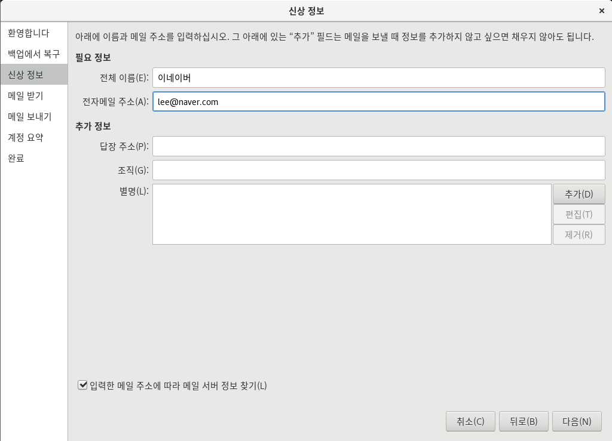

# <!-- 메일 서버의 개념 -->

# 메일 서버의 개념

### 우선 인터넷상에서 메일이 전송되는 과정을 정확히 파악하고 메일 서버 구축을 하기 위한 준비 운동을 하자

### 이메일 송수신에 사용되는 프로토콜은 세가지다. 일단 용어만 눈에 익히고 각 프로토콜이 사용되는 용도를 살펴보자

|              프로토콜               |                                   내용                                    |
| :---------------------------------: | :-----------------------------------------------------------------------: |
| SMTP(Simple Mail Transfer Protocol) | 클라이언트가 메일을 보내거나, 메일 서버끼리 메일을 주고 받을 때 사용한다. |
|     POP3(Post Office Protocol)      |        메일 서버에 도착한 메일을 클라이언트로 가져올 때 사용한다.         |
| IMAP(Internet Mail Access Protocol) |                            POP3와 용도가 같다                             |

### [책 527쪽 그림참조]

### 이메일 전송 전송 원리


### 센드메일 서버 입장


1. 메일 클라이언트 1은 SMTP 프로토콜을 이용해서 메일 서버 1의 센드메일 서비스(데몬)에게 메일을 보내달라고 요청한다.
2. 센드메일 서비스는 메일을 "메일 큐"에 넣어둔다 (이 파일은 /var/spool/mqueue다)
3. 센드메일 서비스는 시간이 되면 MDA에게 메일을 보내달라고 요청한다.
4. MDA는 SMTP 프로토콜을 이용해서 메일 서버 2의 센드메일 서비스에게 메일을 전송한다.
5. 메일 서버 2의 센드 메일 서비스는 받은 메일을 MDA 를 통해 사용자의 메일 박스에 넣어놓는다.
6. 메일 클라이언트 2는 메일 서버 2의 dovecot 서비스에게 자신의 메일을 달라고 요청한다.
7. dovecot 서비스는 메일 박스에서 메일 클라이언트 2의 메일을 POP3 또는 IMAP 프로토콜을 이용해 전송한다.

<br>

# 센드메일 서버 구현

### 이번에는 메일 서버 프로그램 중 CentOS 에서 기본적으로 제공하는 센드메일(Send Mail)서버를 구축해 보자

### 메일 서버 1대를 구현하는 것으로는 별로 실습 효과가 크지 않을 것이므로, 이번 실습에서는 메일 서버 2대를 설치한다.

### 실습 전에 꼭 chapter 9 의 네임 서버의 개념을 완전히 파악하고 있어야한다. 네임 서버 구현 없이는 메일 서버를 구현할 수 없기 때문이다.

### 이번 실습은 VMware 내부를 사설 네트워크라고 생각하지 말고 그냥 외부 인터넷의 일부라고 생각한다. 그러면 인터넷상에서 2개의 메일 서버를 구축하고 운영하는 것과 완전히 동일한 환경이 된다.


### 먼저 그림과 함께 다음 설명을 잘 이해해보자

- VMware 내부의 사설 네트워크를 내부 네트워크라고 생각하지 않고 그냥 외부 인터넷이라고 간주한다.

따라서 도메인 이름으로 'daum.net' 'naver.com'을 사용해되 되는 이유는 지금 사설 네트워크 안을 인터넷이라고 가정하기 때문이다.

- 메일 서버 2대를 구현한다. Server는 naver.com 메일 서버로 구현하고 , Server(B)는 daum.net 메일 서버로 구현한다.
- Client는 naver.com 메일 서버의 lee 라는 계정을 가진 사용자 PC다. 즉 lee@naver.com이라는 계정을 사용할 PC다
- WinClient는 daum.net 메일 서버의 kim이라는 계정을 가진 사용자 PC다. 즉 kim@daum.net이라는 계정이 사용할 PC다.
- 먼저 네임 서버를 구현한다. 위의 그림에는 별도의 컴퓨터로 나타나있지만 , Server 가 네임 서버의 역할도 하도록 설정한다. 즉 Server는 naver.com 메일 서버 겸 네임 서버의 역할을 하는 것이다 이 네임 서버는 naver.com 과 daum.net 두개의 도메인을 관리하는 역할을 할 것이다.
- 모든 컴퓨터는 'DNS 이름 서버(=네임 서버)'를 192.168.111.100으로 사용할 것이다.

<br>
<br>

# 실습 1) naver.com과 daum.net을 도메인을 곤리하는 네임 서버 구현.

## [ 1 ] Server

이번에 Server 는 메일 서버와 네임 서버 두개의 역할을 한다.

### 0. 센드메일을 설치한다.

- dnf -y install sendmail

### [Server - 메일서버] 1. 호스트이름을 mail.naver.com 으로 설정하자

에디터로 /etc/hostname 파일의 "localhost.localdomain"을 "mail.naver.com"으로 변경한다.

- vi /etc/hostname

### [Server - 메일 서버] 2. /etc/hosts 파일의 제일 아래 추가

제일 아래에 "192.168.111.100 mail.naver.com"을 추가한다.

- vi /etc/hosts
  

### [Server - 메일 서버] 3. /etc/mail/local-host-names 파일의 제일 아래에 'mail.naver.com'을 추가한다.

- vi /etc/mail/local-host-names
  

### [Server - 메일 서버] 4. /etc/sysconfig/network 파일의 맨 아래에 'HOSTNAME=mail.naver.com'을 추가한다.

- vi /etc/sysconfig/network
  

### [Server - 메일 서버] 5. 설정된 내용이 적용되도록 재부팅한다.

<br>

## [ 2 ] Server (B) - Server (B)의 호스트 이름을 'mail.daum.net'으로 설정

### 1. 센드 메일을 설치한다.

- dnf -y install sendmail

### 2. /etc/hostname 파일의 'localhost.localdomain'을 제거하고 'mail.daum.net'으로 변경한다.

- vi /etc/hostname

### 3. /etc/mail/local-host-names 파일의 제일 아래에 'mail.daum.net'을 추가한다.

- vi /etc/mail/local-host-names

### 4. /etc/sysconfig/network 파일의 맨 아래에 'HOSTNAME=mail.daum.net'을 추가한다.

- vi /etc/sysconfig/network

### 5. hostname 명령을 입력해서 호스트 이름이 변경된 것을 확인하자


<br>

## [ 3 ] Server [네임서버] - naver.com 도메인과 daum.net 도메인의 네임 서버를 설정한다.

### [Server - 네임서버] 1. 네임 서버 패키지를 설치하자

- dnf -y install bind bind-chroot

### [Server - 네임서버] 2. /etc/named.conf 파일을 수정

- 11행 : listen-on port 53 {127.0.0.1;}; >> listen-on port 53 {any;};
- 12행 : listen-on-v6 port 53 { ::1 ;}; >> listen-on-v6 port 53 { none ;};
- 19행 : allow-query {localhost;}; >> allow-query {any;};
- 34행 : dnssec-validation yes; >> dnssec-validation no;
- 제일 끝 부분:

```bash
zone "naver.com" IN {
        type master;
        file "naver.com.db";
        allow-update { none;};
 };
 zone "daum.net"  IN{
         type    master;
         file    "daum.net.db";
         allow-update    { none;};
 };

```

### [Server - 네임서버] 3. /var/named/ 디렉터리로 이동후 naveer.com.db 파일과 daum.com.db 라는 빈 파일을 만든다.


### [Server - 네임서버] 4. /var/named/naver.com.db 파일을 다음과 같이 추가하고 종료한다.

URL 형식에 ' . '을 붙이는 것을 잊지 말자!!

```
$TTL	3H
@	SOA	@	root.	(	2	1D	1H	1W	1H	)
	IN	NS	@
	IN	A	192.168.111.100       # Server의 IP 주소
	IN	MX	10	mail.naver.com. # 메일을 처리하는 컴퓨터를 지정

mail	IN	A	192.168.111.100   # Server의 IP 주소
```

### [Server - 네임서버] 5. /var/named/daum.net.db 파일을 다음과 같이 추가하고 종료한다.

```
$TTL	3H
@	SOA	@	root.	(	2	1D	1H	1W	1H	)
	IN	NS	@
	IN	A	192.168.111.200       # Server (B) 의 IP 주소
	IN	MX	10	mail.daum.net. # 메일을 처리하는 컴퓨터를 지정

mail	IN	A	192.168.111.200   # Server (B) 의 IP 주소
```

### [Server - 네임서버] 6. 설정한 파일에 이상이 없는지 체크하낟.

- named-checkconf
- named-checkzone naver.com naver.com.db
- named-checkzone daum.com daum.net.db


### [Server - 네임서버] 7. 밑의 명령을 차례로 입력해 네임 서비스를 재시작, 상시 가동하도록 하자

- systemctl restart named
- systemctl enable named
- systemctl status named


### [Server - 네임서버] 8. DNS 포트를 방화벽에서 열어야한다. 방화벽 설정을 하자

다만 실습이 편하도록 이때는 그냥 방화벽을 잠시 멈추자

- systemctl stop firewalld
- systemctl disable firewalld

### [Server - 네임서버] 9. nslookup 명령을 입력한 후 server 192.168.111.100 , mail.naver.com , mail.daum.net 을 차례로 입력해 네임 서버가 잘 설정됬는지 확인하자
- nslookup
- server 192.168.111.100
- mail.naver.com
- mail.daum.net
- exit


## [ 4 ] Server [메일서버] - mail.naver.com 메일 서버의 DNS 서버를 우리가 구축한 네임 서버(192.168.111.100)로 설정한다.

### [Server - 메일 서버] 1. /etc/sysconfig/network-scripts/ifcfg-ens160 파일의 수정하자
DNS1 부분을 192.168.111.100 으로 수정한 다음 저장하고 종료한다.
- vi /etc/sysconfig/network-scripts/ifcfg-ens160


### [Server - 메일 서버] 2. /etc/resolv.conf 또한 수정한다
- vi /etc/resolv.conf


## [ 5 ] Client 

### 1. /etc/resolv.conf 파일을 수정
- su -c 'vi /etc/resolv.conf' 명령을 입력해 nameserver 를 192.168.111.100으로 변경

### 2, nslookup 명령을 입력하고 mail.naver.com과 mail.daum.net을 차례로 입력해 각각의 IP 주소가 나오는지 확인한다

## [6] Server(B) [위의 그림]에 나타난 대로 네임 서버를 192.168.111.100로 바꾸자
###  1. /etc/sysconfig/network-scripts/ifcfg-ens160 파일의 수정하자
DNS1 부분을 192.168.111.100 으로 수정한 다음 저장하고 종료한다.
- vi /etc/sysconfig/network-scripts/ifcfg-ens160


### 2. /etc/resolv.conf 또한 수정한다
- vi /etc/resolv.conf


### 3. nslookup 명령을 입력하고 mail.naver.com과 mail.daum.net을 차례로 입력해 각각의 IP 주소가 나오는지 확인한다

### 4. 재부팅한다.

## [7]  - Winclient를 설치하지 않았으므로 Server 를 kim@daum.net PC으로 사용

<br>
<br>

# 실습 2번 ) naver.com 메일 서버와 daum.net 메일 서버를 구현하자
##  [ 8 ] Server [메일 서버] - naver.com 메일 서버를 구축한다.
### 1. 메일 서버를 구현하는 필수 패키지는 sendmail , sendmail-cf , dovecot 3가지이다. 
sendmail 은 앞서 설치했으므로 2개를 추가로 설치
- dnf -y install sendmail-cf dovecot

<참조> <br>
아마 이거 안될건데 그 /etc/resolv.conf 네임 서버가 자기로 되어 있어서 그럼 ㅋㅋㅋ

### 2. 패키지 확인
- rpm -qa | grep sendamil 
- rpm -qa dovecot


### 3. vi 에디터로 /etc/mail/sendmail.cf 파일을 수정
- 85행 : Cwlocalhost -> Cwnaver.com (붙여 쓸것)
- 267행 : O DaemonProtOptions=Port=smtp, Addr=127.0.0.1, Name=MTA
-   -> O DeamonPortOptions=Port=smtp, Name=MTA ('Addr=127.0.0.1' 부분 삭제)

<참조> snedmail.cf 파일 <br>
/etc/mail/sendmail.cf 파일은 Sendmail 서버의 설정파일이다. 설정 내용이 복잡해서 그렇지 필요한 부분만 알면 된다.
|코드|내용|
|:--:|:--:|
|Cw도메인네임|도메인 이름을 가진 메일서버로 사용하겠다는 의미|
|MaxMessageSize=용량|메일 1개의 본문과 첨부파일을 합친 제한 용량(바이트단위)이다.|
|O QueueDirectory=/var/spool/mqueue|메일 전송시 사용하는 임시 저장 디렉터리|
|O DaemonPortOptions=Port=smtp, Addr=127.0.0.1, Name=MTA|'Addr=172.0.0.1'은 자기 자신만 메일을 보낼 수 있다는 의미다. 그래서 외부에서도 메일을 보낼 수 있도록 이 부분을 삭제했다.|


sendmail.cf 파일을 수정한 후에는 Sendmail 서비스를 재시작해야한다. 하지만 아직은 다른 설정까지 한 후 서비스를 재시작할 것이므로 아직은 서비를 재시작 하지 않는다.

### 4. 외부 네트워크 또는 호스트가 메일을 보낼 수 있도록 허가해준다.
gedit 이나 vi 로 /etc/mail/access 파일에 다음 내용을 추가한다.
```bash
naver.com   RELAY # naver.com 도메인의 릴레이 허용
daum.net    RELAY # daum.net 도메인의 릴레이 허용
192.168.111 RELAY # 192.168.111.ooo 컴퓨터의 릴레이 허용
```


<참조> 메일 릴레이 <br>
메일 릴레이(Mail Relay)란 다른 네트워크 또는 호스트에서 자신의 메일 서버를 경유하여 메일을 전송하는 것이다. 이 기능을 악용해서 스팸 메일이나 바이러스 메일 등 대량 메일을 발송하는 경우가 종종 발생되어 사회적인 문제까지 야기시키곤 한다.

그래서 Sendmail 에서 제공하는 메일 릴레이 기능은 기본적으로 자기 자신 IP 주소(127.0.0.1) 외에는 아무도 메일을 발송할 수 없도록 설정된 것이다. 이 파일이 /etc/mail/access 파일 이다.

하지만 모든 사용자가 메일 서버 컴퓨터 앞에서 앉아서 메일을 보낼 수는 없으므로, 신뢰할 수 있는 도메인이나 호스트 또는 네트워크에는 메일을 릴레이 할 수 있도록 허용한다. 보통 /etc/mail/access 파일의 릴레이 허용은 RELAY 로 , 거부는 REJECT 또는 DISCARD 를 사용한다.

예를 들면 다음과 같다.
```bash
192.168.111.200   RELAY # 192.168.111.200 컴퓨터의 릴레이 허용
abc.com           RELAY # abc.com 도메인에 릴레이 허용
192.168           RELAY # 192.168.xxx.xxx 의 모든 컴퓨터에 릴레이 허용
babo@             DISCARD # babo라는 메일 계정의 메일 거부 (거부 메시지 않보냄)
@daum.net         REJECT # daum.net 메일 사용자의 메일 거부(거부 메시지 보냄)
```
/etc/mail/access 파일을 수정하면 서비스를 다시 시작해야하나 아직 다른 설정도 하고 서비스를 시작할 거다.

### 5. 사용자에게 메일 박스의 내용을 보여주는 dovecot 서비스의 설정파일은 /etc/dovecot/dovecot.conf 이다.
다음 부분을 수정하자
- vi /etc/dovecot/dovecot.conf
- 24행 : protocols = imap pop3 lmtp <- 주석 제거
- 30행 : listen = *, :: <- 주석 제거
- 33행 : base_dir = /var/rundovecot <- 주석 제거


<참조> dovecot.conf <br>
많은 자세한 내용은 http://dovecot.org 또는 man dovecot.conf명령어를 입력해 확인할 수 있다.
|코드|내용|
|:--:|:--:|
|protocols = imap pop3 lmtp|세 가지 프로토콜을 모두 사용한다는 의미다.|
|listen = *, ::| '*'은 IPv4를 , '::'은 IPv6 프로토콜을 의미한다.|

### 7. /etc/dovecot/conf.d/10-ssl.conf 파일을 수정
- vi /etc/dovecot/conf.d/10-ssl.conf 
- 8행 : ssl = required -> ssl = yes


### 8. /etc/dovecot/con.d/10-mail.conf 파일을 수정
- vi /etc/dovecot/con.d/10-mail.conf
- 25행 : mail_location = mbox:~/mail:INBOX=/var/mail/%u <- 주석 제거
- 121행 : mail_access_groups = mail <- 주석 제거 후 변경
- 166행 : lock_method = fcntl <- 주석 제거

### 9. naver.com 의 메일 계정 사용자인 lee를 생성
암호도 lee이며 lee의 메일 계정은 lee@naver.com 이다.
- useradd lee
- passwd lee

### 10. 다음 명령을 입력해 sendmail 과 dovecot 서비스를 재가동, 상시가동 하자
- systemctl restart sendmail
- systemctl enable sendmail
- systemctl restart dovecot
- systemctl enable dovecot

지금까지 진행한 것은 naver.com 메일 서버를 완성한 것이다. daum.net 메일 서버를 만들기 전에 naver.com 메일 서버가 자체적으로 동작하는 지 확인하자.

<br>

## [ 9 ] Client - naver.com 메일 서버가 잘 작동하는 지 테스트
### Client 는 lee@naver.com 계정 사용자의 PC이다.

### 1. [현재 활동] - [에볼루션] 시작
1. 환영합니다 에서 [다음]을 클릭
2. [백업에서 복구] 에서도 [다음]을 클릭
3. [신상 정보]에서는 [전체 이름]에 적당히 '이네이버' , [전자메일 주소]에는 'lee@naver.com'을 입력하고 [다음]을 누른다


4. 잠시 후 [메일 받기]가 나오면 서버 종류를 [POP]으로 변경하고 [서버]에는 'mail.naver.com'을 입력한다. [사용자이름]은 'lee'를 입력하고 [암호화 방식]은 [TLS, 특정 포트 사용]으로 변경한 후 [다음]을 누른다.


5. [받기 옵션]에서는 [다음]을 누른다
6. [메일 보내기]에서는 [서버]에 'mail.naver.com'을 입력하고 [다음]을 누른다.


7. [계정 요약]에서는 [이름]에 '네이버 메일' 등 계정을 식별할 수 있는 이름을 입력하고 [다음]을 누른다.


8. [완료]에서 [적용]을 누른다

9. [메일 - 에볼루션] 창이 나온다. 우선 (보내기/받기)를 클릭한 후 [인증서 신뢰 ...]에서 (계속 허용)을 클릭해 Server의 인증서를 허용하자

... 아 못찍음 ㅋㅋ..

10. 만약 [메일 인증 요청]창이 나오면 사용자 이름과 암호에 'lee', 아래에 있는 [이 암호를 키모음에 추가]의 체크를 끄기 [확인]을 누른다.


### 2. 적당히 메일을 써보자.
1. 에볼루션의 메인 화면이 실행되면 왼쪽 위의 [새로 만들기]를 클릭해 자기 자신(lee@naver.com)에 적당히 메일을 써보자


2. [보내기/받기]를 클릭하고 [받은 편지함]을 확인하면 자신이 보낸 메일을 확인해보자


<br>
<br>

# [ 10 ] Server (B) - daum.net 메일 서버 구축
앞서 만든 naver.com 메일 서버 구축과 거의 동일하다.
### 1. 메일 서버를 구현하는 필수 패키지는 sendmail , sendmail-cf , dovecot 3가지이다. 
sendmail 은 앞서 설치했으므로 2개를 추가로 설치
- dnf -y install sendmail-cf dovecot

<참조> <br>
아마 이거 안될건데 그 /etc/resolv.conf 네임 서버가 자기로 되어 있어서 그럼 ㅋㅋㅋ

### 2. 패키지 확인
- rpm -qa | grep sendamil 
- rpm -qa dovecot


### 3. vi 에디터로 /etc/mail/sendmail.cf 파일을 수정
- 85행 : Cwlocalhost -> Cwdaum.net (붙여 쓸것)
- 267행 : O DaemonProtOptions=Port=smtp, Addr=127.0.0.1, Name=MTA
-   -> O DeamonPortOptions=Port=smtp, Name=MTA ('Addr=127.0.0.1' 부분 삭제)

<참조> snedmail.cf 파일 <br>
/etc/mail/sendmail.cf 파일은 Sendmail 서버의 설정파일이다. 설정 내용이 복잡해서 그렇지 필요한 부분만 알면 된다.
|코드|내용|
|:--:|:--:|
|Cw도메인네임|도메인 이름을 가진 메일서버로 사용하겠다는 의미|
|MaxMessageSize=용량|메일 1개의 본문과 첨부파일을 합친 제한 용량(바이트단위)이다.|
|O QueueDirectory=/var/spool/mqueue|메일 전송시 사용하는 임시 저장 디렉터리|
|O DaemonPortOptions=Port=smtp, Addr=127.0.0.1, Name=MTA|'Addr=172.0.0.1'은 자기 자신만 메일을 보낼 수 있다는 의미다. 그래서 외부에서도 메일을 보낼 수 있도록 이 부분을 삭제했다.|


sendmail.cf 파일을 수정한 후에는 Sendmail 서비스를 재시작해야한다. 하지만 아직은 다른 설정까지 한 후 서비스를 재시작할 것이므로 아직은 서비를 재시작 하지 않는다.

### 4. 외부 네트워크 또는 호스트가 메일을 보낼 수 있도록 허가해준다.
gedit 이나 vi 로 /etc/mail/access 파일에 다음 내용을 추가한다.
```bash
naver.com   RELAY # naver.com 도메인의 릴레이 허용
daum.net    RELAY # daum.net 도메인의 릴레이 허용
192.168.111 RELAY # 192.168.111.ooo 컴퓨터의 릴레이 허용
```


<참조> 메일 릴레이 <br>
메일 릴레이(Mail Relay)란 다른 네트워크 또는 호스트에서 자신의 메일 서버를 경유하여 메일을 전송하는 것이다. 이 기능을 악용해서 스팸 메일이나 바이러스 메일 등 대량 메일을 발송하는 경우가 종종 발생되어 사회적인 문제까지 야기시키곤 한다.

그래서 Sendmail 에서 제공하는 메일 릴레이 기능은 기본적으로 자기 자신 IP 주소(127.0.0.1) 외에는 아무도 메일을 발송할 수 없도록 설정된 것이다. 이 파일이 /etc/mail/access 파일 이다.

하지만 모든 사용자가 메일 서버 컴퓨터 앞에서 앉아서 메일을 보낼 수는 없으므로, 신뢰할 수 있는 도메인이나 호스트 또는 네트워크에는 메일을 릴레이 할 수 있도록 허용한다. 보통 /etc/mail/access 파일의 릴레이 허용은 RELAY 로 , 거부는 REJECT 또는 DISCARD 를 사용한다.

예를 들면 다음과 같다.
```bash
192.168.111.200   RELAY # 192.168.111.200 컴퓨터의 릴레이 허용
abc.com           RELAY # abc.com 도메인에 릴레이 허용
192.168           RELAY # 192.168.xxx.xxx 의 모든 컴퓨터에 릴레이 허용
babo@             DISCARD # babo라는 메일 계정의 메일 거부 (거부 메시지 않보냄)
@daum.net         REJECT # daum.net 메일 사용자의 메일 거부(거부 메시지 보냄)
```
/etc/mail/access 파일을 수정하면 서비스를 다시 시작해야하나 아직 다른 설정도 하고 서비스를 시작할 거다.

### 4 - 1. /etc/mail/access 파일을 수정한 후에는 makemap hash /etc/mail/access < /etc/mail/access 를 입력해 적용시킨다.
- makemap hash /etc/mail/access < /etc/mail/access

### 5. 사용자에게 메일 박스의 내용을 보여주는 dovecot 서비스의 설정파일은 /etc/dovecot/dovecot.conf 이다.
다음 부분을 수정하자
- vi /etc/dovecot/dovecot.conf
- 24행 : protocols = imap pop3 lmtp <- 주석 제거
- 30행 : listen = *, :: <- 주석 제거
- 33행 : base_dir = /var/rundovecot <- 주석 제거


<참조> dovecot.conf <br>
많은 자세한 내용은 http://dovecot.org 또는 man dovecot.conf명령어를 입력해 확인할 수 있다.
|코드|내용|
|:--:|:--:|
|protocols = imap pop3 lmtp|세 가지 프로토콜을 모두 사용한다는 의미다.|
|listen = *, ::| '*'은 IPv4를 , '::'은 IPv6 프로토콜을 의미한다.|

### 7. /etc/dovecot/conf.d/10-ssl.conf 파일을 수정
- vi /etc/dovecot/conf.d/10-ssl.conf 
- 8행 : ssl = required -> ssl = yes


### 8. /etc/dovecot/con.d/10-mail.conf 파일을 수정
- vi /etc/dovecot/con.d/10-mail.conf
- 25행 : mail_location = mbox:~/mail:INBOX=/var/mail/%u <- 주석 제거
- 121행 : mail_access_groups = mail <- 주석 제거 후 변경
- 166행 : lock_method = fcntl <- 주석 제거

### 9. naver.com 의 메일 계정 사용자인 kim를 생성
암호도 kim이며 kim의 메일 계정은 kim@daum.net 이다.
- useradd kim
- passwd kim

### 10. 다음 명령을 입력해 sendmail 과 dovecot 서비스를 재가동, 상시가동 하자
- systemctl restart sendmail
- systemctl enable sendmail
- systemctl restart dovecot
- systemctl enable dovecot

### 11. 메일 서비스와 관련된 여러개의 서비스를 실행해야 하므로 systemctl stop firewalld 명령과 systemctl disable firewalld 명령을 실행하자
- systemctl stop firewalld
- systemctl disable firewalld

<br>
<br>

# [ 11 ] WinClient - 없는 독자는 Server를 사용해도 됨
Server를 사용한다면 에볼루션을 사용하자

### 1. [현재 활동] - [에볼루션] 시작
1. 환영합니다 에서 [다음]을 클릭
2. [백업에서 복구] 에서도 [다음]을 클릭
3. [신상 정보]에서는 [전체 이름]에 적당히 '킴다운' , [전자메일 주소]에는 'kim@daum.net'을 입력하고 [다음]을 누른다


4. 잠시 후 [메일 받기]가 나오면 서버 종류를 [POP]으로 변경하고 [서버]에는 'mail.daum.net'을 입력한다. [사용자이름]은 'kim'를 입력하고 [암호화 방식]은 [TLS, 특정 포트 사용]으로 변경한 후 [다음]을 누른다.


5. [받기 옵션]에서는 [다음]을 누른다
6. [메일 보내기]에서는 [서버]에 'mail.daum.net'을 입력하고 [다음]을 누른다.


7. [계정 요약]에서는 [이름]에 '다음 메일' 등 계정을 식별할 수 있는 이름을 입력하고 [다음]을 누른다.


8. [완료]에서 [적용]을 누른다

9. [메일 - 에볼루션] 창이 나온다. 우선 (보내기/받기)를 클릭한 후 [인증서 신뢰 ...]에서 (계속 허용)을 클릭해 Server의 인증서를 허용하자

... 아 못찍음 ㅋㅋ..

10. 만약 [메일 인증 요청]창이 나오면 사용자 이름과 암호에 'kim', 아래에 있는 [이 암호를 키모음에 추가]의 체크를 끄기 [확인]을 누른다.

### 2. 적당히 메일을 써보자.
적당히 첨부파일도 추가 할 수 있다.
1. 에볼루션의 메인 화면이 실행되면 왼쪽 위의 [새로 만들기]를 클릭해 Client PC (lee@naver.com)에 적당히 메일을 써보자


### 3. Client 에서 확인해보자
2. [보내기/받기]를 클릭하고 [받은 편지함]을 확인하면 Server (kim@daum.net) 에서 보낸 메일을 확인해보자


