# 웹 메일 설치 및 사용
### 메일 계정을 제공하는 많은 인터넷 사이트는 대게 웹 브라우저에서 메일을 보내고 받을 수 있다.
### 이렇게 웹 브라우저에서 사용하는 메일을 '웹 메일'이라고 부른다.
### 요즘 이메일을 사용하는 수 많은 사용자는 에볼루션 , 오페아 메일, 아웃록등을 한번도 사용해본 적이 없거나 아예 모르는 사람들이 더 많은 것 같다. 
### 그래서 요즘은 이메일 서버와 함께 필수적으로 설치해야하는 것이 '웹 메일'이다. 웹 메일은 우리가 잘 아는 것처럼 웹 브라우저에서 이메일 서비스를 사용하는 것이다.
### 메일 계정을 주는 많은 사이트가 이 웹 메일 서비스를 제공한다.

### 그래서 이번에 설치할 웹 메일은 라운드 큐브(Round Cube)다
<참조> <br>
라운드 큐브 웹 메일의 소스 코드와 상세한 내용은 (https://roundcube.net/)을 참조하자

### 라운드 큐브는 PHP로 만들어 졌으며 Sendmail 과 IMAP 서버 (dovecot)을 기반으로 둔 웹 메일 프로그램이다. 반드시 아파치 웹 서버 (httpd)와 PHP가 설치되어 있어야 한다.

<br>
<br>

# 실습해보자!!
앞의 메일 서버와 이어진다. (ch10 -1 메일서버를 읽고 오자)

## [ 1 ] [Server - 메일 서버 ] 
### 1. 먼저 해당 관련 패키지를 설치한다.
- dnf -y install httpd mariadb-server php php-mysqlnd php-gd php-mbstring php-pecl-zip php-xml php-json php-intl

|패키지|내용|
|:--:|:--:|
|httpd|아파치|
|mariadb-server|maria db|
|php|php|
|php-mysqlnd|...|
|php-gd||
|php-mbstring||
|php-pecl-zip||
|php-xml||
|php-json||
|php-intl||

<참조> <br>
안된다면 /etc/resolv.conf 네임 서버를 192.168.111.2 로 VMware 네임 서버로 잠시 바꿔놓자

### 2. httpd 와 maria db 서비스를 가동/상시 가동 시켜놓자
- systemctl restart httpd
- systemctl enable httpd
- systemctl restart mariadb
- systemctl enable mariadb

### 3. 라운드 큐브를 다운로드 설치하자
라운드 큐브는 공식적으로 CentOS에서 제공하지 않는다.
1. https://github.com/roundcube/roundcubemail/releases/download/1.3.10/roundcubemail-1.3.10-complete.tar.gz 을 wget으로 다운로드 하거나 
2. http://download.hanbit.co.kr/centos/8/roundcubemail-1.3.10-complete.tar.gz 에서 다운 받아도 된다.

### 4. 압축을 풀고 /var/www/html 폴더 아래로 옮긴후 폴더의 링크를 roundcube로 생성하자
- tar xfz roundcubemail-1.3.10-complete.tar.gz 
- mv roundcubemail-1.3.10 /var/www/html
- ln -s /var/www/html/roundcubemail-1.3.10/ /var/www/html/roundcube

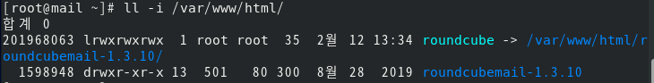

### 5. 사용할 데이터베이스를 emailDB 이름으로 생성하자 , 사용자는 emailAdmin@localhost 로 하고 비밀번호는 1234이다.
데이터 베이스 : emailDB <br>
사용자 : emailAdmin@localhost <br>
비밀번호 : 1234 <br>
```bash
> mysql 명령어 입력후
CREATE DATABASE emailDB;
GRANT ALL ON emailDB.* TO 'emailAdmin'@'localhost' IDENTIFIED BY '1234';
FLUSH PRIVILEGES;
EXIT
```

## [ 2 ] [Server - 메일 서버 ] - 라운드 큐브 초기 설정하기
### 1. 라운드 큐브 초기 설정을 진행하자.
웹 브라우저로 http://mail.naver.com/roundcube/installer/ 에 접속하면 초기 화면 [ 1. Check Enviroment ]화면이 나온다. PHP 관련 부분이 모두 OK 로 나오면 된다.<br> 그 외 부분은 일부 NOT AVAILABLE 이나 NOT OK가 나와도 된다. <br> 제일 아래로 스크롤 해서 [NEXT]를 눌러보자
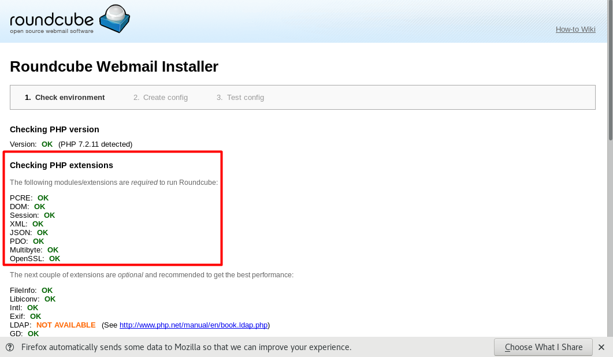

### 2. 라운드 큐브 [ 2. Create Config ]
[2. Create config] 화면이 나오면 product_name을 적당히 입력하고 아래로 스크롤 하여 [Database setup] 부분에서 MYSQL을 선택한 후 데이터베이스에서 만든 정보 localhost, emailDB, emailAdmin , 1234로 차례로 채운다.

그리고 제일 아래의 [CREATE CONFIG]를 입력한다.
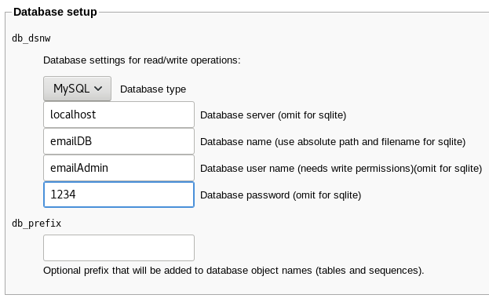

### 3. 자동으로 위로 올라가면 [Download]를 클릭해서 config.inc.php를 저장한다.
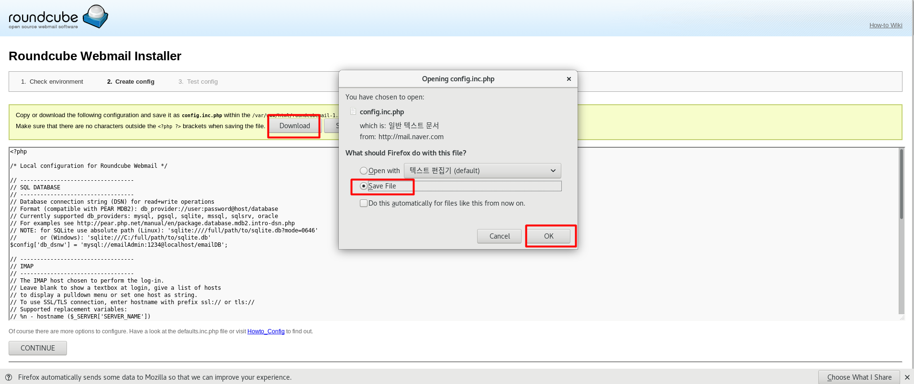

### 4. 아직 웹 브라우저를 닫지 말고 터미널을 열자
다음 명령으로 저장한 파일을 이동시키고 속성도 바꾸자
- mv /root/다운로드/config.inc.php /var/www/html/roundcube/config
- chmod 707 /var/www/html/roundcube/config/config.inc.phps

### 5. 다시 웹 브라우저에서 약간 아래로 스크롤 하여 [CONTINUE]를 클릭한다.

### 6. [ 3. Test Config ] 화면에서 [Initialize database]를 클릭하면 DB Schema 부분이 OK로 변경된다.
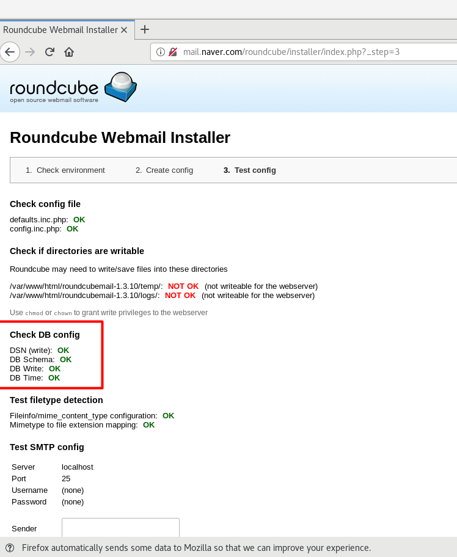

### 7. 아래로 스크롤 해서 [Test SMTP config]의 Sender 와 Recipient에 모두 'lee@naver.com'을 입력하고 [Send test mail]을 클릭하면 'SMTP send : OK' 메시지가 나온다. <br> <br> 또 [Test IMAP config]의 Username 과 Password 모두 'lee'를 입력하고 [Check Login]을 클리갛면 'IMAP connect: OK' 메시지가 나온다.
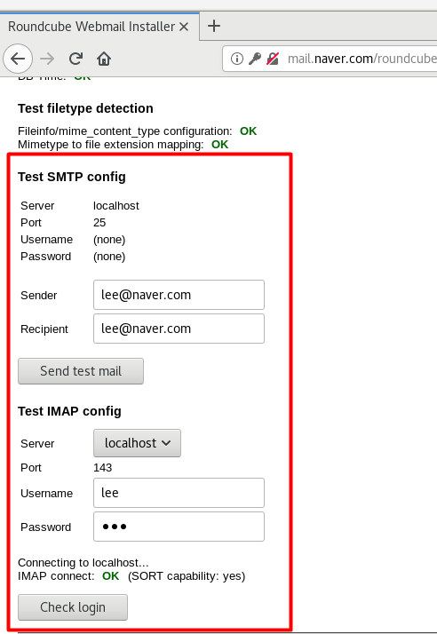

이렇게 해서 라운드 큐브 설정이 정상적으로 마무리 되었다. 별도록 저장할 것은 없으므로 브라우저를 종료한다.

<br>
<br>

# [ 3 ] Client 또는 WinClient - 웹 메일 접속 테스트
### 1. 웹 브라이저 접속
웹 브라우저를 열고 http://mail.naver.com/roundcube/ 에 접속하자
초기 화면이 나오면 [이름]은 기존 사용자 'lee' , [비밀번호] 'lee'를 입력해 로그인하자
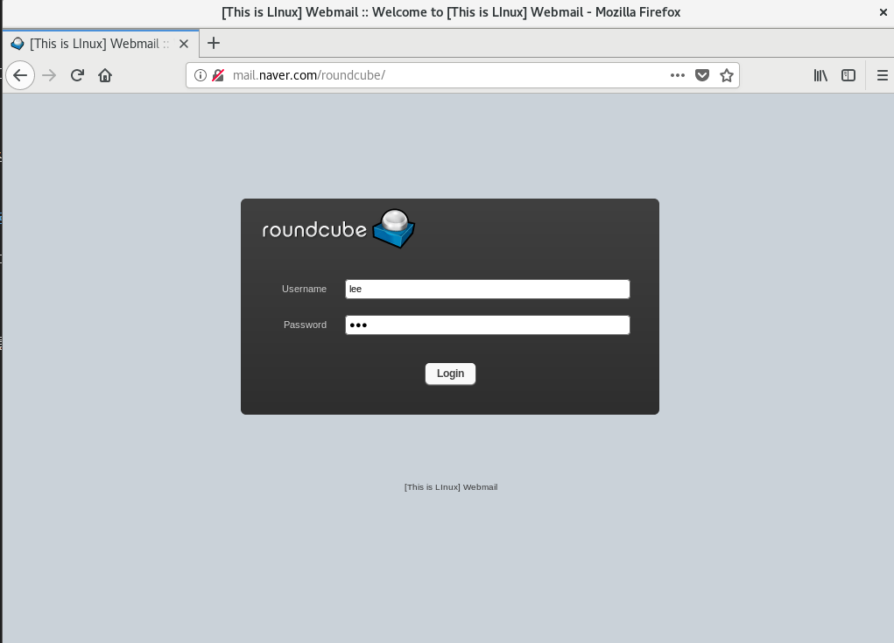

### 2. 화면이 영문으로 보이면 [settings]를 클릭하자
[Preferences] -> [User Interface]를 선택하고 Language를 [Korea (한국어)]로 변경해 [save]를 누르자
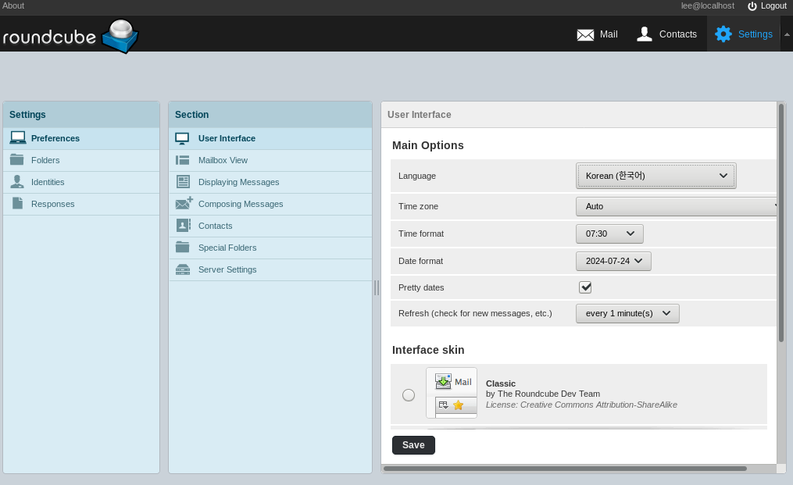


### 3. 새 메일을 써보자
왼쪽 상단의 [roundcube]아이콘을 클릭해서 초기 화면으로 돌아온다. [작성] 아이콘을 클릭하고 새 메일을 쓰자

### 4. 보내는 사람이 'lee (lee@localhost)'로 보인다면 [신원 편집]을 클릭한다.
신원 [lee \<lee@localhost\>]를 클릭하고 이메일을 "lee@naver.com"으로 변경한 후 <저장>을 클릭한다.
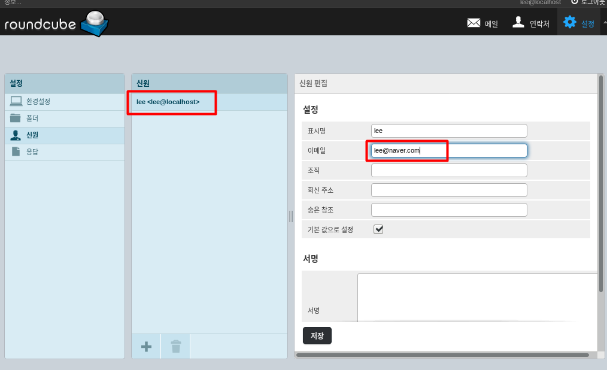

### 5. [roundcube]아이콘을 클릭하자
다시 왼쪽 상단에 있는 [roundcube]아이콘을 클릭해서 초기화면으로 돌아와 [작성]아이콘을 클릭한다. 보내는사람이 "lee \<lee@naver.com\>"으로 되어 있을 것이다. 

받는 사람 "kim@daum.net"을 입력하고 제목과 내용을 채워 보내보자
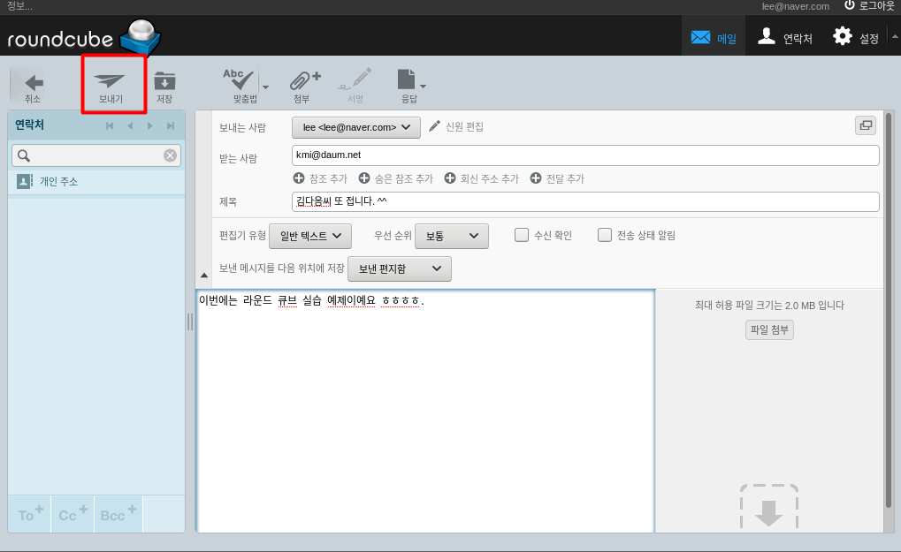
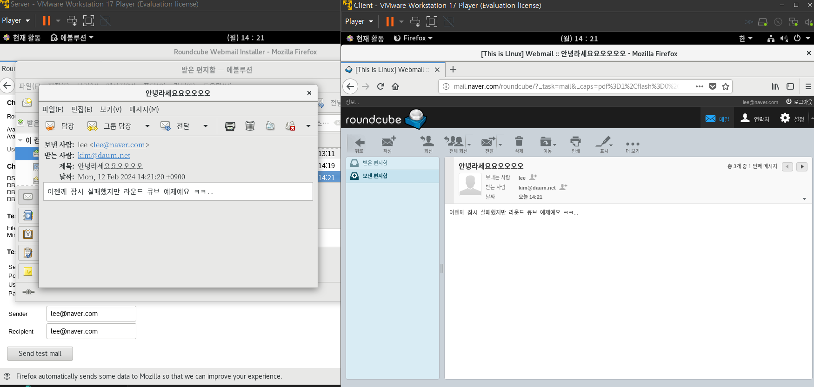

### 6. 그런데 첨부 파일의 크기가 2MB로 제한되어 있다 이를 수정해 보자

<br>
<br>

# [ 4 ] [Server - 메일 서버] 웹 서버의 PHP 설정에서 2MB보다 큰 파일을 업로드할 수 있도록 하자
### 1. /etc/php.ini 파일을 열고 다음을 수정해보자
- vi /etc/php.ini
- 383행 : max_execution_time = 30 -> 300으로
- 672행 : post_max_size = 8M -> 500M
- 825행 : upload_max_filesize = 2M -> 500M

그 다음 리부팅을 한다
- reboot

|코드|내용|
|:--:|:--:|
|max_execution_time|파일을 업로드 할 때 스크립트가 실행되는 초 단위의 시간을 설정, 시간을 너무 짧게 설정하면, 대용량 파일을 업로드할 때 시간이 오래 걸릴 경우 업로드가 중단 될 수 있다.|
|post_max_size|POST 방식으로 데이터를 전송할 수 있는 최대 용량|
|upload_max_filesize|업로드 가능한 파일의 최대 크기다. upload_max_filesize가 실질적으로 업로드할 수 있는 파일의 크기를 결정하는 부분이다|

<br>
<br>

# [ 5 ] Client 
이제 대용량 파일이 첨부되는지 확인해 보자
### 1. 웹 브라이저 접속
웹 브라우저를 열고 http://mail.naver.com/roundcube/ 에 접속하자
초기 화면이 나오면 [이름]은 기존 사용자 'lee' , [비밀번호] 'lee'를 입력해 로그인하자

### 2. [작성] 아이콘을 클릭 후 최대 500MB 이하 대용량 파일을 첨부해서 [kim@daum.net]에게 메일을 보내보자
첨부되면 된다.

