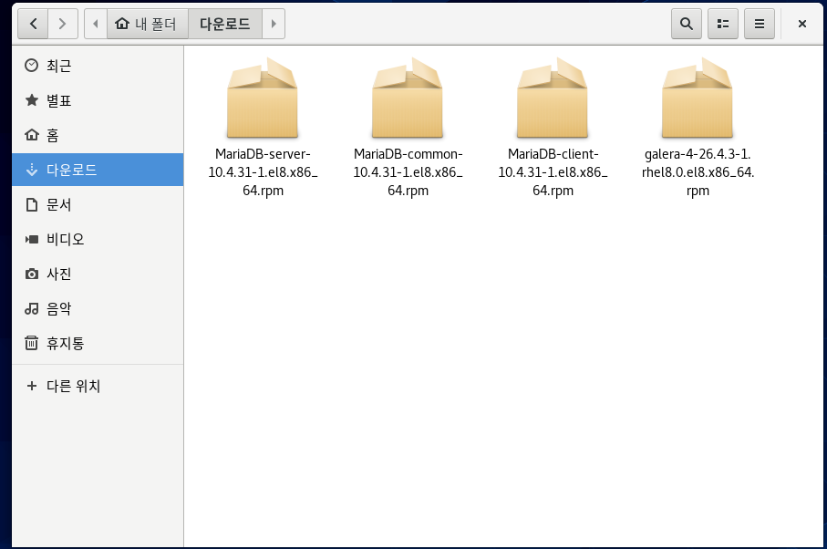
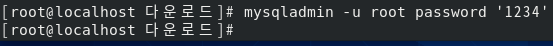
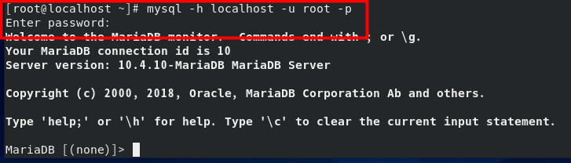
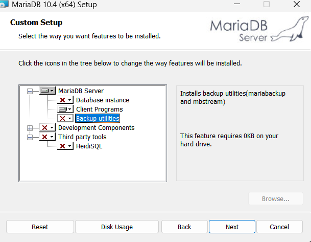
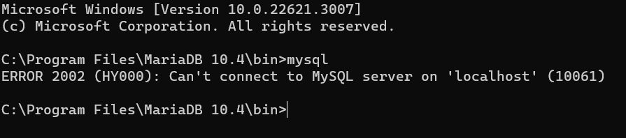
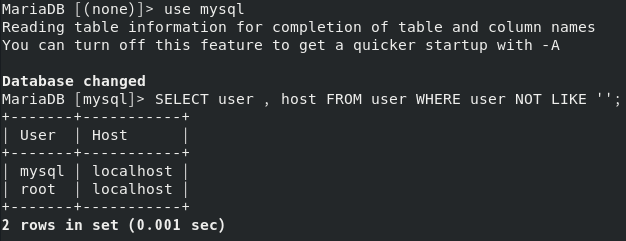
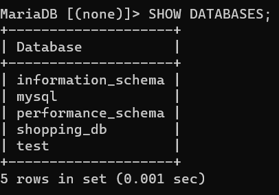
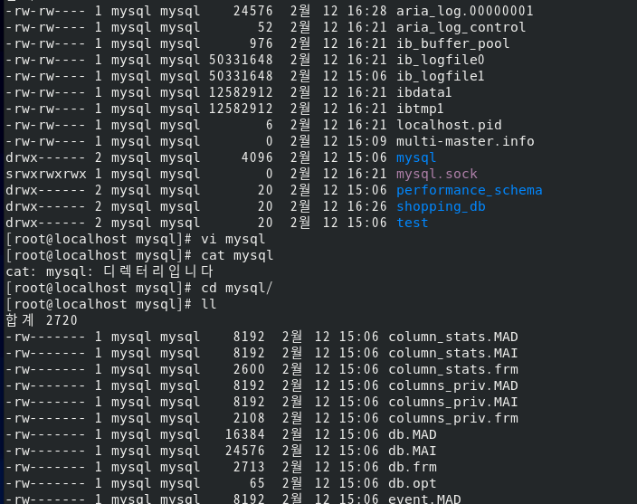
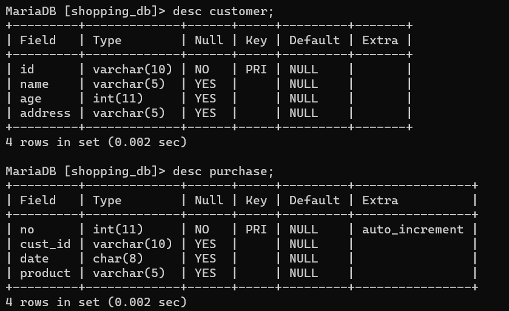

# <!-- 데이터베이스 서버 구축과 운영 -->

# DBMS의 개념과 간단한 SQL 문

### 간단하게 DBMS의 개념과 SQL 문의 기본을 파악해보자.

<br>
<br>

## DBMS 관련 용어와 역할의 이해

### 이번 실습은 MariaDB와 Oracle을 사용한다. 간단히 용어를 이해해보자

|             관련 용어             |                                          사전의 정의                                           |
| :-------------------------------: | :--------------------------------------------------------------------------------------------: |
|            데이터 DATA            |                                              자료                                              |
|           테이블 TABLE            |                                   데이터를 표 형식으로 표현                                    |
|       데이터베이스 DATABASE       |                         테이블을 저장하는 저장공간 또는 테이블의 집합                          |
| DBMS (Database Management System) |                               데이터베이스를 관리하는 소프트웨어                               |
|    레코드 record 또는 로우 row    |                                          테이블의 행                                           |
|    필드 field 똔느 컬럼 column    |                                          테이블의 열                                           |
|       데이터 타입 Data type       |                         각 필드에 입력할 값의 타입 정수 , 문자 날짜 등                         |
|      주 키 primary key 필드       |                   레코드를 식별하기 위한 유일한 값을 갖고 비어있지 않는 필드                   |
|     외래 키 foreign key 필드      |                              다른 테이블의 주 키와 대응되는 필드                               |
|      RDBMS (Relational DBMS)      |                                          관계형 DBMS                                           |
|  SQL (Structured Query Language)  | '구조화된 질의 언어'라는 의미로 DB에서 정보를 얻거나 생성 및 갱신하려고 정의한 표준 언어(규약) |


### 나머지는 책 570 ~ 581쪽 참조

<br>
<br>

# MariaDB 설치와 운영
리눅스를 DBMS로만 사용해도 충분히 그 진가를 발휘할 수 있다. 이번절에서는 리눅스르 DBMS 서버 전용으로 운영한다고 가정하고 MariaDB의 최신 버전을 설치 및 운영해보자

### <참조> MySQL 과 MariaDB <br>
오픈 소스 기반의 데이터베이스로 MySQL이 오랫동안 가장 많이 사용되어 왓다. 그런데 MySQL이 Sun사에 인수되고 다시 Sun 사가 오라클(Oracle)사에 인수되자, 오라클사의 라이선스 정책에 동조하지 않는 주요 핵심 개발자들이 2009년 퇴사해서 별도의 데이터베이스 도구를 개발했다 

이것이 MariaDB 이다. 그러므로 MariaDB는 MySQL 과 거의 동일한 제품이라고 보면된다. 현재는 CentOS를 비롯한 많은 리눅스 진영에서 MySQL 대신 MariaDB를 기본 DBMS로 제공한다.

<br>

## MariaDB 서버 및 클라이언트 다운로드와 설치
시나리오는 이렇다.

독자가 오프라운 쇼핑몰 회사의 IT 부서에 신입 사원으로 취직했다. 처음으로 참여한 회의 주제는 오프라인 쇼핑몰과 연동한 온라인 쇼핑몰 구축이다. 팀원 중 웹 프로그래머 와 웹 디자이너가 근무하므로 웹 사이트 구축은 문제가 없지만, 데이터 베이스 관리자가 별도로 없어서 모두 고민 중이다. 또 다른 문제는 비용이다.

아직은 시범 시스템을 구축하는 단계여서 별도의 하드웨어나 소프트웨어를 구매할 수 도 없는 상황이다. 그렇다고 기존 데이터베이스 서버에 시범 운영할 시스템을 같이 사용하려니, 아무래도 기존에 운영하던 시스템이 느려질 것 같아서 좀 불안하다. 이때 신입 사원인 독자가 조용히 손을 들고 "제가 데이터베이스 구축을 책임지겠습니다"라고 말해 버렸다 

<br>
<br>

# 실습 1 ) Server 를 DBMS 전용 서버로 운영하자
### 1. 마리아 DB 설치
CentOS 8은 MariaDB 10.3 버전을 포함하지만 , 이번에는 직접 해당 사이트에서 이 책을 집필하는 시점의 최신 버전인 10.4.10 버전의 RPM 파일을 다운로드해서 설치해보자

웹 브라우저는 https://mariadb.org/ 에 접속한 후 [Download]를 클릭하자

다만 지금 다운로드 하면 독자가 실습하는 시점의 최신버전과 다르므로 http://yum.mariadb.org/10.4/centos8-amd64/rpms/ 주소로 직접 접속하거나 우리 사이트 https://cafe.naver.com/thisislinux/6620 에서 다음 4개의 파일을 다운로드 하자

다운로드는 밑의 4가지이다.
- galera-4-26.4.3-1 rhel8.0.el8.x86_64.rpm
- MariaDB-client-10.4.10-1.el8.x86_64.rpm
- MariaDB-common-10.4.10-1.el8.x86_64.rpm
- MariaDB-server-10.4.10-1.el8.x86_64.rpm


### 2. 다운로드한 파일을 설치하자
- cd 다운로드/
- dnf -y install ga*.rpm Maria*.rpm

### 3. 밑의 명령을 차례로 입력해 서비스를 가동하자
참고로 MariaDB의 서비스이름은 mariadb다
- systemctl restart mariadb
- systemctl enable mariadb
- systemctl status mariadb

<참조> 서비스 등록 차이 <br>
CentOS 8에 포함된 서버 패키지를 dnf 명령으로 설치하면 /lib/systemd/system/ 디렉터리에 서비스이름.service 또는 서비스이름.socket 으로 등록된다.

### 4. firewall-config 로 방화벽 설정
- firewall-config
- [설정] - [영구적]을 선택한 후 [영역] - [public]이 선택된 상태로 [서비스] 탭 [mysql]의 체크를 켜서 MariaDB 서버를 열어주자.
- [옵션] - [Firewalld 다시 불러오기]를 선택한 후 설정을 닫는다.

각 서버의 포트 번호는 /etc/services 파일에 설저오디어 있다. mysql의 포트는 3306이다.

### 5. Maria 클라이언트 프로그램
이제 Maria 클라이언트 프로그램을 이용해서 MariaDB 서버에 접속해 보자. MariaDB 클라이언트 프로그램의 실행 명령인 mysql 을 입력해보자

[MariaDB (none)] 프롬프트가 나오면 서버에 정상적으로 접속된것이다. 이제 앞 절에서 배운 SQL 문을 사용한다. exit 명령을 입력해 종료도 가능하다.

```
[root@localhost 다운로드]# mysql
Welcome to the MariaDB monitor.  Commands end with ; or \g.
Your MariaDB connection id is 8
Server version: 10.4.10-MariaDB MariaDB Server

Copyright (c) 2000, 2018, Oracle, MariaDB Corporation Ab and others.

Type 'help;' or '\h' for help. Type '\c' to clear the current input statement.

MariaDB [(none)]> 

```

여기까지 문제없이 진행했다면 독자는 Maria DB 데이터베이스 서버 설치를 완료한것이다. 이제는 이 데이터베이스 서버를 잘 활용하는 일만 남았다.

<참조> 마리아 DB 설치 <br>
1. wget http://download.hanbit.co.kr/centos/8/파일이름 4개를 입력해 관련 파일다운로드
2. 포트 열기
- firewall-cmd --permanent --add-service=mysql
- firewall-cmd --reload

<br>
<br>

# Window에서 리눅스 MariaDB 서버로 접속
데이터베이스 서버에는 중요한 정보를 많이 보관한다. 그래서 대부분의 DBMS는 사용자와 관련된 보안 정책이 별도로 있다. 즉 아무나 DBMS에 접속할 수 있는 것이 아닌 허가받은 사용자만 접속 할 수 있는 것이다

데이터 베이스 사용자인 root는 MariaDB 서버 안에서 모든 권한을 실행할 수 있는 데이터베이스 관리자다. 운영체제 사용자인 root 와 우연히 이름만 같을 뿐 전혀 별개의 사용자다

그래서 원칙적으로 MariaDB 서버에 접속하려면 mysql -h 접속할컴퓨터 -u DB사용자 이름 -p 명령을 실행한 후, 데이터베이스 사용자의 비밀번호를 입력해서 접속해야 한다.
 - mysql -h 접속할컴퓨터 -u DB사용자 이름 -p

 그런데 옵션을 모두 생략하고 mysql 명령만 실행하면, 우선 MariaDB가 설치된 컴퓨터를 현재 컴퓨터로 간주하고 현재 운영체제의 사용자와 같은 이름인 root 사용자 권한으로 비밀번호 없이 접속하게 된다. 

 즉, 우연히도 현재 사용중인 컴퓨터에 현재 운영체제 사용자 이름과 데이터베이스 사용자의 이름이 root이고, 아직 데이터베이스의 사용자인 root 에 비밀번호를 넣어준 적이 없으므로 MariaDB 서버에 그냥 접속이 가능한 것이다.

 그러므로 MariaDB 서버를 설치한 직후에는 데이터베이스 사용자 root의 비밀번호를 먼저 지정하여 데이터베이스 보안의 기본을 지켜야한다.
 
## MariaDB의 기본적인 보안 환경을 설정하자.
이번에는 Windows에서 리눅스의 MariaDB 서버에 접속해서 실습해보자

### [Server] 보안에 중요한 데이터 베이스 관리자 root 비밀번호 설정
### 1. 데이터베이스 관리자 root 의 비밀번호를 1234로 변경
- mysqladmin -u root password '1234'


이제 외부에서 접속할 때는 mysql 명령을 입력해서 접속할 수 없다. mysql -h localhost -u root -p 명령을 입력해 MariaDB로 접속한 후 , 비밀번호를 별도로 입력해야 한다. 
- mysql -h localhost -u root -p


<br>

<참조> <br>
MariaDB 10.4의 경우 설치된 컴퓨터에서 로그인한 운영체제의 관리자(root)는 비밀번호 없이 접속을 허용한다. 즉, Linux에서 root 사용자로 로그인했다면 mysql 명령만으로도 접속이 가능하다. 

이전 버전의 10.3에서는 현재 로그인한 운영체제 사용자가 누구든 비밀번호를 입력해야 했다.


<br>
<br>

# 다른 컴퓨터에서 데이터베이스로 접속
### [WinClient 또는 호스트운영체제]
꼭 MariaDB 서버가 설치된 컴퓨터가 아닌 다른 컴퓨터에서도 MariaDB 서버에 접속할 수 있어야한다. 이번에는 Windows에서 Server에 설치된 MariaDB 서버에 접속해 보자

### 1. MariaDB 클라이언트 설치
MariaDB 서버에 접속하려면 MariaDB 클라이언트가 필요하다. 웹 브라우저를 실행하고 http://www.mariadb.org/ 에 접속해서 Window용 MariaDB 10.4.x 버전 클라이언트를 다운로드해 설치하자

이때 운영체제에 맞는 파일을 다운로드 해야한다. <br> 64bit 용 Windows 사용자는 mariadb-10.4.10-win64.msi를 <br> 32bit 용 Windows 사용자는 mariadb-10.4.10-win32.msi 를 다운로드 하자

(이 책과 같이 하려면 책 사이트 https://cafe.naver.com/thisisLinux/ 의 자료실에서 다운하자)

1. 다운로드 설치 파일을 시작한다.
2. 라이선스 관련 내용이 나오면 [I accecpt the terms ..]에 체크하고 [Next]
3. [Custom Setup]이 나오면 [Database instance] 앞의 디스크 모양을 클릭해서 [Entire feature will be unavailable]을 선택하여 설치되지 않게 설정한다.
4. 같은 방식으로 [Development Components]와 [Third party tools]도 설치되지 않게 설정한다.
5. 최종적으로 [Client Programs]만 설치하고 [Next]
6. [Ready to install MariaDB 10.4]에서 [install]을 클릭하고 설치한다.


### 2. 이제 Windows 에서 리눅스의 MariaDB 서버로 접속해보자 (안될 것이다.)
명령프롬프트를 실행하여 MariaDB 클라이언트가 설치된 C:\Program Files\MariaDB 10.4\bin\ 또는 C:\Program Files(x86)\MariaDB 10.4\bin\ 으로 이동해서 mysql 명령을 입력한다.

아마 접속이 안될 것이다.


접속이 안되는 이유를 파악해보자 mysql 클라이언트 명령은 아무런 옵션없이 실행할 경우 호스트 컴퓨터에 MariaDB 서버가 설치되었을 것이라고 접속하지만 없기 때문이다. 

따라서 접속할 컴퓨터 [Server (192.168.111.100)]에 접속하도록 지정하자
- mysql -h 호스트이름또는 IP주소 -u 사용자이름 -p
- mysql -h 192.168.111.100 -u root -p

그런데 이번에도 비밀번호까지는 갔는데, 접속이 되지 않는다 

여기서 MariaDB가 관리하는 사용자의 개념이 하나 더 나온다. MariaDB는 이메일 주소와 비슷한 형식으로 사용자 이름을 사용한다. 즉 '사용자이름@호스트이름또는IP주소' 형식으로 사용자를 관리한다. 

그래서 MariaDB 서버에서 비밀번호를 지정한 1234 로 지정한 데이터베이스 사용자 root 의 정식 이름은 'root@localhost'였던 것이다.

원칙적으로 MariaDB 서버에 접속하는 MariaDB의 클라이언트 명령은 mysql -h 서버호스트이름또는IP주소 -u 사용자이름 -p 명령을 실행해 접속해야한다. 그러면 내부적으로 사용자 이름에 '사용자이름@현재컴퓨터IP'를 붙여서 접속하게 된다

- 한마디로 우리는 'root@호스트IP(Window의 IP 주소)'로 접속했던 것!!

필자의 경우 root@192.169.111.137로 접속했던 것이다. MariaDB 서버에 접속이 허용된 DB 사용자는 root@localhost(또는 root@127.0.0.1)만 있을 뿐 root@192.169.111.137이라는 사용자는 존재하지 않으므로 거부된 것이다.

<br>

# 이제 개념을 파악했으므로 WinClient(호스트컴퓨터)에서 접속할 사용자를 생성하자. 
### [Server] 컴퓨터
MariaDB 서버 관리자인 root와 혼동되므로 Windwows 사용자는 winuser로 생성하자

### 1. 먼저 MariaDB의 사용자가 들어있는 user 테이블 확인
mysql 데이터베이스를 사용한다.
- mysql -u root -p
- use mysql
- select user, host from user where user not like '';


<참조> mysql ,test 데이터베이스 <br>
MariaDB 서버를 설치하면 자동으로 mysql 과 test 두개의 데이터베이스가 생성되며, mysql 에는 MariaDB 서버와 관련된 모든 시스템정보가 들어있다. 그중에서 MariaDB 서버에 접속할 사용자 정보 테이블은 user 테이블에 있다.

질의 문의 응답으로 mysql 과 root 가 들어있는데 이 이름의 사용자 정식 이름은 
밑과 같다.
- mysql@localhost
- root@localhost

### 2. WinClient 의 정확한 IP 주소만으로 사용자를 생성할 수 있다. 
필자의 경우 WinClient 의 IP 주소가 192.168.111.137 이므로 사용자이름@192.168.111.137 사용자를 생성하면 된다. 그런데 WinClient 는 동적 IP 주소를 사용하기 때문에 재부팅할 때 마다 IP 주소가 바뀔 수 있으므로 문제가 발생한다.

이를 해결하려면 192.168.111.xxx 으로 시작하는 IP 주소 모두가 접속할 수 있게 사용자를 생성하면 된다
- GRANT ALL ON*.* TO winuser@'192.168.111.%' IDENTIFIED BY '4321'

<br>
<br>


<참조> GRANT 구문 <br>
형식은 다음과 같다.
- GRANT 사용권한 ON 데이터베이스이름.테이블이름 TO 사용자이름@'호스트이름' IDENTIFIED BY '비밀번호';

사용 권한을 ALL PRIVILIEGES 또는 ALL로 설정하면 모든 권한을 다 준다는 의미다. 권한의 일부만 주려면 다음과 같다 더 있긴 하다
|권한|
|:--:|
|ALL 또는 ALL PRIVILIEGES|
|SELECT|
|INSERT|
|UPDATE|
|DELETE|
'데이터베이스이름.테이블이름'을 *.*로 지정하면 모든 이라는 의미다.

<br>
<br>

# 호스트운영체제에서 접속해보자
### 1. 접속
mysql -h 호스트이름또는 IP주소 -u 사용자이름 -p 로 접속해보자
- mysql -h 192.168.111.100 -u winuser -p

정상적으로 접속이 되면 좋은것이다!!

<br>
<br>

# MariaDB 데이터베이스 생성과 운영
### [ WinClient 나 호스트 운영체제 ]
쇼핑몰 데이터베이스를 MariaDB 서버에 구축하자

### 1. Server의 mysql 에 접속한다.
mysql -h 호스트이름또는 IP주소 -u 사용자이름 -p비밀번호(붙여서쓴다.)
- mysql -h 192.168.111.100 -u winuser -p4321

### 2. 데이터베이스를 생성하자
- CREATE DATABASE shopping_db CHARACTER SET utf8;
- SHOW DATABASES;


<br>

<참조> 데이터베이스가 저장되는 디렉터리 <br>
SHOW DATABASES 구문을 실행했을때 보이는 데이터베이스의 실체는 운영체제 입장에서 디렉터리일 뿐이다. 그리고 내부에 정의된 테이블은 파일 형태로 갖는다. 

위치는 /var/lib/mysql 이다.


### 3. shopping_db 데이터베이스 안에 customer (고객 정보) 테이블과 purchase (구매정보)테이블을 생성한다.
```
USE shopping_db;
CREATE TABLE customer (
  id VARCHAR(10) NOT NULL PRIMARY KEY ,
  name VARCHAR(5),
  age INT,
  address VARCHAR(5)
);

CREATE TABLE purchase (
  no INT NOT NULL PRIMARY KEY AUTO_INCREMENT,
  cust_id VARCHAR(10),
  date CHAR(8),
  product VARCHAR(5)
);

desc customer;
desc purchase;
```


설명은 생략

### 4. insert
짜증나네 ㅋㅋㅋㅋㅋㅋㅋㅋ
```
INSERT INTO customer VALUES ('hong','홍길동',22,'경기');
INSERT INTO customer VALUES ('dang','당탕이',23,'충북');
INSERT INTO customer VALUES ('ppuni','이뿌니',30,'서울');
INSERT INTO customer VALUES ('john','존벤이',28,'강원');
INSERT INTO purchase VALUES (null,'hong','20160212','TV');
INSERT INTO purchase VALUES (null,'ppuni','20160211','TV');
INSERT INTO purchase VALUES (null,'john','20160211','냉장고');
INSERT INTO purchase VALUES (null,'hong','20160222','세탁기');
INSERT INTO purchase VALUES (null,'john','20160311','비디오');
```

<br>
<br>

# Windows 용 응용 프로그램 (Visual Studio)과 리눅스 DBMS 연동
이 부분은 알아서 하면 될 듯.. 할 필요가 없어서..
위 부분으로도 충분히 좋음
# 책 599쪽

<br>
<br>
<br>

# Oracle Database Express 설치와 운영
### DBMS 중에서 가장 많이 사용되는 Oracle 을 CentOS 에 설치해보자

Oracle 을 구동하려면 높은 사양의 컴퓨터가 필요하다. 특히 Oracle Database Enterprise/Standard 는 최소 2GB 램(메모리 용량)이 필요하다. 

일단 얘도 건너 뛰겠습니다. Firefox 팝업창이 안떠요 ㅋㅋㅋㅋㅋㅋㅋㅋㅋㅋㅋㅋㅋㅋ

#! Oracle Database 그냥 설치 과정 내용을 담고 있음
# 책 615쪽
<!-- ## [ Server ]
### 먼저 메모리 용량 올리는 것 잊지 말자!!

### 1. libnsl 관련 패키지를 설치하자
- dnf -y install libnsl

### 2. 오라클사의 Oracle Database Express 11g를 다운로드 하자
1. 웹 브라우저로 https://www.oracle.com/database/technologies/xe-prior-release-downloads.html 의 [Oracle Database 11gR2 Express Edition for Linux x64]를 클릭한다.
2. 다운로드 페이지에서 [Accept License Agreement]를 클릭하고 [Oracle Database Exporess Edition 11g Release 2 for Linux x64]를 다운로드 하자

파일 이름은 oracle-xe-11.2.0-1.0.x64_64.rpm.zip 이며 301MB 정도이다.

### 3. 다운로드한 파일을 unzip 으로 압축을 출고 Disk1 디렉터리로 디오한후 rpm 파일이 존재하는 지 확인한다.
- unzip oracle*
- cd /Disk1 -->