# <!-- 웹 서버 설치와 운영 -->
# APM 설치와 웹 사이트 구축
CentOS 에서 제공하는 APM 을 설치하는 가장 간단한 방법은 dnf 명령을 이용하는 것이다. 실무에서는 아직도 각각의 소스 파일을 직접 다운로드한 후 컴파일해서 사용하는 경우가 많지만. 초대형 사이트가 아닌 이상 CnetOS 에서 제공하는 rpm 파일을 사용해도 별 무리없이 운영할 수 있다.

## APM 과 LAPM
리눅스를 가장 많이 활용하는 분야 중 하나가 바로 웹(Web) 서버 운영이다. CentOS 는 웹 서버 소프트웨어 중가장 안정적이고 유명한 이미지(Apache) 웹 서버를 포함하고 있다. 또한 웹 프로그램이 언어인 PHP 와 MariaDB 데이터베이스 소프트웨어를 지원한다. 이 세가지를 가리켜 APM (Apache , PHP , MariaDB) 라고 부르기도 한다. 특히 리눅스환경에서 사용하는 경우 LAPM (Linux , Apache , PHP , MariaDB)라고도 부른다

APM 라는 소프트웨어는 존재하지 않으며, 이 세가지가 서로 잘 연동되어 운영되도록 만든 환경을 APM 이라고 한다. 

<br>
<br>

# 실습
## [ 1 ] [Server] - dnf 명령을 이용해 웹 서버를 설치

### 1. dnf 명령으로 APM 을 간단히 설치
일단 먼저 추가로 설치할 패키지는 httpd php php-mysqlnd mariadb-server 다. 
각각 아파치 , PHP , MariaDB 이다.
- dnf -y install httpd php php-mysqlnd mariadb-server 
- rpm -qa httpd php mariadb-server

rpm -qi 패키지이름 또는 dnf info 패키지이름 명령을 사용하면 더 상세한 패키지 정보를 확인 가능하다

### 2. APM 과 관련된 서비스를 가동하고 필요한 설정을 하자
아파치
- systemctl status httpd
- systemctl start httpd
- systemctl enable httpd

MARIA DB
- systemctl status mariadb
- systemctl start mariadb
- systemctl enable mariadb

<참조> maria db 서비스 이름 <br>
chapter 11에서 직접 사이트에서 접속해 다운로드하면 서비스 이름이 'mysql' 이었지만 CentOS 에 포함된 MariaDB 를 설치하면 서비스 이름이 'mariadb'가 된다.

또한 php는 별도의 서비스가 아니라 httpd 에 포함된 기능이므로 별도로 가동하지 않아도 된다.

### 3. 웹 서버 및 PHP 가 작동하는 지 확인하자
/var/www/html/index.html 에 다음 내용을 채워서 저장한다.
- vi /var/www/html/index.html
```
<h1> 안녕하세요 웹 사이트입니다만. </h1>
```

### 4. 브라우저에서 실행해보자 
위의 내용이 나온다면 서비스는 정상적으로 작동하는 것이다.
- http://localhost/
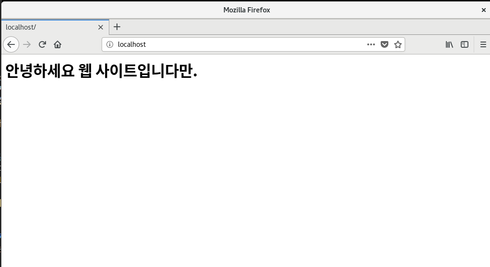

### 5. /var/www/html/phpinfo.php 파일을 생성하고 PHP 코드를 입력한 후 저장하자
웹 서버에 설치된 PHP 정보를 보여주는 함수다.
- vi /var/www/html/phpinfo.php
```php
<?php phpinfo(); ?>
```

- 웹 브라우저 http://localhost/phpinfo.php 로 접속해보자
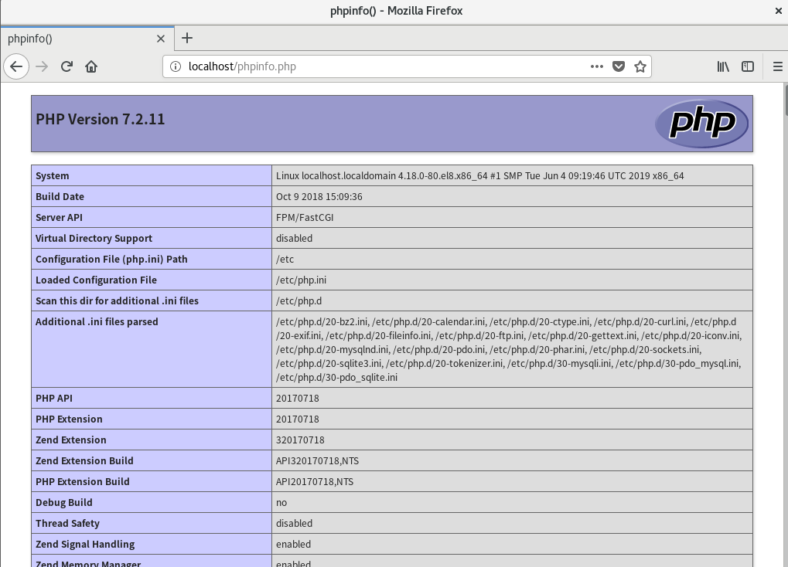

화면이 나타나면 PHP 모듈도 정상적으로 가동하는 것이다. 이제 웹 서버에 PHP 프로그래밍을 할 수 있다.

### 6. 외부에서 웹 서버에 접근할 수 있도록 [방화벽]을 설정하자
- firewall-config
- http 와 https 설정을 키자 [영구적]으로 해야한다.
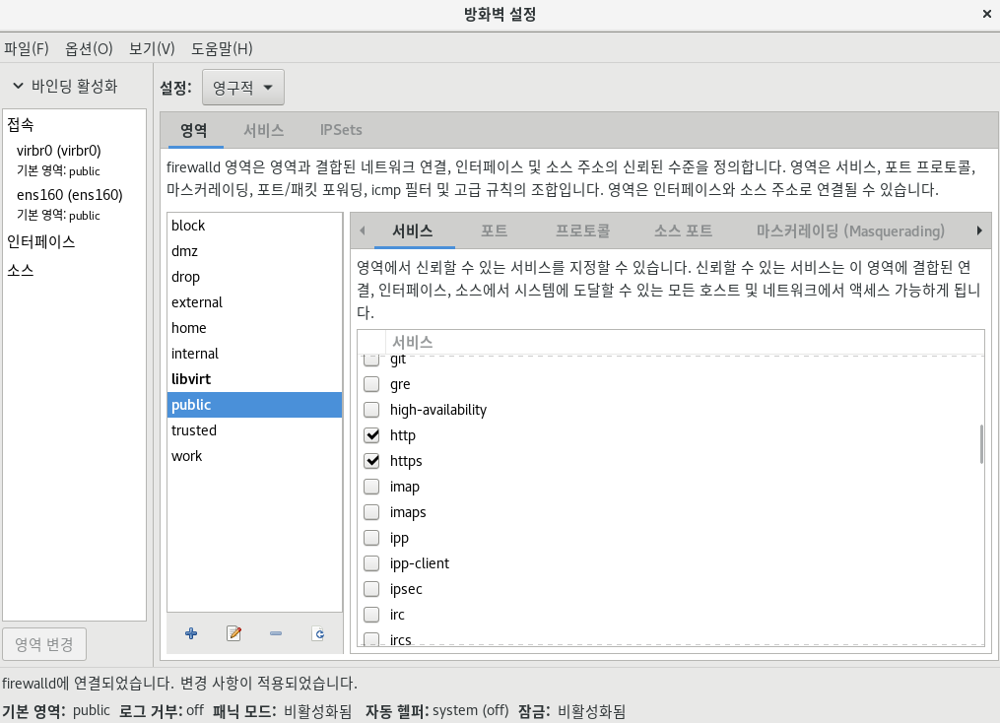
- [옵션] - [Firewalld 다시 불러오기]

<br>

<참조> 텍스트 모드에서는 이렇게 <br>
```
firewall-cmd --permanent --add-service=http
firewall-cmd --permanent --add-service=https
firewall-cmd --reload
```

<br>

## [ 2 ] 호스트 컴퓨터
### 웹 브라우저 실행
웹 브라우저에서 http://192.168.111.100/phpinfo.php 에 접속해 보자

정상적으로 아파치 , PHP , MariaDB 가 작동하는 것을 확인했다. 이제 웹 페이지 또는 php 소스를 /var/www/html/ 디렉터리에 가져다두면 웹 사이트를 운영할 수 있다.
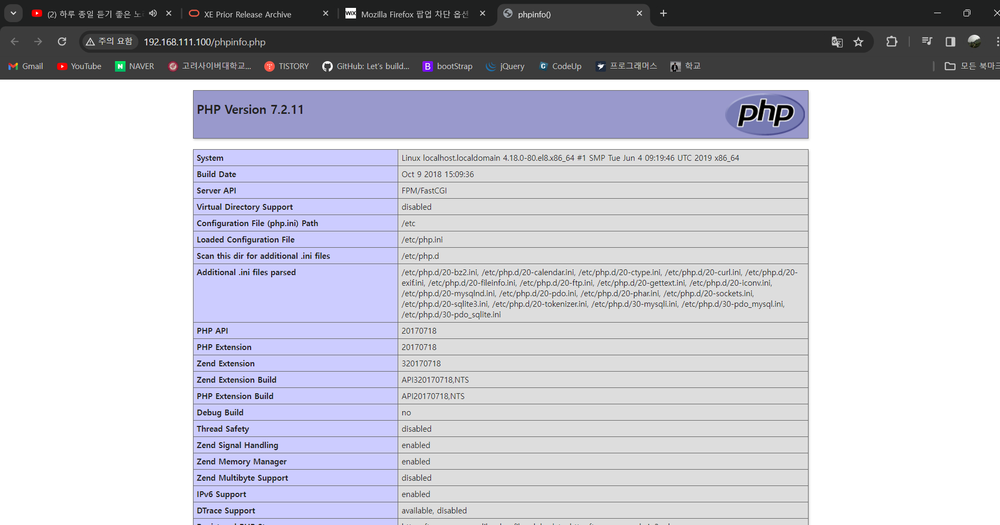

<br>
<br>

# 워드프레스를 활용해 웹 사이트 구축
APM 설치를 완료했다면 회사나 기관의 웹사이트를 구축할 차례다. 그런데 웹 사이트를 구축하는 것은 간단한 일이 아니다. 기본적인 화면이나 메뉴 구성 외에도 게시판/자료실 같은 기능을 구현해야한다.

그래서 이번에는 웹 사이트를 통합적으로 구성하도록 도와주는 오픈소스 도구로 유명한 워드프레스 (WordPress)를 활용해본다. 워드 프레스는 조금만 손보면 훌륭한 웹 사이트를 손쉽게 구성할 수 있다..

## [ 3 ] [Server] 워드 프레스 설치
### 1. MariaDB 에 접속해서 다음 명령을 입력하자
```
- mysql
CREATE DATABASE wpDB;
GRANT ALL PRIVILEGES ON wpDB.* TO wpUser@localhost IDENTIFIED BY '1234';
EXIT
```

### 2. 워드 프레스를 설치하자
- wget https://ko.wordpress.org/wordpress-4.9.8-ko_KR.tar.gz
- 또는 https://ko.wordpress.org/ 웹 사이트에서 다운로드도 가능
- 또는 https://cafe.naver.com/thisislinux 에서 다운로드

<참조> Text 모드 <br>
- wget http://download.hanbit.co.kr/centos/8/wordpress-4.9.6-ko_KR.tar.gz

### 3. 다운로드 파일의 압축을 풀고 /var/www/html 디렉터리로 이동하자
- tar xfz word*
- mv wordpress /var/www/html

### 4. wordpress 디렉터리 퍼미션을 707로 변경한다, (이는 외부에서 이 디렉터리로 접근할 수 있도록 허용하기 위함이다.)
또한 파일 소유자를 apache로 변경하자
- chmod 707 wordpress
- chown -R apache.apache wordpress
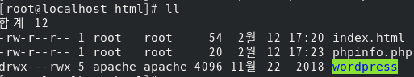

### 5. /var/www/html/wordpress/wp-config-sample.php 파일을 wp-config.php 파일로 복사한다.
그리고 안의 설정 파일을 편집한다.
- cp /var/www/html/wordpress/wp-config-sample.php /var/www/html/wordpress/wp-config.php 
- vi /var/www/html/wordpress/wp-config.php 
- 23행 : define('DB_NAME', 'database_name_here'); -> define('DB_NAME', 'wpDB');
- 26행 : define('DB_USER', 'database_user_here'); -> define('DB_USER', 'wpUser');
- 29행 : define('DB_PASSWORD', 'database_password_here'); -> define('DB_PASSWORD', '1234');

### 6. 웹 서버 설정 파일 편집
/etc/httpd/httpd.conf 의 파일을 편집한다. 이는 웹 브라우저에서 IP 주소 또는 URL 을 입력하면 바로 워드프레스 홈페이지가 보이도록 하기 위함이다
- 122행 : DocumentRoot "/var/www/html" -> DocumentRoot "/var/www/html/wordpress"
- 134행 : <Directory "/var/www/html"> -> <Directory "/var/www/html/wordpress">
- 154행 : AllowOverride None -> AllowOverride All

### 7. 서비스 재시작
- systemctl restart httpd

<br>

## [ 4 ] 호스트 컴퓨터
### 1. 웹 브라우저 접속
웹 브라우저 http://192.168.111.100 에 접속한다.
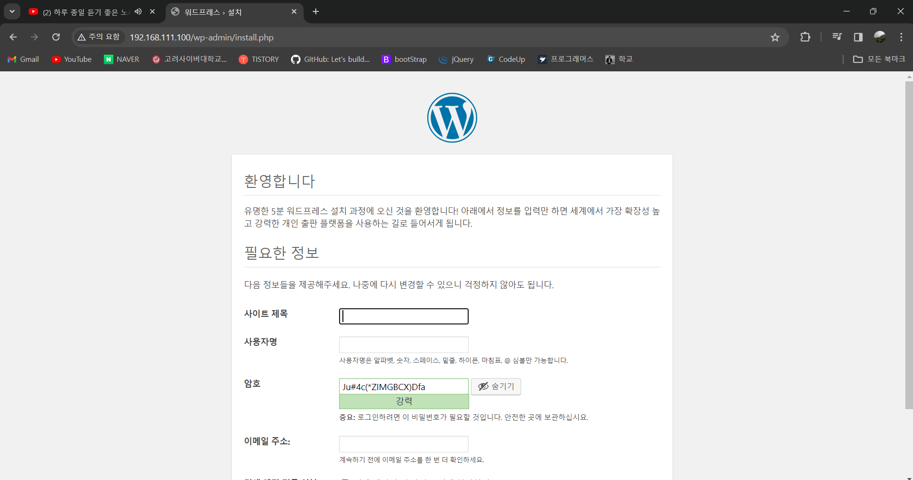

### 2. 필요한 정보를 입력한다.
사용자명 : wpAdmin <br>
비밀번호 : 4321 <br>
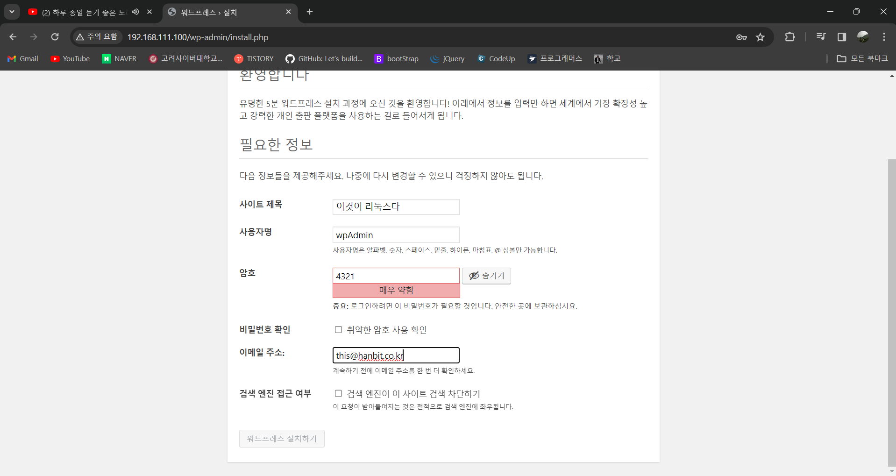

### 3. 그렇게 로그인 한다.
워드프레스 관리를 위한 초기 화면이 나온다. 이제 필요한 설정은 독자 스스로 하면된다.

<참조> 워드프레스 <br>
워드프레스는 별도의 책이 나올 정도로 다양한 사용 및 설정이 가능하다. 우리는 간단하게만 사용해보자

### 4. 테마 변경
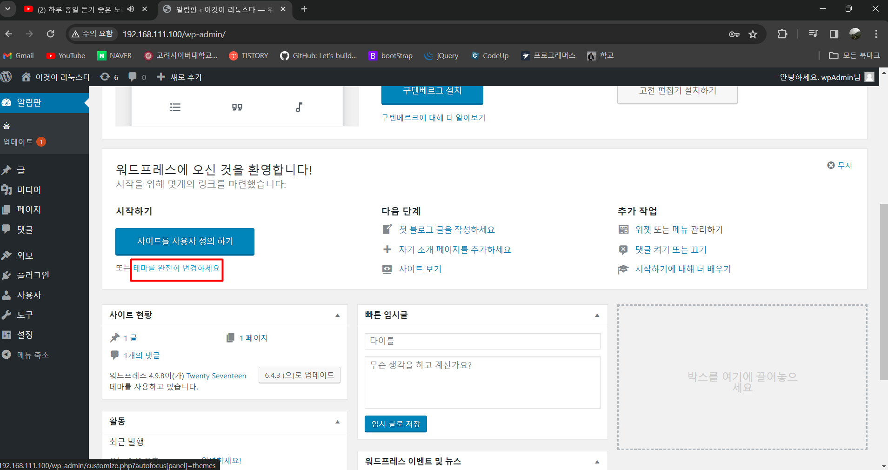

이후 생략

### 5. 홈페이지 http://192.168.111.100 으로 접속해보자
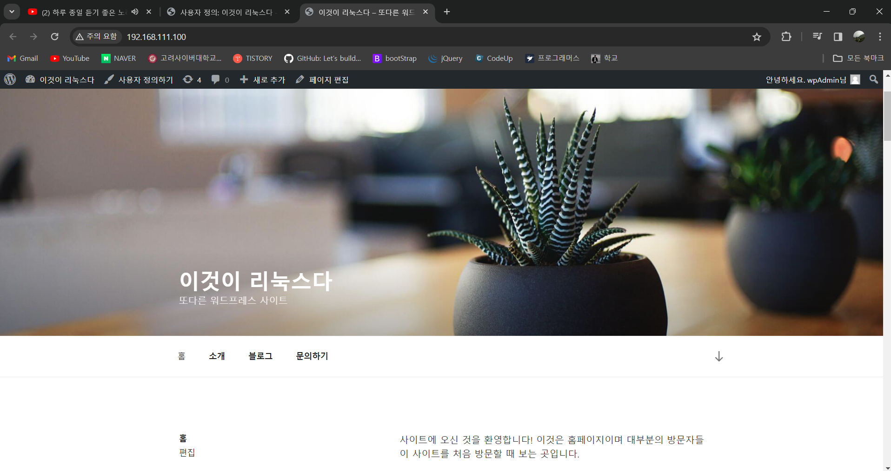

워드 프레스는 따로 http://ko.wordpress.org/ 나 별도의 책으로 학습하자

<br>
<br>

# 웹 서버의 응용 서비스
앞에서 웹 사이트를 구축하는 간단한 방법을 학습했다. 이번에는 웹 서버를 적극적으로 활용하는 서비스를 실습해보자. 클라우드 저장소가 대표적인 웹 서버의 응용 서비스로 인정받고 있다.

<br>

## 클라우드 저장소 구축
예전에는 웹하드(WebHard)라 불리는 웹 응용서비스가 많이 사용되었지만, 웹 브라우저로만 접속한다는 한계점이 있기 때문에 최근들어서는 인기가 예전 같지 않다. 그 대신 요즘에는 클라우드 저장소가 많이 활용되고 있다.
대표적으로 N드라이브 , 구글 드라이브 , Microsoft OneDrive 등이 있는데 , 기존 웹하드 기능까지 포함하고 있어 별도의 웹하드가 없어도 된다.

[그림 책 643쪽]은 한명의 사용자가 사용하는 클라우드 저장소를 표현했다. 사용자는 평소대로 집에서 자시느이 하드디스크에 있는 폴더으 ㅣ파일을 생성/수정/삭제하면 된다. 그러면 서버의 파일과 회사의 파일이 동기화(synchronization)이 되어 동일한 파일로 유지된다.

즉 이동식 디스크를 들고 다니는 것과 같이 각 컴퓨터에는 동일한 파일이 들어 있게 된다.스마트폰에서도 동일한 파일을 확인할 수 있다. 단, 스마트폰은 저장 공간이 작으므로 서버의 폴더와 파일을 스마트폰의 데이터처럼 보여준다

그렇다면 웹하드와 비교했을 때 큰 차이점은 무엇일까? 웹 하드는 웹 브라우저를 통해 파일을 다운로드 해야하며, 파일을 변경한 후에는 다시 업로드 해야한다. 하지만 클라우드 저장소는 웹 브라우저를 사용할 필요 없이 자연스럽게 자신의 하드디스크에 접근한다.

그래서 클라우드 저장소는 서버의 설정 뿐만아니라 클라이언트 프로그램도 설치해야하고, PC 부팅 시 자동으로 작동하도록 해야한다.

간단한 개념을 익혔다면 여기에서는 클라우드 저장소 도구 중 오픈소스로 유명하고 기능도 막강한 ownCloud를 사용해 보자

<br>

# ownCloud
클라우드 저장소 기능을 제공하는 오픈 소스인 ownCloud 커뮤니티 에디션을 설치하고 운영해보자 ownCloud는 기본적으로 APM 이 필요하다.

## [ 1 ] [Server] 

### 1. CentOS 8 에 포함된 APM 과 ownCloud 를 위한 관련 패키지를 설치
- dnf -y install httpd mariadb-server php php-mysqlnd php-gd php-mbstring php-pecl-zip php-xml php-json php-intl

### 2. 데이터베이스 및 웹 서버와 관련된 설정을 하자
- systemctl restart mariadb
- systemctl enable mariadb
```
mysql
CREATE DATABASE webDB;
GRANT ALL ON webDB.* TO webUser@localhost IDENTIFIED BY '1234';
EXIT
```

### 3. 아파치 서비스
- systemctl restart httpd
- systemctl enable httpd

웹 포트도 허용한다.
```
firewall-cmd --permanent --add-service=http
firewall-cmd --permanent --add-service=https
firewall-cmd --reload
```

### 4. ownCloud 를 다운로드 받고 설치하자
/var/www/html 디렉터리로 이동한 후 ownCloud 10.3.1. 버전을 다운로드 하자
- cd /var/www/html
- wget https://download.owncloud.org/community/owncloud-10.3.1.zip
 - ( 또는 wget http://download.hanbit.co.kr/centos/8/owncloud-10.3.1.zip )
- unzip -q owncloud-10.3.1.zip
- mkdir owncloud/data   # 데이터가 저장될 디렉터리 생성
- chown -R apache.apache owncloud
- chmod -R 755 owncloud

### 5. 웹 서비스 재시작
- systemctl restart httpd

<br>

## [ 2 ] [Server 또는 WinClient 또는 호스트운영체제]
ownCloud 서버 설정을 웹으로 접속해서 진행하자

### 1. 웹 브라우저 접속
- http://192.168.111.100/owncloud/ 에 적속

처음에 관리자 아이디와 비밀번호를 지정한다 
필자는 관리자 아이디 admin , 비밀번호 1234로 했다.
그리고 ' 저장소 및 데이터베이스'를 확장해서 <MySQL / MariaDB> 부분을 클릭한다.

### 2. 이번 실습에서 생성한 데이터베이스 정보를 입력한다
사용자 : webUser <br>
암호 : 1234 <br>
데이터베이스이름 : webDB <br>
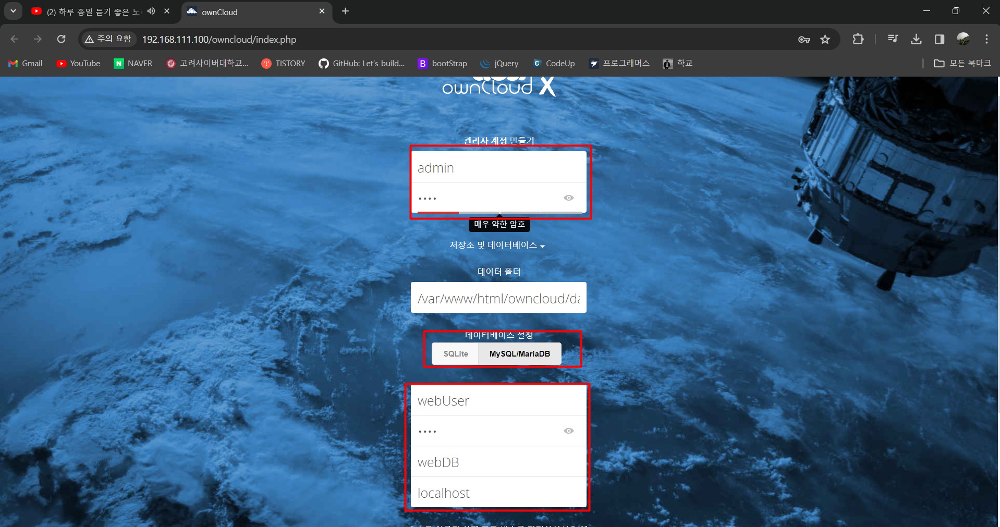
- 설치 완료를 누른다

### 3. 잠시 기다리면 로그인 화면이 나오고 이제 접속한다.
사용자 : webUser <br>
암호 : 1234 <br>

### 4. [Welcome to ownCloud]가 나온다. ownCloud 는 데스크톱과 스마트폰에서 사용할 수 있다 [X]를 눌러 닫는다

<참조> 오른쪽 위의 [admin] - [설정]을 선택하면 암호 변경 , 언어 설정 ,이름 변경 등의 작업이 가능하다

### 5. 일반 사용자 생성
현재는 관리자로 로그인 되어 있다. ownCloud 를 사용할 일반사용자를 생성하자. 
- [admin] - [사용자]를 선택한 후 왼쪽 위의 [사용자 이름]과 [이메일]을 설정
([사용자 이름 : thisUser , 이메일 : this@hanbit.co.kr])
- 그 다음 오른쪽 옆에 있는 [ + 그룹 추가]를 클릭해 [Users] 그룹을 만든 후 <만들기>를 클릭한다
- 또 thisUser의 암호부분을 클릭해 암호를 1234로 입력하고 [Enter]를 누른다. (상단의 메일 관련 오류 메시지가 나와도 무시한다.)
- 필요하다면 사용자가 사용할 수 있는 할당량을 오른쪽 [기본값]에서 변경이 가능하다. 할댱량을 1GB 로 변경한다.
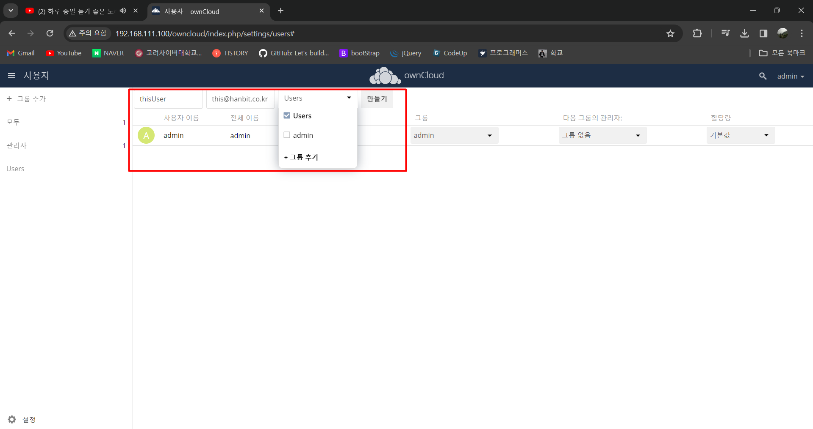
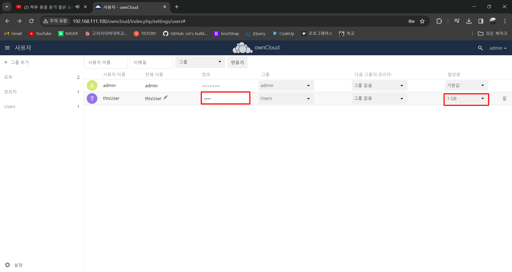

<br>

## [ 3 ] [ WinClient 또는 호스트 컴퓨터 ]
### 1. 웹 브라우저에서 http://192.168.111.100/ 으로 접속하자 
아이디 : thisUser , 비밀번호 : 1234

### 2. 파일 하나를 업로드 해보자
파일 하나의 최대 업로드 용량은 513MB이다.
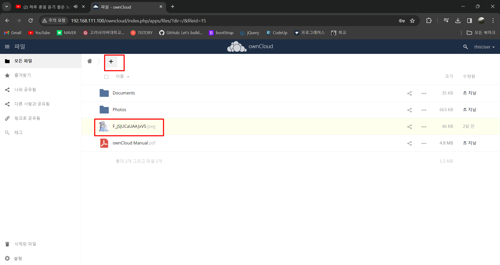

<br>

## [ 4 ] [ WinClient 또는 호스트 컴퓨터 ]
### 1. 윈도우 용 ownCloud 클라이언트를 설치해서 사용하자
- https://owncloud.org/download/
- 또는 https://cafe.naver.com/thisislinux/6620

### 2. 다운로드한 파일을 설치하자
설치할 때는 기본 설정을 변경하지 않은 상태로 계속 [Next] [install]및 [finish]을 눌러 설치

### 3. 바탕화면의 ownCloud 아이콘을 더블 클릭한다. 
ownCloud 클라이언트가 실행되면 [ServerAddress] 에 http://192.168.111.100/owncloud/
- [ServerAddress] 에 http://192.168.111.100/owncloud/

만약 http 가 연결되지 않으면 https로 바꿔본다.

### 4. [Connect to ownCloud. Enter user credentials]
[Connect to ownCloud. Enter user credentials] 에서 [Username]에 thisUser를 <br>
[password]에 1234를 입력하고 [Next]

### 5. [Connect to ownCloud. Setup local folder options]
동기화 될 저장소(폴더)를 지정한다. <br>
필자는 [Load Folder] 오른쪽 항목을 클릭하면 [Local Sync Folder]가 등장한다 <br>
- C:\ownCloud\ 폴더를 생성하고 저장소로 지정하자
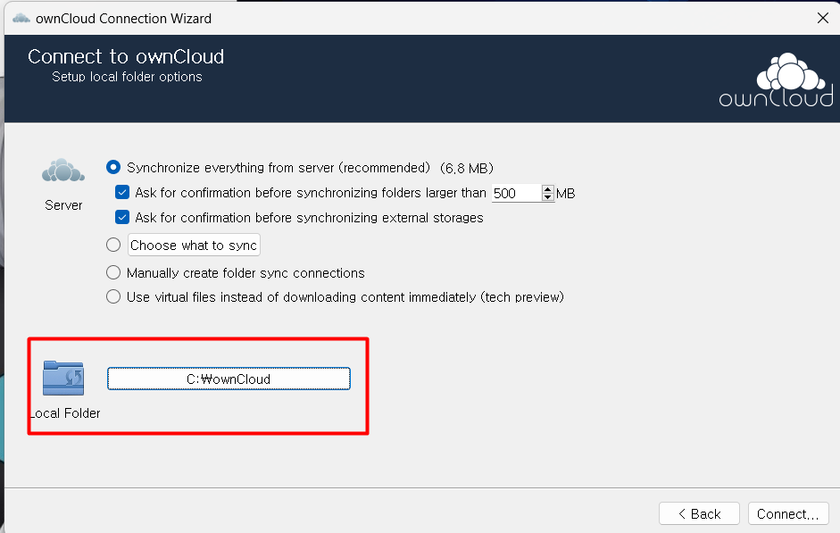


### 6. ownCloud 창이 나오고 파일이 동기화되는 화면이 나온다 그냥 [Close]을 눌러도 내부적으로 계속해서 동기화된다.
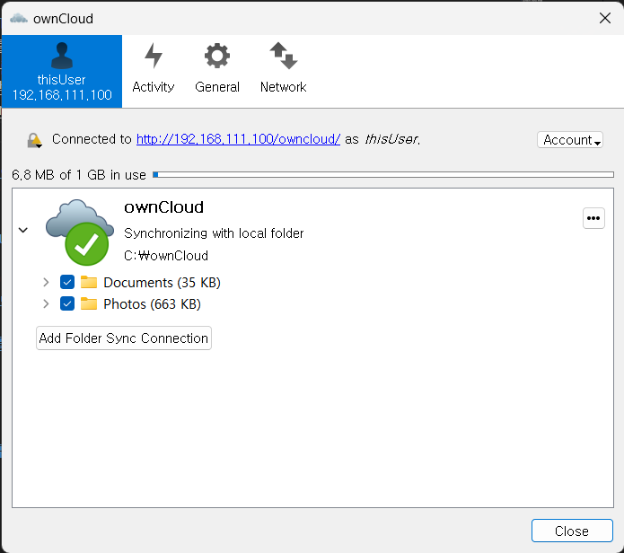


### 7. [Everything set up!!] 끝났난아아1!?

### 8. ownCloud 아이콘이 있다 동기화 중이면 아이콘 모양이 계속 움직이는 모양으로 표시되고, 동기화가 완료되면 체크모양 의 아이콘으로 바뀐다.

### 이제 C:\ownCloud\ 폴더에 뭔가를 넣으면 된다. 이 파일들도 모든 곳에 동기화 될 것이다.

<br>
<br>

# [Client 또는 회사 컴퓨터] 리눅스용 ownCloud 클라이언트
### 1. 다음 명령을 차례로 입력해서 ownCloud 클라이언트를 설치한다
```
su
cd /etc/yum.repos.d/
wget https://download.opensuse.org/repositories/isv:ownCloud:desktop/CentOS_8/isv:ownCloud:desktop.repo
(또는 wget http://download.hanbit.co.kr/centos/8/isv_ownCloud_desktop.repo )
dnf -y install owncloud-client
exit
```

<참조>
시간이 흐른 후 Linux 용 ownCloud 클라이언트가 책처럼 설치되지 않는다면 , Client 가상머신을 초기화 하고 다음과 같이 작업한다.
```
su
mkdir rpms
cd rpms
wget http://download.hanbit.co.kr/centos/8/12-3.tar.bz2
tar xfj 12-3.tar.bz2
dnf -y install *.rpm
exit
```

### 2. ownCloud 실행
```
owncloud &
```

### 3. [Server Address]에 Windows 에서 설정한 것과 동일하게 http://192.168.111.100/owncloud/ 입력

### 4. [Connect to ownCloud. Enter user credentials] 에서 [Username]에 thisUser를 <br> [password]에 1234를 입력하고 [Next]

### 5. 디렉터리 지정한다.
기본 설정인 /home/centos/ownCloud 그대로 두자

### 6. 동기화 화면이 나온다 [Close]

### 7. [현재 활동] -> [파일]을 실행해서 Cloud 폴더를 확인할 수 있다.

<br>
<br>

# [호스트 운영체제] 이번에는 외부 컴퓨터에서 ownCloud 에 접속할 수 있도록 설정하자
이건 실습 말고 그냥 알아두는 정도로 해보자

## 책 657쪽 부터 660쪽

### 1. [부록 1]의 [그림 A-1]과 2-3 ~ 2-5 를 참고해서 가상머신 (Server)의 http (80)와 https(443)를 '내부 포트 번호' 호스트 컴퓨터의 10080 과 10443의 '외부 포트 번호로 연결하자'

### 2.  [부록 1]의 2-6 ~ 2-11 을 참고해서 Windows 방화벽 10080과 10443번을 열어주자

### 3. 명령 프롬프트
ipconfig 명령을 입력해 [이더넷 어댑터 이더넷]의 IPv4 주소 부분을 확인하자
필자는 현재 192.168.1.101번을 사용하고 있다.

<참조> 무선랜을 사용중이라면 [무선 LAN 어댑터 Wi-Fi]의 [IPv4 주소]부분을 확인한다


<br>

# [Server] - 호스트 컴퓨터의 IP 주소를 신뢰할 수 있는 도메인 주소로 추가
### 1.  /var/www/html/owncloud/config/config.php 파일 수정
/var/www/html/owncloud/config/config.php 파일을 열고 9행 쯤에 ', 1 => '호스트컴퓨터IP주소'를 추가하자
```
이전
'trusted_domains' =>
  array (
    0 => '192.168.111.100'
  )

변경 후
'trusted_domains' =>
  array (
    0 => '192.168.111.100' , 1 => '192.168.1.101'
  )
```

- systemctl restart httpd 명령으로 웹 서비스를 재시작

<br>

# [ 외부 컴퓨터 ]
이제 외부 컴퓨터에서 ownCloud 에 접속할 수 있다.
웹 브라우저로 http://호스트컴퓨터IP주소:10080/owncloud/ 에 접속하고, thisUser 사용자로 로그인이 가능하다

# [ 스마트폰 ]
스마트폰에서도 동일하게 접속이 가능하다. 이번에는 스마트폰 전용 앱이 있다.
구글 playstore 에서 다운 가능하다.
<br>
주소 부분을 http://호스트컴퓨터IP주소:10080/owncloud/로 입력한 후 사용자 아이디 thisUser와 비밀번호 1234를 입력해 접속하면 가능하다.


<br>
<br>

# [참고] 웹 서버 설정파일
고급 웹 서비스를 구현하려면 웹 서버의 설정파일인 /etc/httpd/conf/httpd.conf 의 의미를 파악하는 것이 좋다

## 웹 서버 설정 파일
아파치 웹 서버의 설정 파일인 httpd.conf 의 몇몇 중ㅇ한 의미를 알아보자
|코드|설명|
|:--:|:--:|
|ServerRoot"/etc/httpd"|웹 서버의 설정 파일, 로그 파일 등이 저장되는 최상위 디렉터리|
|Listen 80|웹 서버의 포트 번호, 기본적으로 대부분의 웹 서버는 80번 포트 사용|
|include conf.modules.d/*.conf|설정 파일에 포함될 파일의 경로와 파일 이름이 들어있다.|
|User apache / Group apache|웹 서비스를 작동하는 사용자와 그룹|
|DocumentRoot"/var/www/html|웹 서버의 홈 디렉터리, 예를 들어 http://서버IP주소 또는 URL/로 접속되는 디렉터리|
|
```
 <Directory "/var/www/html>
  Option Indexes FollowSymLinks
  AllowOverride None
  Require all granted
</Diretory>
 ```
| 웹 서버는 디렉터리 단위로 설정한다. 각 디렉터리마다 허가/거부 등 접근 권한을 달리 할 수 있다. 'Option Indexes FollowSymLinks'의 의미는 현재 디렉터리에서 DirectoryIndex에 지정된 파일이 없다면 목록을 대신 출력하라는 의미다.


<br>
이 외에도 복잡한 문법이 많으며 http.conf 를 검색해서 알아보자
<br>
httpd.conf 파일을 수정한 후 문법적으로 오류가 있는지 체크하려면 service httpd configtest 명령을 입력해 테스트 할 수 있다 설정에 이상이 없다면 'Syntax OK'라는 메시지를 준다

- service httpd configtest


